# 编码器

> 原文：<https://www.javatpoint.com/encoders-digital-electronics>

将二进制信息转换成 N 条输出线的组合电路称为**编码器**。二进制信息以 2 N 输入行的形式传递。输出行定义了二进制信息的 N 位代码。简单来说，**编码器**执行**解码器**的反向操作。为简单起见，每次仅激活一条输入线。产生的 N 位输出码相当于二进制信息。

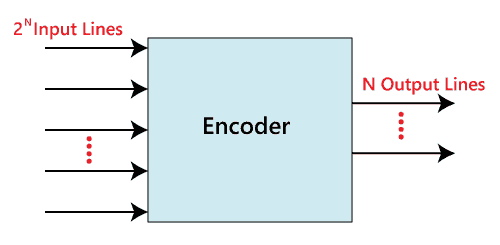

编码器有以下各种类型:

## 4 至 2 线编码器:

在 4 至 2 线编码器中，总共有四个输入，即 Y 0 、Y 1 、Y 2 、Y 3 ，以及两个输出，即 A 0 和 A 1 。在 4 输入行中，一次将一个输入行设置为 true，以在输出端获取相应的二进制代码。下面是 4 至 2 线编码器的框图和真值表。

### 框图:

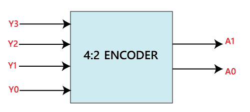

### 真值表:

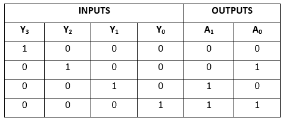

术语 A0 和 A1 的逻辑表达式如下:

A1= Y3+Y2T6】A0= Y3+Y1

上述表达式的逻辑电路如下:

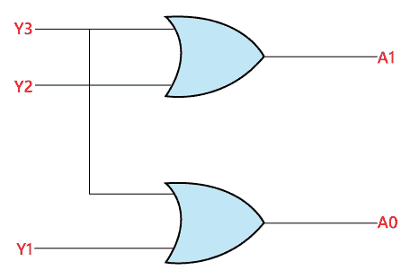

## 8 至 3 线编码器:

8 至 3 线编码器也称为**八进制至二进制编码器**。在 8 至 3 线编码器中，共有 8 个输入，即 Y 0 、Y 1 、Y 2 、Y 3 、Y 4 、Y 5 、Y 6 、Y 7 和 3 个输出，即 A 0 、A1 和 A【t2t 在 8 输入行中，一次将一个输入行设置为 true，以在输出端获取相应的二进制代码。以下是 8 至 3 线编码器的框图和真值表。

### 框图:

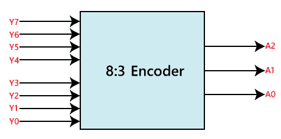

### 真值表:

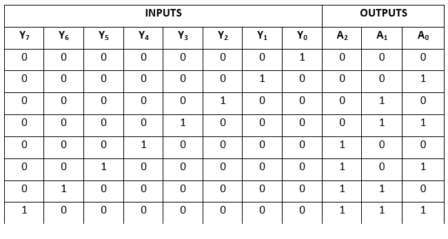

术语 A0、A1 和 A2 的逻辑表达式如下:

A2= Y4+Y5+Y6+Y7T10】A1= Y2+Y3+Y6+Y7T21】A0= Y7

上述表达式的逻辑电路如下:

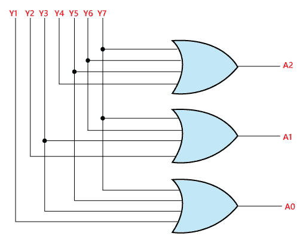

## 十进制到 BCD 编码器

八进制到二进制编码器也称为 **10 到 4 行编码器**。在 10 至 4 线编码器中，共有 10 个输入，即 Y 0 、Y 1 、Y 2 、Y 3 、Y 4 、Y 5 、Y 6 、Y 7 、Y 8 、Y 9 和 4 个输出，在 10 输入行中，一次将一个输入行设置为真，以在输出侧获得相应的 **BCD 代码**。下面给出了十进制到 BCD 编码器的框图和真值表。

### 框图:

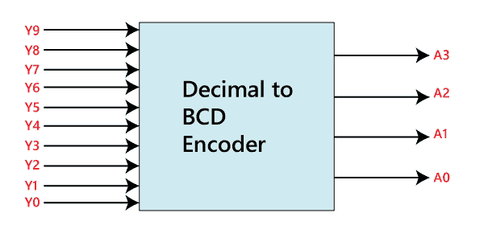

### 真值表:

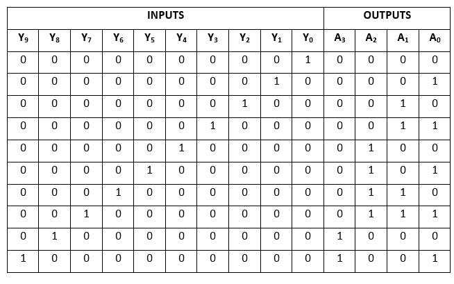

术语 A 0 、A 1 、A 2 、A 3 的逻辑表达如下:

a3 = Y9+Y8
A2 = Y7+Y6+Y5+Y4
A1 = Y7+Y6+Y3+Y2
A0 = Y9+Y7+Y5+Y3+Y1

上述表达式的逻辑电路如下:

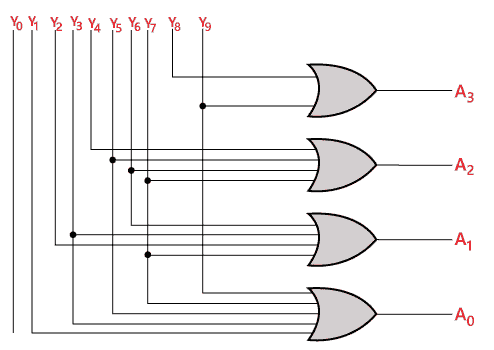

## 优先级编码器:

### 4 至 2 线优先编码器:

在这个优先级编码器中，共有 4 个输入，即 Y 0 、Y 1 、Y 2 、Y 3 ，以及两个输出，即 A 0 和 A 1 。Y 3 为高，Y 0 为低优先级输入。当多个输入同时为“1”时，输出将是对应于较高优先级输入的(二进制)代码。下面是 4 到 2 线优先级编码器的真值表。

### 真值表:

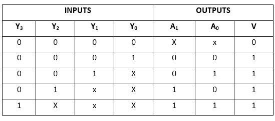

术语 A 0 和 A 1 的逻辑表达式可以使用 **K-map** 找到，如下所示:

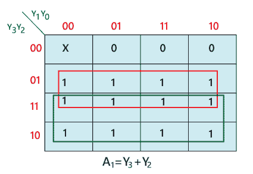

A1= Y3+Y2
A0= Y3+Y2。Y 1

上述表达式的逻辑电路如下:

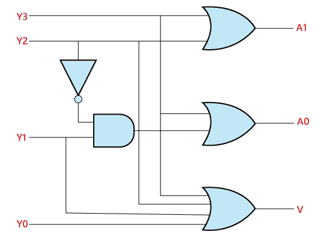

### 编码器的用途:

1.  这些系统在所有数字系统中都非常容易使用。
2.  编码器用于将十进制数转换成二进制数。目标是执行二进制运算，如加法、减法、乘法等。

* * *