# 多路器

> 原文：<https://www.javatpoint.com/multiplexer-digital-electronics>

多路复用器是一种组合电路，具有 2 n 条输入线和一条输出线。简单地说，多路复用器是一个多输入单输出的组合电路。从输入线接收二进制信息并将其导向输出线。根据选择线的值，这些数据输入之一将连接到输出。

与编码器和解码器不同，有 n 条选择线和 2 条 n 输入线。因此，总共有 2 个 N 个可能的输入组合。多路复用器也被视为**多路复用器**。

多路复用器有以下各种类型:

## 2×1 多路复用器:

在 2×1 多路复用器中，只有两个输入端，即 A 0 和 A 1 ，1 条选择线，即 S 0 和单个输出端，即 y。基于选择线 S 0 处存在的输入组合，这两个输入端中的一个将连接到输出端。2 **×** 1 多路复用器的框图和真值表如下。

### 框图:

### 真值表:

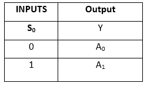

术语“Y”的逻辑表达式如下:

Y=S 0 。A 0 +S 0 。A 1

上述表达式的逻辑电路如下:

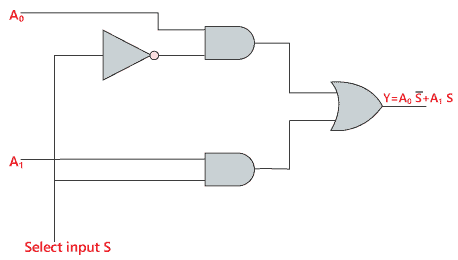

## 4×1 多路复用器:

在 4×1 多路复用器中，总共有四个输入，即 A 0 、A 1 、A 2 、A 3 、2 条选择线，即 S 0 和 S 1 和单个输出，即 y4 **×** 1 多路复用器的框图和真值表如下。

### 框图:

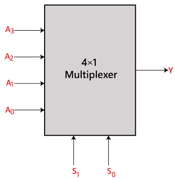

### 真值表:

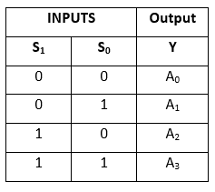

术语“Y”的逻辑表达式如下:

y = S1S0A0+S1S0A1+S1S0A2+S1S0A3

上述表达式的逻辑电路如下:

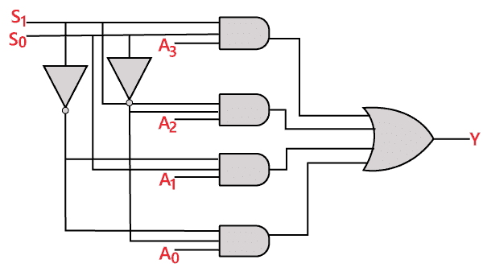

## 8 对 1 多路复用器

在 8 对 1 多路复用器中，共有 8 路输入，即 A 0 、A 1 、A 2 、A 3 、A 4 、A 5 、A 6 、A 7 ，3 条选择线，即 S 0 、S 1 【T19 y .基于存在于选择线 S 0 、S 1、和 S 2 处的输入的组合，这 8 个输入中的一个连接到输出。 8 **×** 1 多路复用器的框图和真值表如下。

### 框图:

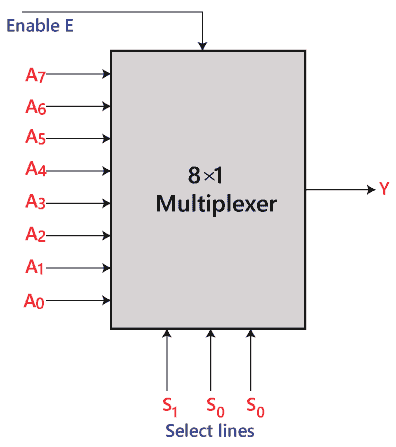

### 真值表:

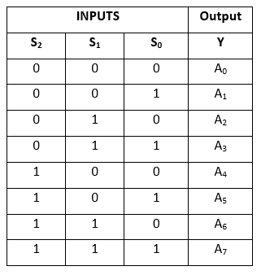

术语“Y”的逻辑表达式如下:

Y=S 0 。S 1 。S 2 。A 0 +S 0 。S 1 。S 2 。A 1 +S 0 。S 1 。S 2 。A 2 +S 0 。S 1 。S 2 。A 3 +S 0 。S 1 。S2A4+S0。S 1 。S2A5+S0。S 1 。S 2 。A 6 +S 0 。S 1 。S 3 。A 7

上述表达式的逻辑电路如下:

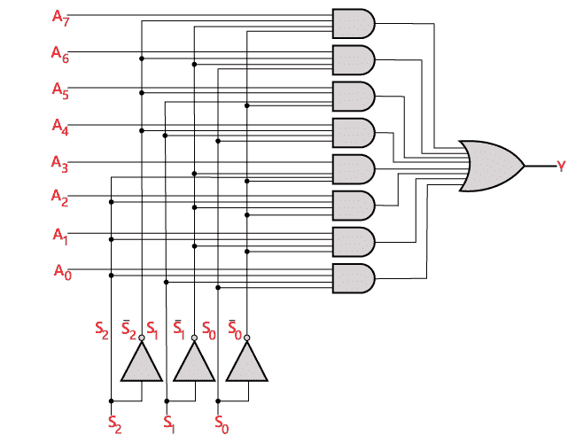

### 使用 4×1 和 2×1 多路复用器的 8 ×1 多路复用器

我们可以使用较低阶的多路复用器来实现 8 **×** 1 多路复用器。为了实现 8 **×** 1 多路复用器，我们需要两个 4 **×** 1 多路复用器和一个 2 **×** 1 多路复用器。4 **×** 1 多路复用器有 2 条选择线、4 个输入和 1 个输出。2 **×** 1 多路复用器只有 1 条选择线。

为了获得 8 个数据输入，我们需要两个 4 **×** 1 多路复用器。4 **×** 1 多路复用器产生一个输出。因此，为了获得最终输出，我们需要一个 2 **×** 1 多路复用器。使用 4 **×** 1 和 2 **×** 1 多路复用器的 8 **×** 1 多路复用器的框图如下。

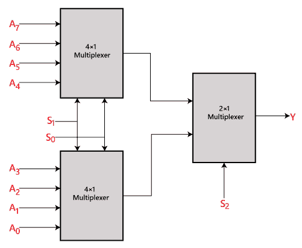

## 16 对 1 多路复用器

在 16 对 1 多路复用器中，总共有 16 个输入，即 A 0 、A 1 、…、A 16 、4 条选择线，即 S 0 、S 1 、S 2 、S 3 和单个输出，即 y16 **×** 1 的框图和真值表

### 框图:

### 真值表:

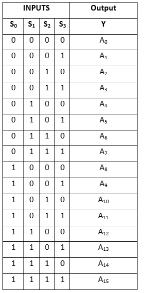

术语“Y”的逻辑表达式如下:

Y=A0.S0'.S1'.S2'.S3'+A1.S0'.S1'.S2 '.S3+A2.S0'.S1'.S2.S3'+A3.S0'.S1 '.S2.S3+A4.S0'.S1.S2'.S3'+A5.S0 '.S1.S2'.S3+A6.S1.S2.S3'+A7.S0 '.S1.S2.S3+A8.S0.S1'.S2'.S3'+A9 .S0.S1'.S2'.S3+Y10.S0.S1'.S2.S3 '+A11.S0.S1'.S2.S3+A12 S0.S1.S2 '.S3'+A13.S0.S1.S2'.S3+A14.S0.S1 .S2.S3'+A15.S0.S1.S2'.S3

上述表达式的逻辑电路如下:

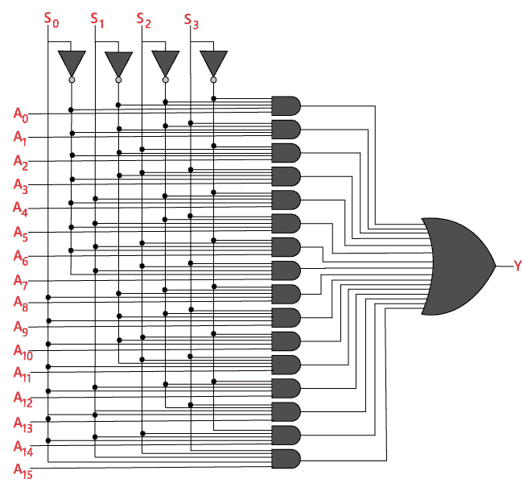

### 使用 8×1 和 2×1 多路复用器的 16×1 多路复用器

我们可以使用较低阶的多路复用器来实现 16 **×** 1 多路复用器。为了实现 8 **×** 1 多路复用器，我们需要两个 8 **×** 1 多路复用器和一个 2 **×** 1 多路复用器。8 **×** 1 多路复用器有 3 条选择线、4 个输入和 1 个输出。2 **×** 1 多路复用器只有 1 条选择线。

为了获得 16 个数据输入，我们需要两个 8 ×1 多路复用器。8 **×** 1 多路复用器产生一个输出。因此，为了获得最终输出，我们需要一个 2 **×** 1 多路复用器。使用 8 **×** 1 和 2 **×** 1 多路复用器的 16 **×** 1 多路复用器框图如下。

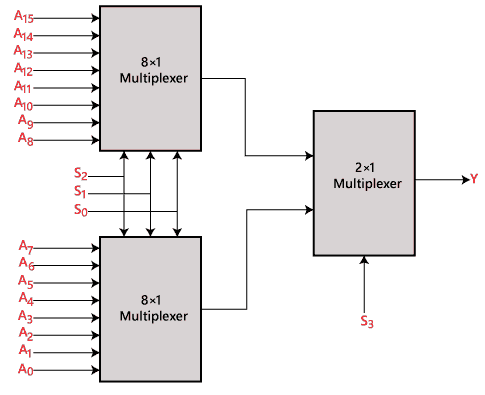

* * *