# 多路分解器

> 原文：<https://www.javatpoint.com/de-multiplexer-digital-electronics>

解复用器是一种只有 1 条输入线和 2 条 N 输出线的组合电路。简单地说，多路复用器是一个单输入多输出的组合电路。从单个输入线接收信息，并将其导向输出线。根据选择线的值，输入将连接到这些输出之一。解复用器与复用器相对。

与编码器和解码器不同，有 n 条选择线和 2 个 n 个输出。因此，总共有 2 个 n 个可能的输入组合。解复用器也被视为**解复用器**。

有以下各种类型的解复用器:

## 1×2 解复用器:

在 1 对 2 解复用器中，只有两个输出，即 Y 0 ，Y 1 ，1 条选择线，即 S 0 ，以及单个输入，即 a。根据选择值，输入将连接到其中一个输出。1 **×** 2 多路复用器的框图和真值表如下。

### 框图:

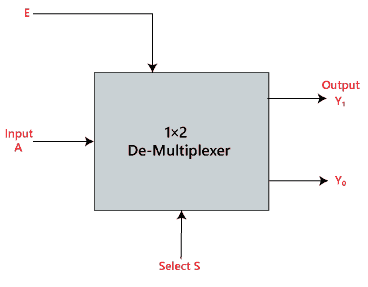

### 真值表:

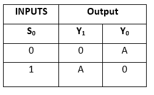

术语“Y”的逻辑表达式如下:

Y 0 =S 0 。A
Y 1 =S 0 。A

上述表达式的逻辑电路如下:

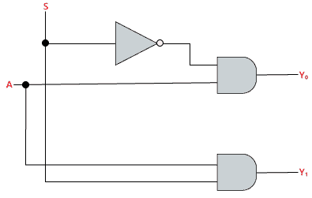

## 1×4 多路分解器:

在 1 至 4 解复用器中，总共有四个输出，即 Y 0 、Y 1 、Y 2 、Y 3 、2 条选择线，即 S 0 和 S 1 和单个输入，即 a1 **×** 4 多路复用器的框图和真值表如下。

### 框图:

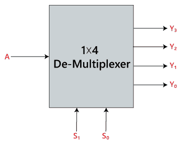

### 真值表:

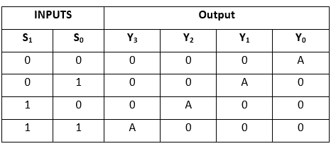

术语“Y”的逻辑表达式如下:

y0= S1S0A
y1= S1S0A
y2= S1S0A
y3= S1S

上述表达式的逻辑电路如下:

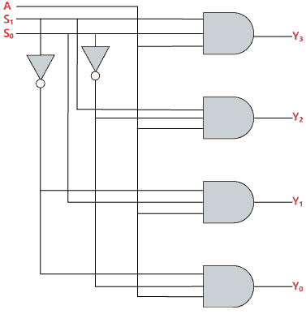

## 1×8 多路分解器

在 1 至 8 路多路分解器中，共有 8 路输出，即 Y 0 、Y 1 、Y 2 、Y 3 、Y 4 、Y 5 、Y 6 、Y 7 ，3 条选择线，即 S 0 、S 1 a .根据存在于选择线 S 0 、S 1 和 S 2 的输入组合，输入将连接到这些输出之一。 1 **×** 8 解复用器的框图和真值表如下。

### 框图:

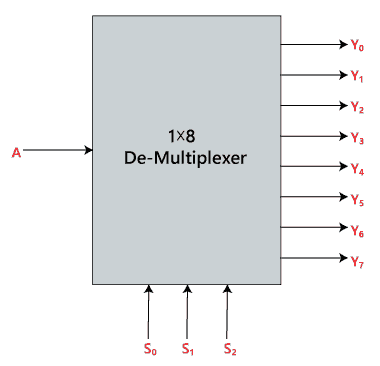

### 真值表:

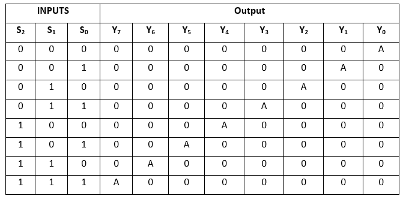

术语“Y”的逻辑表达式如下:

Y 0 =S 0 。S 1 。S 2 。A
Y 1 =S 0 。S 1 。S 2 。A
Y 2 =S 0 。S 1 。S 2 。A
Y 3 =S 0 。S 1 。S 2 。A
Y 4 =S 0 。S 1 。S2A
Y5= S0。S 1 。S2A
Y6= S0。S 1 。S2A
Y7= S0。S 1 。S 3 。A

上述表达式的逻辑电路如下:

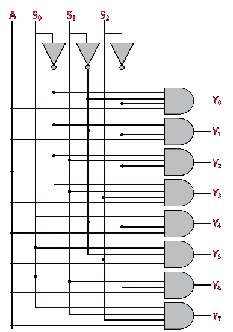

### 使用 1×4 和 1×2 解复用器的 1×8 解复用器

我们可以使用低阶解复用器来实现 1 **×** 8 解复用器。为了实现 1 **×** 8 解复用器，我们需要两个 1 **×** 4 解复用器和一个 1 **×** 2 解复用器。1 **×** 4 多路复用器有 2 条选择线、4 个输出和 1 个输入。1 **×** 2 解复用器只有 1 条选择线。

为了获得 8 个数据输出，我们需要两个 1 **×** 4 解复用器。1×2 多路分解器产生两个输出。因此，为了获得最终输出，我们必须将 1×2 解复用器的输出作为 1 **×** 4 解复用器的输入。使用 1 **×** 4 和 1 **×** 2 解复用器的 1 **×** 8 解复用器的框图如下。

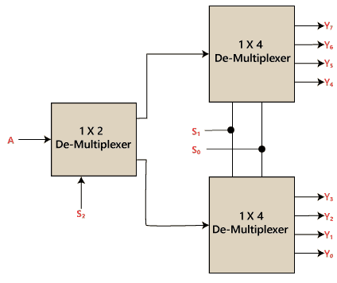

## 1 x 16 多路分解器

在 1×16 解复用器中，总共有 16 个输出，即 Y 0 、Y 1 、…、Y 16 、4 条选择线，即 S 0 、S 1 、S 2 、S 3 和单个输入，即 a1 **×** 16 解复用器的框图和真值表如下。

### 框图:

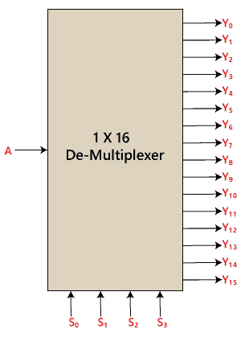

### 真值表:

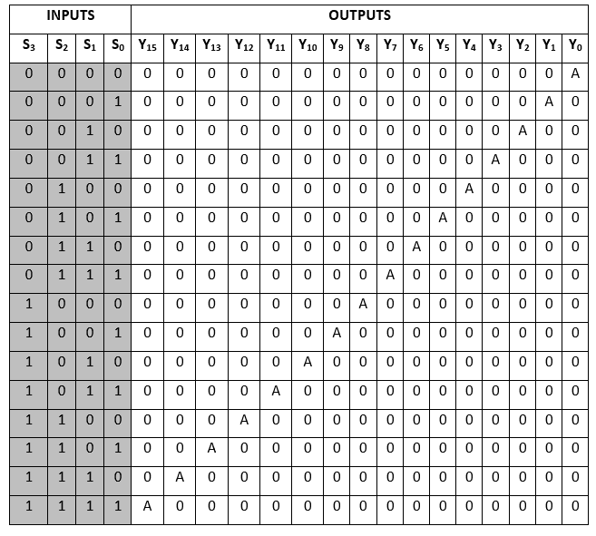

术语“Y”的逻辑表达式如下:

Y 0 =A.S 0 。S 1 。S 2 。S3'
Y1= A . S0。S 1 。S 2 。S3T21】Y2= A . S0。S 1 。S 2 。S3'
Y3= A . S0。S 1 。S 2 。S3T43【Y4= A . S0。S 1 。S 2 。S3'
Y5= A . S0。S 1 。S 2 。S3
Y6= A . S0。S 1 。S 2 。S3'
Y7= A . S0。S 1 。S 2 。S3T87】Y8= A . S0。S 1 。S 2 。S3'
Y9= A . S0。S 1 。S 2 。S3
Y10= A . S0。S 1 。S 2 。S3'
Y11= A . S0。S 1 。S 2 。S3
Y12= A . S0。S 1 。S 2 。S3'
Y13= A . S0。S 1 。S 2 。S3
Y14= A . S0。S 1 。S 2 。S3'
Y15= A . S0。S 1 。S 2 。S 3

上述表达式的逻辑电路如下:

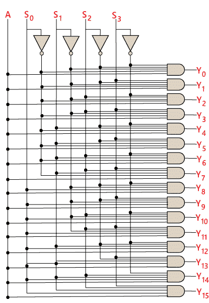

### 使用 1×8 和 1×2 解复用器的 1×16 解复用器

我们可以使用低阶解复用器来实现 1 **×** 16 解复用器。为了实现 1 **×** 16 解复用器，我们需要两个 1 **×** 8 解复用器和一个 1 **×** 2 解复用器。1 **×** 8 多路复用器有 3 条选择线、1 个输入和 8 个输出。1 **×** 2 解复用器只有 1 条选择线。

为了获得 16 个数据输出，我们需要两个 1×8 解复用器。1 **×** 8 解复用器产生 8 个输出。因此，为了获得最终输出，我们需要一个 1 **×** 2 解复用器，从单个输入产生两个输出。然后，我们将这些输出作为输入传递给多路分解器。使用 1 **×** 8 和 1 **×** 2 解复用器的 1**×16 解复用器的框图如下。**

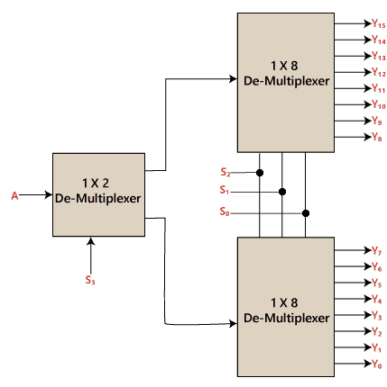

* * *