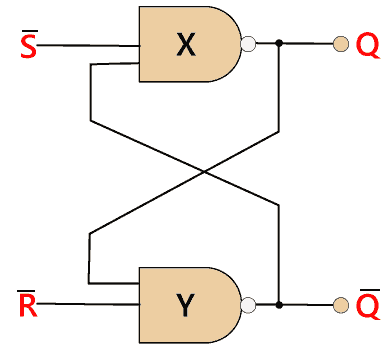
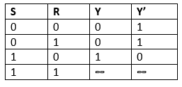
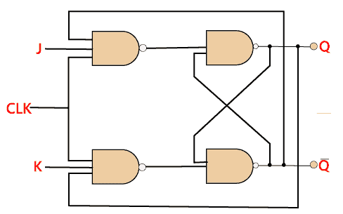
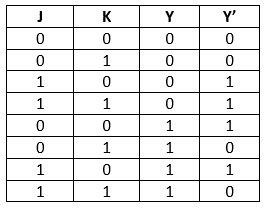
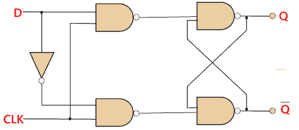
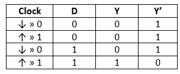
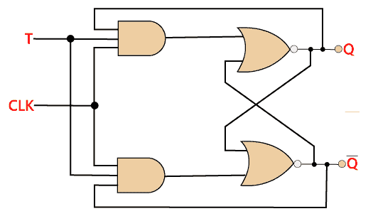
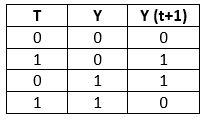

# 触发器基础

> 原文：<https://www.javatpoint.com/basics-of-flip-flop-in-digital-electronics>

具有两种稳定状态的电路被视为**触发器**。这些稳定状态用于存储二进制数据，这些数据可以通过应用不同的输入来改变。触发器是数字系统的基本构件。触发器和锁存器是数据存储元件的例子。在时序逻辑电路中，触发器是基本的存储元件。锁存器和触发器是基本的存储元件，但工作方式不同。触发器有以下几种类型:

## SR 触发器

[S-R 触发器](sr-flip-flop-in-digital-electronics)是数字系统中最常用的触发器。在 SR 触发器中，当置位输入“S”为真时，输出 Y 为高，Y’为低。当建立输出时，需要保持电路的接线。我们保持接线，直到置位或复位输入变高，或者电源关闭。

S-R 触发器是最简单、最容易理解的电路。

### 真值表:

## J-K 触发器

[JK 触发器](jk-flip-flop-in-digital-electronics)用于消除 S-R 触发器的缺点，即未定义的状态。JK 触发器是通过对 SR 触发器进行修改而形成的。为了构造 J-K 触发器，对 S-R 触发器进行了改进。当 S 和 R 输入设置为真时，SR 触发器给出不准确的结果。但是在 JK 触发器的情况下，它给出了正确的输出。

在 J-K 触发器中，如果其两个输入不同，则下一个时钟沿的 J 值由输出 y 取值。如果其两个输入都为低，则不发生变化，如果在时钟沿为高，则从一种状态切换到另一种状态，输出将被切换。JK 触发器是数字系统中的置位或复位触发器。

### 真值表:

## d 触发器

d 触发器是数字系统中广泛使用的触发器。D 触发器主要用于移位寄存器、计数器和输入同步。

### 真值表:

## 触发器

就像 JK 触发器一样，用的是 T 触发器。与 JK 触发器不同，在 T 触发器中，时钟输入只有一个输入。T 触发器是通过将 JK 触发器的两个输入连接在一起作为单个输入而构成的。

T 触发器也被称为**触发触发器**。这些 T 触发器能够找到其状态的补码。

### 真值表:

* * *