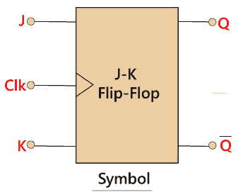
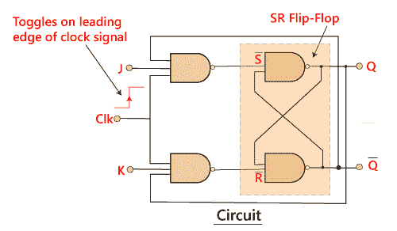
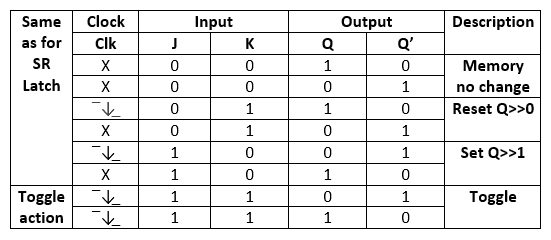

# JK 触发器

> 原文：<https://www.javatpoint.com/jk-flip-flop-in-digital-electronics>

SR 触发器或置位复位触发器有很多优点。但是，它有以下切换问题:

*   当设置“S”和重置“R”输入设置为 0 时，总是避免这种情况。
*   当使能输入为 1 时，置位或复位输入改变其状态时，会发生不正确的锁存动作。

JK 触发器消除了 [SR 触发器](https://www.javatpoint.com/sr-flip-flop-in-digital-electronics)的这两个缺点。

[JK 触发器](https://www.javatpoint.com/jk-flip-flop-in-digital-electronics)是数字电路中使用最多的触发器之一。JK 触发器是一种通用触发器，具有两个输入“J”和“K”。在 SR 触发器中，“S”和“R”是 Set 和 Reset 的缩写字母，但 J 和 K 不是。J 和 K 本身是自主字母，选择它们是为了将触发器设计与其他类型区分开来。

JK 触发器的工作方式与 SR 触发器相同。JK 触发器有“J”和“K”触发器，而不是“S”和“R”。JK 触发器和 SR 触发器的唯一区别是，当 SR 触发器的两个输入都设置为 1 时，电路产生无效状态作为输出，但是在 JK 触发器的情况下，即使“J”和“K”触发器都设置为 1，也没有无效状态。

JK 触发器是一个门控 SR 触发器，增加了一个时钟输入电路。当两个输入都设置为 1 时，会出现无效或非法输出情况，通过增加时钟输入电路可以防止这种情况。因此，JK 触发器有四种可能的输入组合，即 1、0、“无变化”和“切换”。除了增加一个时钟输入外，JK 触发器的符号与 **SR 双稳态锁存器**相同。

### 框图:

### 电路图:

在 SR 触发器中，输入“S”和“R”都被两个输入“J”和“K”代替。这意味着“J”和“K”输入分别等于“S”和“R”。

两个 2 输入与门被两个 3 输入[与非门](https://www.javatpoint.com/nand-gate-in-digital-electronics)取代。每个门的第三输入端连接到 Q 和 Q’端的输出端。SR 触发器的交叉耦合允许以前的无效条件(S =“1”，R =“1”)用于产生“切换动作”，因为两个输入现在是互锁的。

如果电路“置位”，J 输入从 Q’的“0”位置通过下与非门中断。如果电路“复位”，则通过上部与非门从 0 位置中断输入。由于 Q 和 Q’总是不同的，我们可以用它们来控制输入。当输入“J”和“K”都设置为 1 时，JK 根据给定的真值表切换触发器。

### 真值表:

当 JK 触发器的两个输入都设置为 1，并且时钟输入也为脉冲“高”时，电路将从设置状态切换到复位状态。当 JK 触发器的两个输入都设置为 1 时，它作为一个 T 型触发器工作。

JK 触发器是一种改进的钟控 SR 触发器。但它仍然受到**“种族”**问题的困扰。当输出 Q 的状态在时钟输入的定时脉冲到达**“关”**之前发生变化时，就会出现这个问题。为了避免这个周期，我们必须保持短的时间加周期。

* * *