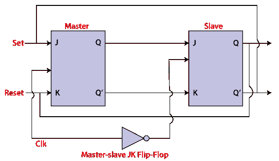
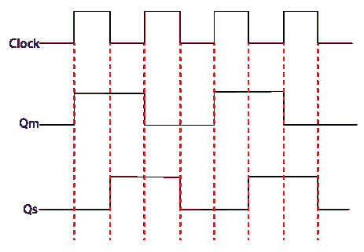

# 主从 JK 触发器

> 原文：<https://www.javatpoint.com/master-slave-jk-flip-flop-in-digital-electronics>

在“JK 触发器”中，当输入和 CLK 长时间设置为 1 时，Q 输出切换，直到 CLK 为 1。因此，不确定或不可靠的输出产生。这个问题在 JK 触发器中被称为比赛回合条件，通过确保 CLK 仅在非常短的时间内设置为 1 来避免这个问题。

## 说明

主从触发器由两个 [JK 触发器](https://www.javatpoint.com/jk-flip-flop-in-digital-electronics)组合而成。这些触发器以串联配置连接。在这两个触发器中，第一个触发器作为“主”工作，称为主触发器，第二个触发器作为“从”工作，称为从触发器。主从触发器的设计使得“主”触发器的输出被传递到“从”触发器[的两个输入端](https://www.javatpoint.com/basics-of-flip-flop-in-digital-electronics)。“从”触发器的输出传递到主触发器的输入。

在“主从触发器”中，除了这两个触发器之外，还使用了反相器或[非门](https://www.javatpoint.com/note-gate-in-digital-electronics)。为了将反相时钟脉冲传递到“从”触发器，反相器连接到时钟脉冲。简单来说，当 CP 为“主”设置为假时，那么 CP 为“从”设置为真，当 CP 为“主”设置为真时，那么 CP 为“从”设置为假。

### 工作:

*   当时钟脉冲为真时，从触发器将处于隔离状态，系统状态可能会受到 J 和 K 输入的影响。“从机”保持隔离，直到 CP 为 1。当 CP 设置为 0 时，主触发器将信息传递给从触发器以获得输出。
*   主触发器首先从从触发器响应，因为主触发器是正电平触发器，从触发器是负电平触发器。
*   当输入 J 设置为 0，K 设置为 1 时，主触发器的输出 Q’= 1 作为输入 K 传递给从触发器。时钟迫使从触发器作为复位工作，然后从触发器复制主触发器。
*   当 J=1，K=0 时，输出 Q=1 传递到从机的 J 输入端。时钟的负转换设置从机并复制主机。
*   当输入 J 和 K 设为 1 时，主触发器开启时钟的正向转换。此时，从触发器开启时钟的负转换。
*   触发器将被禁用，当 JK 触发器的两个输入都设置为 0 时，Q 保持不变。

### 主触发器的时序图:

*   当时钟脉冲设置为 1 时，主触发器的输出将为 1，直到时钟输入保持为 0。
*   当时钟脉冲再次变为高电平时，主机输出为 0，当时钟再次变为 1 时，主机输出将设置为 1。
*   当时钟脉冲为 1 时，主触发器工作。从机的输出保持为 0，直到时钟没有设置为 0，因为从机触发器不工作。
*   当时钟脉冲为 0 时，从触发器工作。主机的输出保持为 1，直到时钟不再设置为 0。
*   切换发生在整个过程中，因为输出在周期中改变一次。

* * *