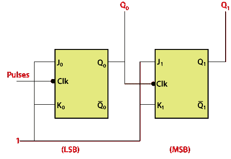
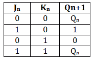
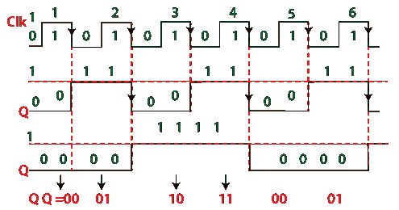
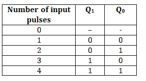

# 纹波计数器

> 原文：<https://www.javatpoint.com/ripple-counter-in-digital-electronics>

纹波计数器是一种特殊类型的**异步**计数器，其中时钟脉冲在电路中产生纹波。n-MOD 纹波计数器由 n 个触发器组合而成。n-MOD 纹波计数器可以计数 2n 个状态，然后计数器复位到初始值。

**波纹计数器的特性:**

*   使用具有不同时钟脉冲的不同类型的触发器。
*   这是一个异步计数器的例子。
*   触发器用于触发模式。
*   外部时钟脉冲仅施加到一个触发器。该触发器的输出被视为下一个触发器的时钟脉冲。
*   在计数序列中，外部时钟脉冲通过的触发器充当 LSB。

根据其电路设计，计数器分为以下类型:

**上行计数器**

上行计数器按升序对状态进行计数。

**向下计数器**

递减计数器按降序对状态进行计数。

**上下计数器**

向上和向下计数器是一种特殊类型的双向计数器，它对正向或反向状态进行计数。它也指可逆计数器。

## 二进制波纹计数器

一个**二进制计数器**是一个 **2-Mod 计数器**，它最多计数 2 位状态值，即 22 = 4 个值。具有类似于 T 和 JK 的触发条件的触发器用于构建**波纹计数器**。下面是**二进制纹波计数器**的电路图。

在二进制纹波计数器的电路设计中，使用了两个 JK 触发器。高压信号被传递到两个触发器的输入端。该高电压输入将触发器保持在状态 1。在 [JK 触发器](https://www.javatpoint.com/jk-flip-flop-in-digital-electronics)中，负触发时钟脉冲使用。

输出 Q 0 和 Q 1 分别是最低有效位和最高有效位。JK 触发器的真值表帮助我们理解计数器的功能。

当触发器的输入端有高电压时，JK 触发器出现第四种情况。当我们向触发器的输入端施加高电压时，触发器将处于状态 1。因此，触发器通过的状态在时钟脉冲的负向端切换。简而言之，当时钟脉冲从 1 转换到 0 时，触发器触发。

当负时钟沿传递到触发器时，输出 Q 0 的状态改变。最初，所有触发器都设置为 0。当传递的时钟从 1 变为 0 时，这些触发器改变它们的状态。当触发器的输入为 1 时，JK 触发器触发，然后触发器将其状态从 0 变为 1。对于所有的时钟脉冲，过程保持不变。

第一触发器的输出作为时钟脉冲传递给第二触发器。从上面的时序图可以清楚地看到，当输出 Q 0 从 1 转变为 0 时，第二触发器的状态发生了变化。输出 Q 0 和 Q 1 视为最低有效位和最高有效位。计数器对数值 00、01、10、11 进行计数。对这些值进行计数后，计数器会自我复位，并从 00、01、10 和 1 开始再次计数。时钟脉冲传递到 J 0 K 0 触发器之前的计数值。

* * *