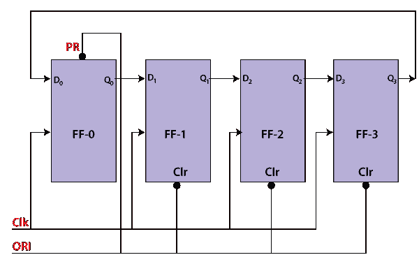
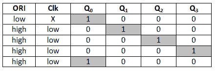
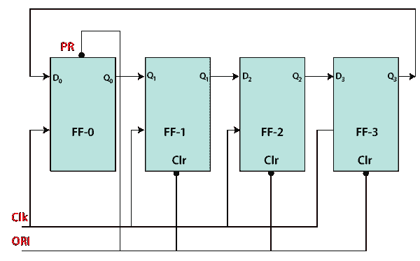
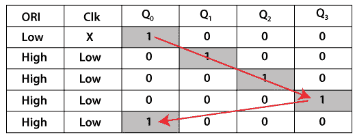
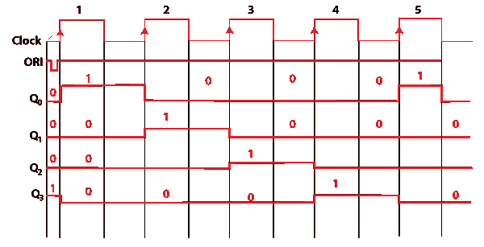
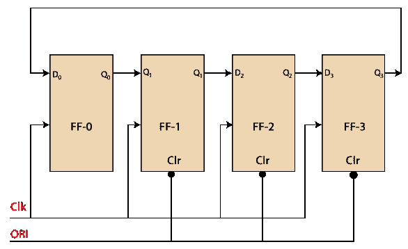
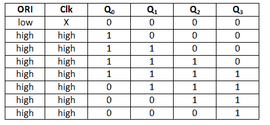
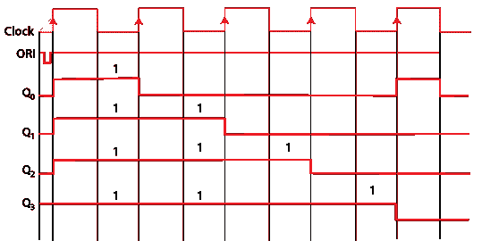

# 环形计数器

> 原文：<https://www.javatpoint.com/ring-counter-in-digital-electronics>

**环形计数器**是**串行输入串行输出**移位寄存器的一种特殊应用。移位寄存器和环形计数器之间的唯一区别是，最后一个触发器的输出作为移位寄存器的输出。但是在环形计数器中，这个结果作为输入传递给第一个触发器。环形计数器中所有剩余的东西都与移位寄存器相同。

在**环形计数器**中

No. of states in Ring counter = No. of flip-flop used

下面是 4 位环形计数器的框图。这里，我们用 4**T1】D 人字拖 T3】。相同的时钟脉冲作为同步计数器传递到所有触发器的时钟输入端。**超驰输入(ORI)** 用于设计该电路。**

覆盖输入用作**清除**和**预设**。



当预设值设置为 0 时，输出为 1。当清零设置为 0 时，输出为 0。PR 和 CLR 总是在值 0 下工作，因为它们是低电平有效信号。

```

PR = 0, Q = 1
CLR = 0, Q = 0

```

这两个值(总是固定的)与输入 D 和时钟脉冲(CLK)无关。

## 工作

ORI 输入被传递到第一个触发器的 PR 输入端，即 FF-0，它也被传递到其余三个触发器的清零输入端，即 FF-1、FF-2 和 FF-3。第一个触发器的预设输入设置为 0。因此，第一个触发器的输出为 1，其余触发器的输出为 0。第一触发器的输出用于在**环形计数器**中形成环形，并被称为**预置 1** 。



在上表中，高亮显示的 1 是**预设的 1** 。

**预设 1** 在以下情况下产生

*   ORI 输入设为低电平，此时 Clk 不关心。

*   当 ORI 输入设置为高电平时，低电平时钟脉冲信号作为负时钟沿触发通过。

当**预置 1** 在每个时钟脉冲被转移到下一个触发器时，形成一个环。

因此，4 位计数器有 4 种可能的状态，如下所示:

```

1 0 0 0
 0 1 0 0
 0 0 1 0
 0 0 0 1

```

## 环形计数器的类型

环形计数器分为以下两部分:

### 直环计数器

**直环计数器**指的是**一热计数器**。最后一个触发器的结果作为输入传递给第一个触发器。在环形计数器中，ORI 输入传递给第一个触发器的 PR 输入和其余触发器的清零输入。

#### 注:直环计数器使单个 1(或 0)位围绕环循环。

**逻辑图**



**真值表**



**信号图**



## 扭曲环形计数器

**扭环计数器**指的是**开关尾环计数器**。像**直环计数器**一样，最后一个触发器的结果作为输入传递给第一个触发器。在扭环计数器中，ORI 输入作为**清零**输入传递给所有触发器。

#### 注意:扭转环计数器在环周围循环一串 1 后跟 0。

**逻辑图**



**真值表**



**信号图**



* * *