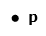
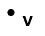
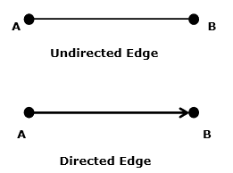
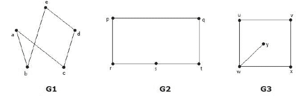

# 基本概念

> 原文：<https://www.javatpoint.com/graph-theory-fundamental-concepts>

**图论**的一些基本基本概念是:

## 1.要点

一个**点**是位于空间中的一个特定位置。空间可以是一维、二维或三维空间。点用于表示图形中的一个点，它由字母、数字或字母数字值标记。

### 例子

这里，点是一个标有“p”的点。

* * *

## 2.线条

两点通过**线**相互连接。一条**线**是两点之间的连线。它用实线表示。

### 例子

在这里，‘A’和‘B’是点，两点之间的联系叫做线。

* * *

## 3.顶点

一个**顶点**是图中一个点的同义词，即在其上定义了图并且可以通过线/边连接的一个点被称为顶点。

顶点也称为“节点”、“点”或“交叉点”。顶点由字母、数字或字母数字值表示。

### 例子

这里，点是用字母“v”标记的顶点。

* * *

## 4.边缘

**边**是两个顶点之间的连接。每条边将图中的一个顶点连接到另一个顶点。没有顶点，就不能形成边。它也被称为线、分支、链接或弧。

边缘可以是**定向的**或**无定向的**。有向边是指从一个顶点指向另一个顶点的边，无向边没有方向。

如果从顶点 A 到 B 有一条有向边，从 B 到 A 有一条有向边，这基本上相当于一条连接 A 和 B 的无向边

### 例子

这里，**‘A’和‘B’**是**顶点**，它们之间的连线‘AB’称为一条**边**。

* * *

## 图表

**图形**指定“函数图形”或“函数图形”，即**图**。

在数学术语中，图形是点和线的集合，连接它们的一些(可能是空的)子集。

图 G 定义为 G = {V，E}，其中 V 是所有顶点或点的集合，E 是图中所有边的集合。

### 例 1

在上面的例子中，A、B、C、D 和 E 是图的顶点，AB、BC、CA 和 AD 是图的边。

### 例 2

在上面的例子中，G1、G2 和 G3 是曲线图。