# 图的类型

> 原文：<https://www.javatpoint.com/graph-theory-types-of-graphs>

尽管根据顶点的数量、边的数量、互连性以及它们的整体结构，有许多不同类型的图，但是这些常见类型的图如下:

## 1.零图

**空图**是顶点之间没有边的图。空图也称为空图。

### 例子

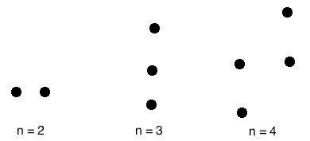

有 n 个顶点的空图用 Nn 表示。

* * *

## 2.平凡图

一个**平凡图**就是只有一个顶点的图。

### 例子

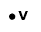

在上图中，只有一个没有任何边的顶点“v”。因此，它是一个微不足道的图。

* * *

## 3.简单图形

一个**简单图**是**无平行边**和**无环**的无向图。

A simple graph which has n vertices, the degree of every vertex is at most n -1.

### 例子

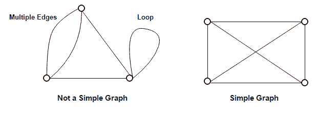

在上面的例子中，First 图不是一个简单的图，因为它在顶点 A 和 B 之间有两条边，并且它还有一个循环。

第二个图是一个简单的图，因为它不包含任何循环和平行边。

* * *

## 4.无向图

一个**无向图**是一个其边是**而不是有向**的图。

### 例子

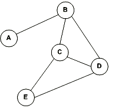

在上图中由于没有有向边，所以是无向图。

* * *

## 5.有向图

**有向图**是其中**边由箭头指向**的图。

有向图也称为**有向图**。

### 例子

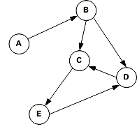

在上图中，每条边都由箭头指向。有向边有一个从 A 到 B 的箭头，表示 A 与 B 有关，但 B 与 A 无关。

* * *

## 6.完全图

每对顶点恰好由一条边连接的图称为**完全图**。它包含所有可能的边。

有 n 个顶点的完全图恰好包含 nC2 条边，用 Kn 表示。

### 例子

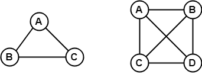

在上面的例子中，由于图中的每个顶点都通过一条边与所有剩余的顶点相连，所以这两个图都是完全图。

* * *

## 7.连通图

一个**连通图**是一个我们可以从任意一个顶点访问到任意其他顶点的图。在连通图中，每对顶点之间至少有一条边或路径。

### 例子


在上面的例子中，我们可以从任何一个顶点遍历到任何其他顶点。这意味着每对顶点之间至少有一条路径，因此，它是一个连通图。

* * *

## 8.不连通图

**不连续图**是指每对顶点之间不存在任何路径的图。

### 例子

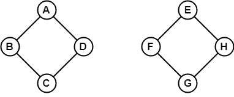

上图由两个不相连的独立组件组成。因为不可能从一个组件的顶点访问到其他组件的顶点，所以它是一个断开的图。

* * *

## 9.正则图

A **正则图**是所有顶点的度数都相同的图。

如果所有顶点的度都是 k，则称之为 k 正则图。

### 例子

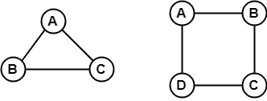

在上面的例子中，所有的顶点都是 2 度。因此它们被称为 2- **正则图**。

* * *

## 10.循环图

一个有“n”个顶点(其中，n>=3)和“n”条边组成一个所有边都为“n”的循环的图称为**循环图**。

包含至少一个循环的图称为**循环图**。

在循环图中，每个顶点的度数是 2。

有 n 个顶点的循环图用 Cn 表示。

### 例 1

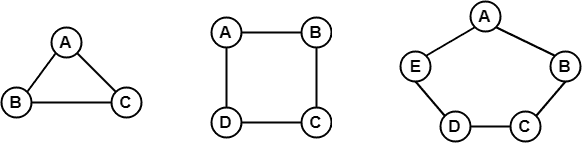

在上面的例子中，所有的顶点都是 2 度。因此它们都是循环图。

### 例 2

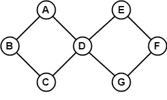

因为上面的图包含两个循环，所以它是一个循环图。

* * *

## 11.无圈图

不包含任何循环的图称为**非循环图**。

### 例子

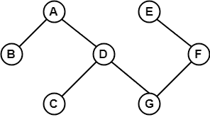

因为上面的图不包含任何循环，所以它是一个非循环图。

* * *

## 12.偶图

一个**二部图**是这样一个图，其中顶点集可以被分成两个集合，这样边只在集合之间，而不是在集合内。

如果一个图 G (V，E)的顶点集 V(G)可以分解成两个非空的不相交子集 V1(G)和 V2(G)，使得每个边 e ∈ E(G)在 V1(G)有最后一个关节，在 V2(G)有最后一个点，则称之为二部图。

划分 V = V1 ∪ V2 称为 g 的二分

### 例 1

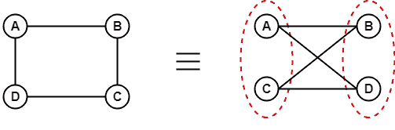

### 例 2

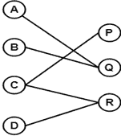

* * *

## 13.完全二部图

一个**完全二部图**是一个二部图，其中第一个集合中的每个顶点正好通过一条边与第二个集合中的每个顶点相连。

完全二部图是完全的二部图。

```

Complete Bipartite graph =   Bipartite graph + Complete graph

```

### 例子

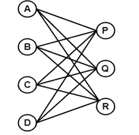

上图称为 K <sub>4</sub> 、 <sub>3</sub> 。

* * *

## 14.星形图

星形图是一个完整的二部图，其中 n -1 个顶点的度数为 1，单个顶点的度数为(n-1)。这看起来就像一个星形，其中(n - 1)个顶点连接到一个中心顶点。

有 n 个顶点的星形图用 S <sub>n</sub> 表示。

### 例子

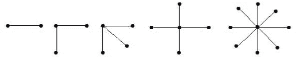

在上面的例子中，在 n 个顶点中，所有(n-1)个顶点都连接到一个顶点。因此，它是一个星图。

* * *

## 15 加权图

加权图是其边已经用一些权重或数字标记的图。

加权图中路径的长度是路径中所有边的权重之和。

### 例子

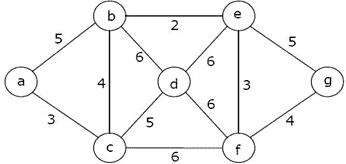

在上图中，如果路径是 a -> b -> c -> d -> e -> g，那么路径的长度是 5 + 4 + 5 + 6 + 5 = 25。

* * *

## 16.多图

任何一对顶点之间有多条边或者从一个顶点到它本身(循环)有边的图称为**多图**。

### 例子

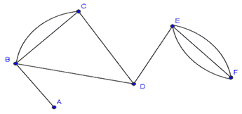

在上图中，顶点集 B 和 C 与两条边相连。类似地，顶点集 E 和 F 用 3 条边连接。因此，它是一个多图。

* * *

## 17.平面图

一个**平面图**是我们可以在一个平面上画出这样一个图，它的两条边除了在它们所入射的一个顶点之外，没有任何一条互相交叉。

### 例子

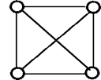

上面的图可能看起来不是平面的，因为它有互相交叉的边。但是我们可以重新绘制上面的图形。

上图的三个平面图是:

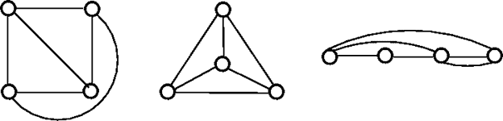

上面的三个图不是由两条互相交叉的边组成的，因此，上面所有的图都是平面的。

* * *

## 18.非平面图

不是平面图的图称为非平面图。换句话说，没有至少一对交叉边就不能画出的图称为非平面图。

### 例子

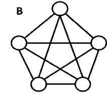

上图是非平面图。