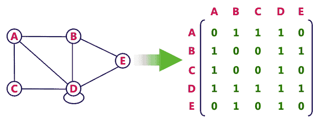
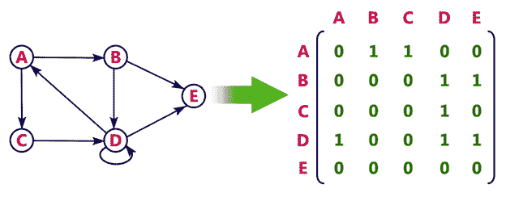
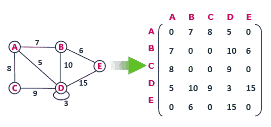
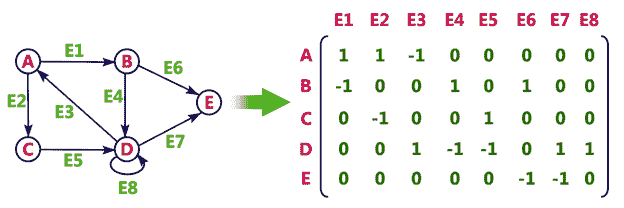
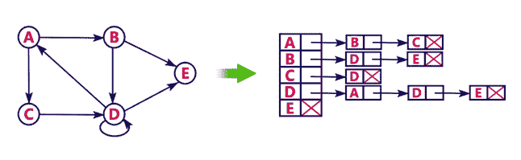
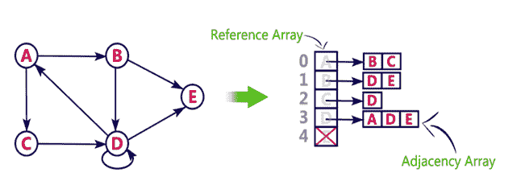

# 图形表示

> 原文：<https://www.javatpoint.com/graph-theory-graph-representations>

在图论中，图形表示是一种将图形存储到计算机内存中的技术。

为了表示一个图，我们只需要顶点的集合，以及每个顶点的邻居(通过一条边与它直接相连的顶点)。如果是加权图，那么权重将与每条边相关联。

根据图形边缘的密度、要执行的操作类型和易用性，有不同的方法可以最佳地表示图形。

## 1.邻接矩阵

*   邻接矩阵是一种顺序表示。
*   它用于表示哪些节点彼此相邻。即是否有任何边将节点连接到图。
*   在这个表示中，我们要构造一个 nXn 矩阵 A，如果从一个顶点 I 到顶点 j 有任何边，那么 A 的对应元素，a i ， j = 1，否则 a i ， j = 0。

#### 注意，即使 100 个顶点上的图只包含一条边，我们仍然必须有一个 100x100 的矩阵，其中有很多零。

*   如果有任何加权图，那么我们可以存储边的权重，而不是 1 和 0。

### 例子

考虑以下**无向图表示**:

**无向图表示**

**有向图表示**

请参见有向图表示:

在上面的例子中，1 表示从行顶点到列顶点的边，0 表示从行顶点到列顶点没有边。

**无向加权图表示**

**优点:**表示更容易实现和遵循。

**Cons:** 访问一个顶点的所有邻居需要花费大量的空间和时间，我们要遍历图中的所有顶点，这需要花费相当多的时间。

* * *

## 2.关联矩阵

在**关联矩阵表示**中，可以使用大小矩阵来表示图形:

顶点总数乘以边总数。

这意味着如果一个图有 4 个顶点和 6 条边，那么它可以用一个 4×6 类的矩阵来表示。在这个矩阵中，列代表边，行代表顶点。

该矩阵用 **0 或 1** 或-1 填充。哪里，

*   0 用于表示未连接到列顶点的行边缘。
*   1 用于表示作为输出边连接到列顶点的行边。
*   -1 用于表示作为输入边连接到列顶点的行边。

### 例子

考虑下面的有向图表示。

* * *

## 3.邻接表

*   邻接表是一种链接表示。
*   在这种表示中，对于图中的每个顶点，我们维护其邻居的列表。这意味着，图的每个顶点都包含其相邻顶点的列表。
*   我们有一个由顶点数索引的顶点数组，对于每个顶点 v，对应的数组元素指向 v 的邻居的**单链表**

### 例子

让我们看看下面使用链表实现的有向图表示:

我们还可以使用数组实现这种表示，如下所示:

**优点:**

*   邻接表节省了大量空间。
*   我们可以很容易地插入或删除，因为我们使用链表。
*   这种表示很容易理解，并且清楚地显示了节点的相邻节点。

cons:t1]

*   邻接表允许测试两个顶点是否彼此相邻，但支持此操作的速度较慢。