# 树木和森林

> 原文：<https://www.javatpoint.com/graph-theory-tree-and-forest>

## 1.什么是树和森林？

### 树

*   在图论中，**树**是一个**无向、连通和无环图**。换句话说，一个连通图，即使不包含单个循环，也叫做树。
*   树以图形形式表示层次结构。
*   树的元素称为它们的节点，树的边称为分支。
*   有 n 个顶点的树有(n-1)条边。
*   在计算机科学的数据结构中，树提供了许多有用的应用，从简单的家谱到复杂的树。
*   树中的一片**叶子**是 1 度的顶点，或者任何没有孩子的顶点都被称为叶子。

### 例子

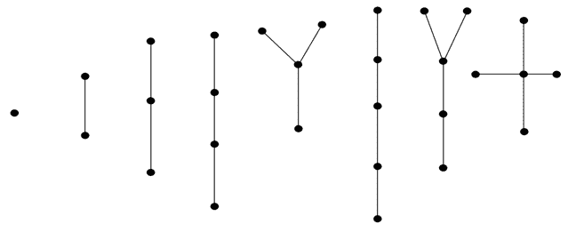

在上面的例子中，所有的树都少于 6 个顶点。

### 森林

在图论中，一个**森林**是**一个无向的、不连续的、无环的图**。换句话说，不相交的树木集合被称为森林。森林的每个组成部分都是树。

### 例子

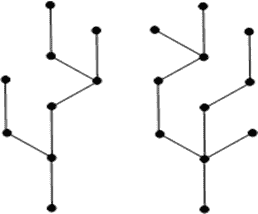

上面的图看起来像两个子图，但它是一个单独的断开图。上图中没有循环。因此它是一片森林。

* * *

## 2.树的性质

1.  每个至少有两个顶点的树应该至少有两片叶子。
2.  树有很多刻画:
    设 T 是一个有 n 个顶点的图，那么下面的语句是等价的:
    *   t 是一棵树。
    *   t 不含圈，有 n-1 条边。
    *   t 是连通的，有(n -1)条边。
    *   t 是连通图，每条边都是割边。
    *   图 T 的任意两个顶点恰好由一条路径连接。
    *   T 不包含循环，对于任何新边 e，图 T+ e 正好有一个循环。
3.  树的每一条边都是切边的。
4.  给树添加一条边正好定义了一个循环。
5.  每个连通图都包含一棵生成树。
6.  每棵树至少有两个二级顶点。

* * *

## 3.生成树

连通图 G 中的**生成树**是 G 的子图 H，包含 G 的所有顶点，也是一棵树。

### 例子

考虑下面的图表 G:

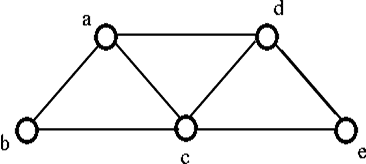

从上面的图 G 中，我们可以实现以下三个生成树 H:

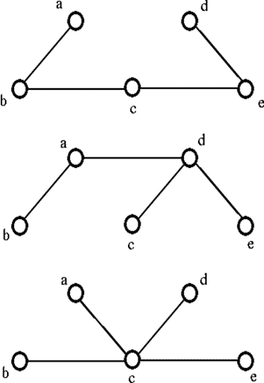

## 查找生成树的方法

我们可以使用以下两种方法之一来系统地找到生成树:

1.  切割方法
2.  建立方法

### 1.切割方法

*   开始选择图形 g 中的任意循环
*   移除循环的一条边。
*   重复此过程，直到没有剩余的周期。

### 例子

*   考虑一个图 G，

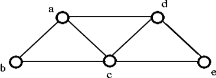

*   如果我们去掉上图中破坏循环 a-d-c-a 的边 ac，那么我们得到如下图:

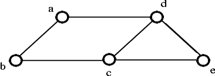

*   从上图中去掉破坏循环 a-d-c-b-a 的边 cb，我们得到如下图:

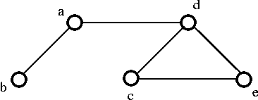

*   如果我们从上面的图中去掉破坏循环 d-e-c-d 的边 ec，那么我们得到下面的生成树:

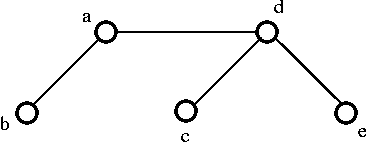

### 2.建立方法

*   一次选择图形 G 的一条边。以这种方式，没有周期被创造。
*   重复此过程，直到包括所有顶点。

### 例子

考虑下面的图 G，


*   选择边缘 **ab** ，

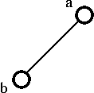

*   选择边缘 **de** ，

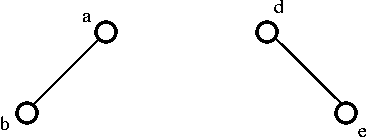

*   之后，选择边缘 **ec** ，


*   接下来选择边 **cb** ，最后得到如下生成树:

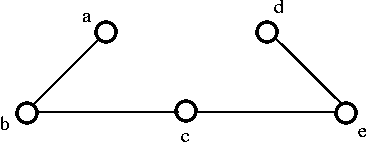

### 电路等级

为了得到生成树，我们需要从 G 中删除的边的数量。

**生成树 G = m- (n-1)** ，称为 G 的**电路秩**

```

Where, m = No. of edges.
n = No. of vertices.

```

### 例子


在上图中，边 m = 7，顶点 n = 5

那么电路等级是，

```

G = m - (n - 1)
   = 7 - (5 - 1) 
   = 3

```