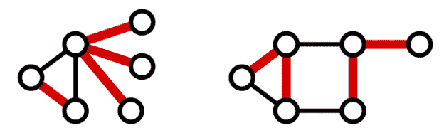
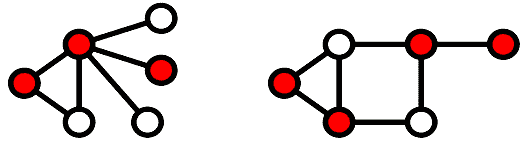
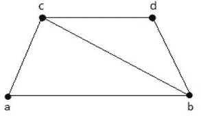
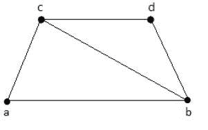

# 覆盖层

> 原文：<https://www.javatpoint.com/graph-theory-coverings>

图 G 的图覆盖是图 G 的一个子图，它包含对应于其他图的所有顶点或所有边。

包含所有顶点的子图称为线/边覆盖。包含所有边的子图称为顶点覆盖。

## 1.边缘覆盖

覆盖图 G 所有顶点的一组边称为图 G 的**线覆盖或边覆盖**

当且仅当 G 有一个孤立顶点时，不存在边覆盖。

有 n 个顶点的图 G 的边覆盖至少有 n/2 条边。

### 例子



在上图中，红色的边代表图的边覆盖中的边。

## 最小线覆盖

图 G 的线覆盖 M 如果没有边可以从 M 中删除，则称其为最小线覆盖**。**

或者最小边覆盖是图 G 的边覆盖**，而不是任何其他边覆盖**的适当子集。

没有最小线覆盖包含循环。

### 例子


从上面的图中，具有边缘覆盖的子图是:

```
M1 = {{a, b}, {c, d}}
M2 = {{a, d}, {b, c}}
M3 = {{a, b}, {b, c}, {b, d}}
M4 = {{a, b}, {b, c}, {c, d}}

```

这里，M <sub>1</sub> ，M <sub>2</sub> ，M <sub>3</sub> 是极小的线覆盖，但是 M <sub>4</sub> 不是因为我们可以删除{b，c}。

## 最小线覆盖

边数最小的**极小线覆盖**称为图 g 的极小线覆盖，也称为**极小线覆盖**。

每个最小边覆盖都是一个最小边凹，但反过来不一定存在。

G 中最小线覆盖的边数称为 G 的线覆盖数，用α <sub>1</sub> 表示。

### 例子


从上面的图中，具有边缘覆盖的子图是:

```
M1 = {{a, b}, {c, d}}
M2 = {{a, d}, {b, c}}
M3 = {{a, b}, {b, c}, {b, d}}
M4 = {{a, b}, {b, c}, {c, d}}

```

在上例中，M <sub>1</sub> 和 M <sub>2</sub> 是 G 和α <sub>1</sub> = 2 的最小边覆盖。

* * *

## 2.顶点覆盖

覆盖图 G 的所有节点/顶点的一组顶点被称为图 G 的**顶点覆盖**

例子



在上面的例子中，每个红色标记的顶点都是图的顶点覆盖。这里，每个图中所有红色顶点的集合接触图中的每条边。

## 最小顶点覆盖

如果图 G 的一个顶点 M 不能从 M 中删除，则称它是最小顶点覆盖

### 例子



从上图中可以得出的子图有:

```
M1 = {b, c}
M2 = {a, b, c}
M3 = {b, c, d}

```

这里，M <sub>1</sub> 和 M <sub>2</sub> 是最小顶点覆盖，但是在 M <sub>3</sub> 中，顶点‘d’可以被删除。

## 最小顶点覆盖

当图 g 中覆盖了最小数量的顶点时，称之为最小顶点覆盖，也称之为最小最小顶点覆盖。

图 G 中最小顶点覆盖的**顶点数**称为 G 的顶点覆盖数，用α <sub>2</sub> 表示。

### 例 1


在上面的图中，最小顶点覆盖的顶点是红色的。

**α <sub>2</sub>** = 3 为第一个图形。

**和α <sub>2</sub>** = 4 为第二个图形。

### 例 2



从上图中可以得出的子图有:

```
M1 = {b, c}
M2 = {a, b, c}
M3 = {b, c, d}

```

这里，M1 是 G 的最小顶点覆盖，因为它只有两个顶点。因此，α <sub>2</sub> = 2。