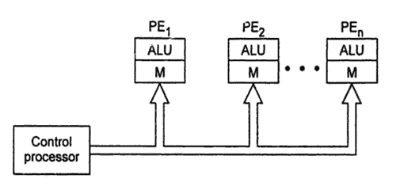

# 微处理器的类型

> 原文：<https://www.javatpoint.com/types-of-microprocessors>

## 向量处理器

一个**向量处理器**被设计用于向量计算。向量是相同类型的操作数的数组。考虑以下向量:

```
Vector A (a1, a2, a3, ......., an)
Vector B (b1, b2, b3,......., bn)
Vector C = Vector A + Vector B 
         = C(c1, c2, c3, .......,cn), where c1 = a1+ b1, c2 = a2 + b2, .....,Cn= an + bn.

```

矢量处理器使用单个矢量指令将矢量 A 和矢量 B 的所有元素相加，硬件方法为**。**

 ****矢量处理器的例子有:**

*   DEC 的 VAX 9000，
*   IBM 390/VF，
*   CRAY 研究 Y-MP 家族，
*   日立的 S-810/20 等。

* * *

## 阵列处理器或 SIMD 处理器

**阵列处理器**也是为矢量计算而设计的。阵列处理器和矢量处理器的区别在于矢量处理器使用多个矢量流水线，而阵列处理器使用多个处理元件并行操作。

一个阵列处理器包含多个算术逻辑单元。每个算术逻辑单元都配有本地存储器。算术逻辑单元和本地存储器一起被称为处理单元。阵列处理器是 **SIMD(单指令多数据)**处理器。因此，使用单个指令，可以对数据数组执行相同的操作，这使得它适合向量计算。



**图:-阵列处理器或 SIMD 处理器的示意图**

* * *

## 标量和超标量处理器

执行标量数据的处理器称为标量处理器。最简单的标量处理器只使用定点操作数处理整数指令。强大的标量处理器可以处理整数和浮点数。它在同一个中央处理器芯片上包含一个整数算术逻辑单元和一个浮点单元。

**标量处理器可以是 RISC 处理器或 CISC 处理器**。

**CISC 处理器的例子有:**

*   英特尔 386，486；摩托罗拉的 68030，68040；等等。

**RISC 标量处理器的例子有:**

*   英特尔 i860、摩托罗拉 MC8810、太阳的 SPARC CY7C601 等。

一个**超标量处理器**有多个流水线，每个时钟周期执行一条以上的指令。

超标量处理器的例子有:

*   奔腾、奔腾 Pro、奔腾 II、奔腾 III 等。

* * *

## RISC 和 CISC 处理器

RISC 代表**精简指令集计算机和**

CISC 代表**复杂指令集计算机**。

微处理器控制单元的设计有两种方法，即

*   硬件方法和
*   软件方法。

**RISC 处理器:-** 要执行一条指令，需要多个步骤。通过处理器的控制单元，为每个步骤产生多个控制信号。为了执行每个指令，如果在控制单元中有一个单独的电子电路，它产生所有必要的信号，这种处理器控制部分的设计方法被称为 **RISC** 设计。这是硬件方法。这也被称为硬连线方法。

**RISC 处理器的例子有:**

*   DEC 的 Alpha 21064、21164 和 21264 处理器；
*   SUN 的 SPARC 和 ULTRA SPARC；
*   PowerPC 处理器等。

**CISC 处理器:-** 如果控制单元包含多个微电子电路以产生一组控制信号，并且每个微电路由微码激活，则这种设计方法被称为 CISC 设计。这是一种设计处理器控制单元的软件方法。

**CISC 处理器的例子有:**

*   英特尔 386，486；
*   奔腾 Pro，奔腾，奔腾 II，奔腾 III，奔腾 4；
*   摩托罗拉的 68000、68020、68030、68040 等。

【RISC 和 CISC 的区别

| 没有。 | 精简指令集计算 | 复杂指令集电脑(complex instruction set computer) |
| 1. | 简单指令集 | 复杂指令集 |
| 2. | 由大量寄存器组成。 | 寄存器数量减少 |
| 3. | 大型计划 | 较小的程序 |
| 4. | 简单的处理器电路(少量晶体管) | 复杂的处理器电路(更多数量的晶体管) |
| 5. | 更多内存使用 | 很少使用内存 |
| 6. | 简单寻址模式 | 多种寻址模式 |
| 7. | 固定长度指令 | 可变长度指令 |
| 8. | 执行一条指令的固定时钟周期数 | 每个指令的可变时钟周期数 |

* * *

## 数字信号处理器

**DSP** 专门设计用于处理信号的微处理器。它们接收一些数字化的信号信息，对信息进行一些数学运算，并将结果提供给输出设备。它们实现积分、微分、复数快速傅里叶变换等。使用硬件。

**数字信号处理器的例子有:**

*   德州仪器的 TMS 320C25，
*   摩托罗拉 56000，
*   国家 LM 32900，
*   富士通 MBB 8764 等。

* * *

## 符号处理器

**符号处理器**设计用于专家系统、机器智能、基于知识的系统、模式识别、文本检索等。

**为人工智能执行的基本操作有:**

Logic interference, compare, search, pattern matching, filtering, unification, retrieval, reasoning, etc. This type of processing does not require floating point operations. Symbolic processors are also called **LISP processors or PROLOG processors**.

* * *

## 位片处理器

期望字长的处理器是使用构造块开发的。基本的构造块称为位片(Bit-Slice)，其中的构造块包括 4 位算术逻辑单元、微程序定序器、进位前瞻发生器等。之所以使用“片”这个词，是因为使用了所需数量的算术逻辑单元和其他组件来构建 8 位、16 位或 32 位的中央处理器。

**位片处理器的例子有:**

*   AMD-2900，AMD 2909，AMD 2910，AMD 29300 系列，
*   德州仪器的 SN-74AS88XX 系列等。

* * *

## 子宫切除术

在多处理器系统中，晶片机是一种专门设计的微处理器，用作组件处理器。

晶片机是在 20 世纪 80 年代末引入的。它们建立在超大规模集成电路芯片上，包含处理器、存储器和通信链路。通信链路是为了在子宫之间提供点对点连接。

晶片机包含 FPU、片上 RAM、高速串行链路等。

**子宫切除的例子有:**

*   INMOS T414、INMOS T800 等。

其中，T414 是一个 32 位处理器，内存为 2 KB。T800 是 32 位晶片机的 FPU 版本，内存为 4 KB。

* * *

## 图形处理器

图形处理器是专门为图形设计的处理器。英特尔开发了英特尔 740-3D 图形芯片。它针对奔腾二电脑进行了优化，采用了超流水线 3D 架构，并增加了 2D 加速。像大多数 3D 图形芯片一样，I-740 将在性能方面上市，而不是主流类别。它主要是为游戏和电影等繁重的多媒体用途而设计的。

**图形处理器的例子有:**

*   英特尔 82786 图形协处理器
*   IBM 的 8514/A，
*   德州仪器的 TMS34010 和 TMS34020，
*   英特尔 i860 和英特尔 i750 等。**