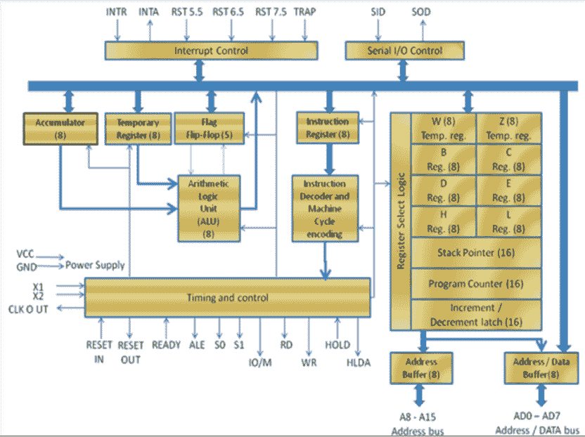
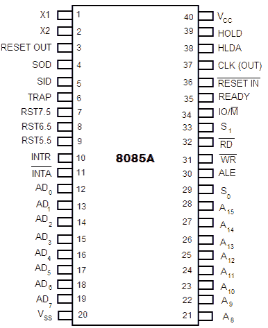
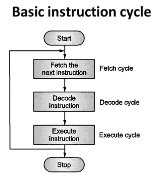
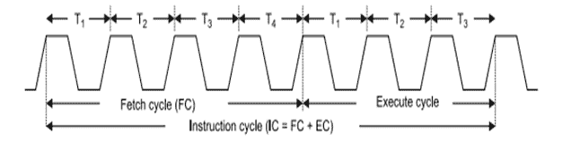
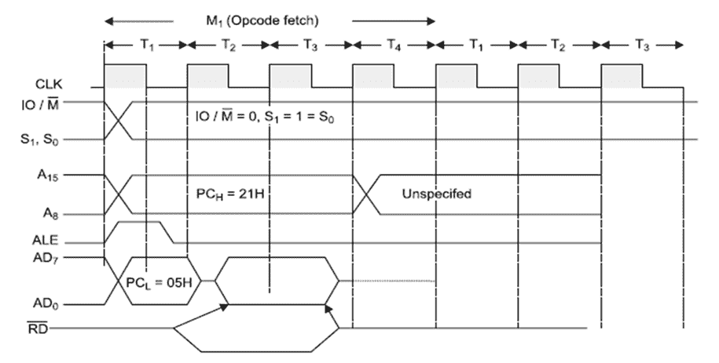
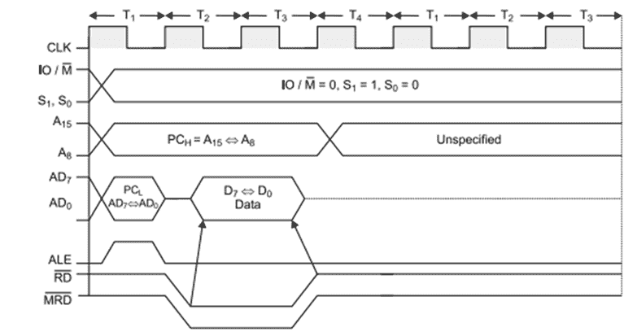
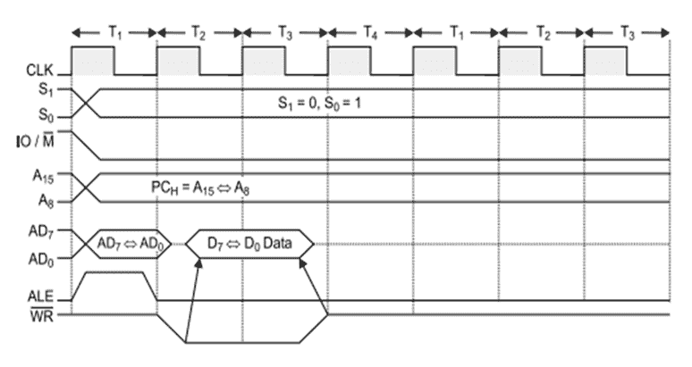
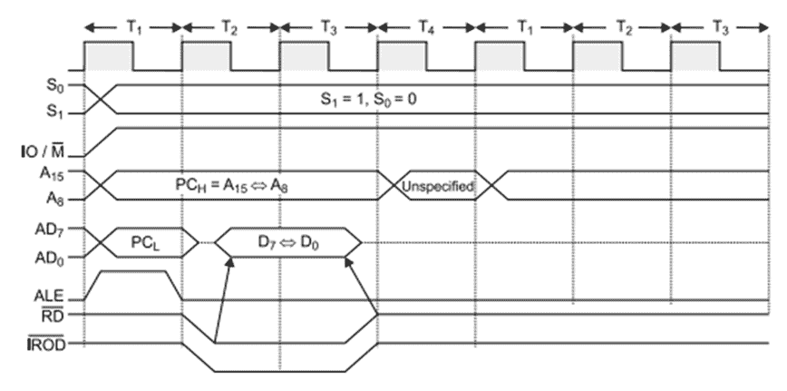
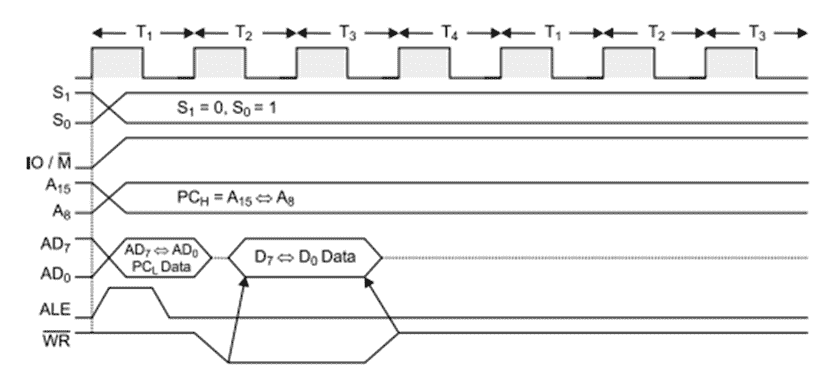
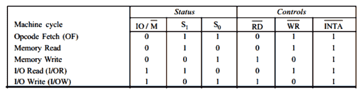

# 微处理器体系结构

> 原文：<https://www.javatpoint.com/microprocessor-architecture>

**微处理器**是电脑的 CPU(中央处理器)。它是计算机的心脏。这里，我们将描述英特尔 8085，因为它是最受欢迎的 8 位微处理器之一。

## 英特尔 8085

英特尔 8085 是英特尔在 1977 年设计的 8 位 NMOS 微处理器。

**配置如下:**

*   它是一个 40 引脚的集成电路封装，在单个大规模集成电路芯片上制造。
*   英特尔 8085 采用+5Vd 直流单电源供电。
*   英特尔 8085？s 时钟速度约为 3 MHz 时钟周期为 320ns。
*   8 ?位数据总线。
*   地址总线为 16 位，最高可寻址 64KB
*   16 位堆栈指针
*   16 位计算机(程序计数器)
*   六个 8 位寄存器成对排列:BC、DE、HL

英特尔 8085 用于手机、微波炉、洗衣机等。

下图为英特尔 8085 的**框图:**



* * *

## 土豆

**算术和逻辑单元**，算术逻辑单元执行算术和逻辑运算:

*   添加
*   减法
*   逻辑“与”
*   逻辑或
*   逻辑异或
*   补码(逻辑非)
*   增量(加 1)
*   减量(减 1)
*   向左移动，向左旋转，向右旋转
*   清除等。

* * *

## 定时和控制单元

**计时控制单元**是 CPU 的部分。

*   它用于产生执行指令所必需的定时和控制信号。
*   它用于控制中央处理器和外围设备(包括内存)之间的数据流。
*   它用于提供存储器和输入输出设备运行所需的状态、控制和定时信号。
*   它用于控制微处理器和与之相连的外围设备的全部操作。

因此，我们可以看到，中央处理器的控制单元充当计算机系统的大脑。

* * *

## 登记

**寄存器**用于微处理器对数据和指令的临时存储和操作。数据保留在寄存器中，直到它们被发送到输入/输出设备或存储器。英特尔 8085 微处理器具有以下寄存器:

*   一个 8 位累加器，即寄存器 A
*   六个 8 位通用寄存器，分别是 B、C、D、E、H 和 L
*   一个 16 位堆栈指针
*   一个 16 位程序计数器，电脑
*   指令寄存器
*   暂存寄存器

除上述寄存器外，8085 微处理器还包含一组五个触发器，用作标志(或状态标志)。

标志是一个触发器，它指示算术或逻辑指令执行后出现的一些情况。

1.  **累加器(ACC):** 累加器是一个与算术逻辑单元相关联的 8 位寄存器。寄存器“A”是 8085 中的累加器。它用于保存算术和逻辑运算的操作数之一。
    算术或逻辑运算的最终结果也存储在累加器中。
2.  **通用寄存器:**8085 微处理器包含 6 个 8 位通用寄存器。它们是:B、D、C、E、H 和 L 寄存器。
    为了保存 16 位数据，可以使用两个 8 位寄存器的组合。
    两个 8 位寄存器的组合称为**寄存器对**。8085 中的有效寄存器对是:D-E、B-C 和 H-L。H-L 对用作内存指针。
3.  **程序计数器(PC):** 是一个 16 位专用寄存器。它用于保存要执行的下一条指令的内存地址。它跟踪程序中正在执行的指令。
    微处理器在指令执行期间递增下一个程序计数器的内容，以便在指令执行结束时指向下一条指令？程序中的地址。
4.  **堆栈指针(SP):** 是用作内存指针的 16 位特殊功能寄存器。堆栈只不过是内存的一部分。在堆栈中，只保存那些寄存器的内容，这在程序的后面部分是需要的。
    堆栈指针(SP)控制堆栈的寻址。堆栈指针包含存储在堆栈中的数据的顶部元素的地址。
5.  **指令寄存器:**指令寄存器保存正在被解码和执行的指令的操作码(操作码或指令代码)。
6.  **临时寄存器:**是一个与算术逻辑单元相关联的 8 位寄存器。它在算术/逻辑运算期间保存数据。它由微处理器使用。程序员无法访问它。
7.  **标志:**英特尔 8085 微处理器包含五个触发器，用作状态标志。触发器根据算术或逻辑运算期间出现的条件进行复位或设置。

**英特尔 8085 的五个状态标志是:**

*   进位标志
*   奇偶校验标志
*   辅助进位标志
*   零标志(z)
*   标志

如果一个特定标志的触发器被置位，那么它指示 1。复位时，它指示 0。

* * *

## 数据和地址总线

*   英特尔 8085 是一款 8 位微处理器。它的**数据总线**是 8 位宽，因此，8 位数据可以从微处理器并行传输或传输到微处理器。
*   英特尔 8085 需要 16 位宽的**地址总线**，因为内存地址是 16 位的。
*   地址的 8 个最高有效位由地址总线 A 总线传输(引脚 A <sub>8</sub> ？一 <sub>15</sub> )。
*   地址的 8 个最低有效位通过数据/地址总线 AD-bus 传输(引脚 AD <sub>0</sub> ？公元 <sub>7</sub> 。

* * *

## 引脚配置



**图:英特尔 8085 微处理器**引脚图

各种引脚的描述如下:

**地址总线和数据总线**

*   **A <sub>8</sub> ？A <sub>15</sub> (输出):**这些是**地址总线**，用于存储地址的最高有效位或 8 位输入/输出地址。
*   **公元 <sub>0</sub> ？AD <sub>7</sub> (输入/输出):**这些是时间复用的**地址/数据总线**，即它们具有双重用途。在第一个周期中，它们用于存储地址或输入/输出地址的最低有效 8 位。同样，它们在第二和第三个时钟周期用于数据。

**控制和状态信号**

*   **ALE(输出):** ALE 代表**地址锁存使能**信号。ALE 在机器周期的第一个时钟周期变为高电平，使地址的低 8 位能够锁存到存储器或外部锁存器中。
*   **IO/M(输出):**是一个**状态信号**，用来区分地址是内存还是输入输出设备。
*   **S <sub>0</sub> ，S <sub>1</sub> (输出):**这些是微处理器发送的**状态信号**，用于区分下表中给出的各种操作类型:

**英特尔 8085 的状态代码**

| S <sub>1</sub> | S <sub>0</sub> | 操作 |
| Zero | Zero | 停止 |
| Zero | one | 写 |
| one | Zero | 阅读 |
| one | one | 取得 |

*   **RD(输出):** RD 是一个**信号，用于控制读取操作**。当它变低时，选定的输入/输出设备或内存被读取。
*   **WR(输出):** WR 是**控制写操作**的信号。当它变低时，数据总线的数据被写入选定的存储器或输入/输出位置。
*   **就绪(输入):**微处理器用它来检测外设是否准备好传输数据。如果 READY 为高电平，则外设已就绪。如果是低电平，微处理器会一直等到高电平。

**中断和外部启动信号**

*   **保持(输入):**保持表示另一个设备正在请求使用地址和数据总线。
*   **HLDA(输出):** HLDA 是**保持确认**的信号，表示已经收到保持请求。删除该请求后，HLDA 变低。
*   **INTR(输入):** INTR 是一个**中断请求信号**。在中断中，它的优先级最低。INTR 由软件启用或禁用。
*   **INTA(输出):** INTA 是接收到 INTR 后微处理器发送的**中断确认**。
*   **RST 5.5、6.5、7.5 和 TRAP(输入):**这些**都是中断**。当识别出任何中断时，从存储器中的固定位置执行下一条指令，如下所示:

| 线条 | 提取下一条指令的位置 |
| 圈套 | 0024 |
| RST 5.5 | 002C |
| RST 6.5 | 0034 |
| RST 7.5 | 003C |

RST 7.5、RST 6.5 和 RST 5.5 是重启中断，会导致自动插入内部重启。

在中断中，TRAP 的优先级最高。中断的优先级顺序如下:

*   最高优先级
*   RST 7.5
*   RST 6.5
*   RST 5.5
*   INTR(最低优先级)。

**复位信号**

*   **复位输入(输入):**将程序计数器(PC)复位为 0。它还复位中断使能和 HLDA 触发器。在未应用复位之前，中央处理器保持复位状态。
*   **复位输出(输出):**复位输出表示中央处理器正在复位。

**时钟信号**

*   **X <sub>1</sub> ，X <sub>2</sub> (输入):** X1 和 X2 是要连接到驱动微处理器内部电路的外部晶体振荡器的端子。它用于为微处理器的操作产生合适的时钟。
*   **CLK(输出):** CLK 是用户的**时钟输出**，可以用于其他数字 IC。它的频率与处理器运行的频率相同。

**串行输入/输出信号**

*   **样本号(输入):**样本号是**串行输入**的数据线。当执行 RIM 指令时，该行上的数据被加载到累加器的第七位。
*   **SOD(输出):** SOD 是**串行输出**的数据线。执行 SIM 指令时，累加器的第七位在 SOD 线上输出。

**电源**

V <sub>cc</sub> : +5 Vlots 电源

五 <sub>ss</sub> :接地参考

* * *

## 8085 说明

计算机的**指令**是给计算机的命令，对给定的数据进行指定的操作。英特尔 8085 微处理器的部分指令有:MOV、MVI、LDA、STA、ADD、SUB、RAL、INR、MVI 等。

* * *

## 操作码和操作数

每个指令包含两个部分:操作码(操作码)和操作数。

指令的第一部分指定了计算机要执行的任务，称为操作码。

指令的第二部分是要操作的数据，称为操作数。指令中给出的操作数(或数据)可以是各种形式，例如 8 位或 16 位数据、8 位或 16 位地址、内部寄存器或寄存器或存储单元。

* * *

## 指令字大小

数字计算机理解用二进制代码(机器码)编写的指令。所有指令的二进制代码长度不同。

**根据字长，英特尔 8085 指令分为以下三种类型:**

1.  一字节指令
2.  双字节指令
3.  三字节指令

**1。一字节指令:**一字节指令的例子有:

*   **MOV A、B** -将寄存器 B 的内容移到寄存器 A
*   **添加 B** ？将寄存器 B 的内容添加到累加器的内容中。

以上两个例子都只有一个字节长。所有单字节指令都包含操作码本身中的操作数信息。

**2。双字节指令:**在双字节指令中，指令的第一个字节是操作码，第二个字节是数据或地址。

**示例:**

**MVI B，05；** 05 移至寄存器 b。

**06，05；** MVI B，05 是代码形式。

第一个字节 06 是 MVI B 的操作码，第二个字节 05 是要移动到寄存器 B 的数据

**3。三字节指令:**指令的第一个字节是操作码，第二个和第三个字节是 16 位数据或 16 位地址。

**示例:**

LXI H，2400H 用 2400 小时加载高-低对

21, 00, 24;代码形式的 LXI H，2400H

第一个字节 21 是指令 LXI H 的操作码。第二个 00 是加载到寄存器 l 中的数据(2400H)的 8 个 LSB。第三个字节 24 是加载到寄存器 h 中的数据(2400H)的 8 个 msb

* * *

## 指令周期



从存储器中取出一条指令和必要的数据并执行它所需的时间称为**指令周期**。或者执行指令所需的总时间由下式给出:

```
      IC = FC + EC

```

**在哪里，**

```
IC = Instruction Cycle
FC = Fetch Cycle
EC = Execute Cycle

```

**指令周期时序图**



*   **提取指令(提取周期)**

在获取周期的开始，程序计数器(PC)的内容被发送到存储器，该内容是操作码可用的存储器位置的地址。存储器将操作码放在数据总线上，以便将其传送给中央处理器。

提取操作码的整个操作需要三个时钟周期。缓慢的记忆可能需要更多的时间。

*   **解码指令(解码周期)**

从存储器中取出的操作码进入数据寄存器 DR，然后进入指令寄存器 IR。它从红外进入解码电路，解码指令。解码器电路在微处理器内。

*   **执行指令(执行周期)**

指令解码后，执行开始。

如果操作数驻留在通用寄存器中，则立即执行。解码和执行指令所花费的时间是一个时钟周期。

在某些情况下，执行周期可能涉及一个或多个读取或写入周期或两者。

**读取周期:**如果一条指令包含内存中的数据或操作数地址，则 CPU 必须执行一些读取操作才能获得所需的数据。在读周期的情况下，从存储器接收的指令是数据或操作数地址，而不是操作码。

**写周期:**在写周期中，数据从中央处理器发送到存储器或输出设备。

*   **机器周期和状态**

执行访问存储器或输入输出设备操作的必要步骤构成了**机器周期**。换句话说，为执行提取、读取或写入操作而执行的必要步骤构成了一个机器周期。

在一个时钟周期内执行的操作的一个细分称为状态或 **T 状态**。简而言之，系统时钟的一个时钟周期称为状态。

* * *

## 时间图

机器循环中执行的必要步骤可以用图形表示。这样的图形表示称为**时序图**。操作码获取、存储器读取、存储器写入、输入/输出读取和输入/输出写入的时序图将在下面讨论:

*   **操作码获取周期的时序图:**



*   **存储器读取时序图**



*   **存储器写入时序图**



*   **输入输出读取时序图**



*   **输入输出写入时序图**



### 在上图中，使用的基本参数是:

**ALE:** ALE 表示复用地址/数据线上有效地址的可用性。当它为高电平或 1 时，它充当地址总线；当它为低电平或 0 时，它充当数据总线。

**RD(低电平有效):**如果为高电平或 1，则微处理器不读取任何数据。如果信号为低电平或 0，则微处理器读取数据。

**WR(低电平有效):**如果为高电平或 1，则微处理器不会写入数据。如果信号为低电平或 0，则微处理器写入数据。

**IO/M(低电平有效):**该信号为高电平或 1 表示输入/输出操作，低电平或 0 表示内存操作。

**S <sub>0</sub> 、S <sub>1</sub> :** S0 和 S1 表示正在进行的机器循环类型。

下表显示了不同操作的不同控制信号的状态:

