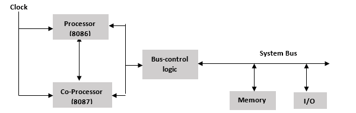
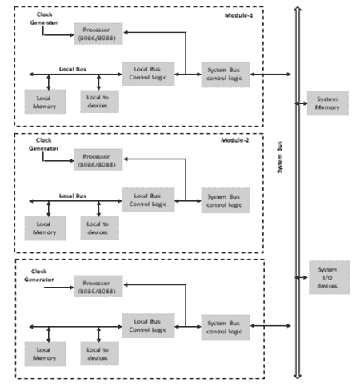
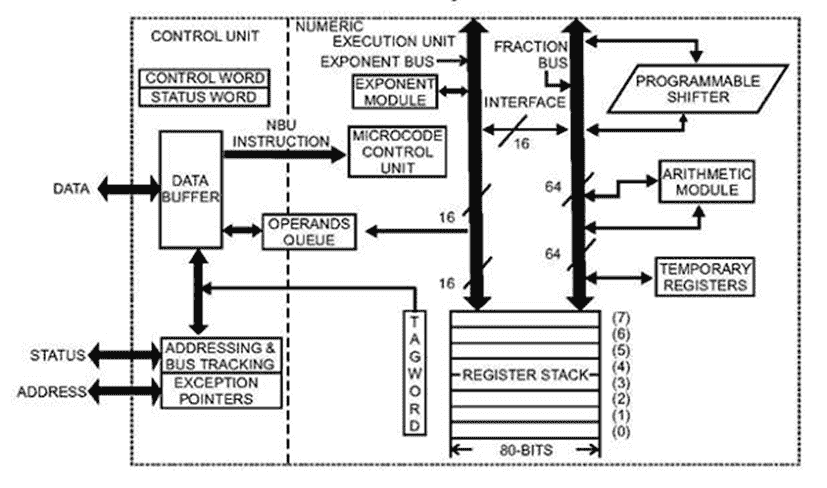
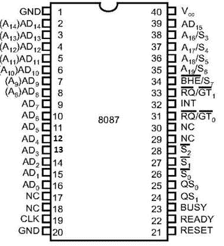

# 多处理器配置概述

> 原文：<https://www.javatpoint.com/multiprocessor-configuration>

**多处理器**是同时执行指令的多个处理器的集合。

**多处理器基本有三种配置:**

*   协处理器配置
*   紧密耦合配置
*   松散耦合配置

## 协处理器配置

协处理器执行与微处理器相同的任务。它是微处理器芯片上专门设计的电路，用于减轻主处理器的工作负荷。它共享相同的内存、输入/输出系统、总线、控制逻辑和时钟发生器。

协处理器处理特殊任务，如数学计算、屏幕图形显示等。

英特尔 8086 和 8087 无法执行复杂的数学运算，因此在这些情况下，微处理器需要像英特尔 8087 数学协处理器这样的数学协处理器，它可以非常快速地轻松执行复杂的数学运算。

**图:协处理器配置框图**

## 处理器与协处理器的连接

*   The processor is connected with the coprocessor through RQ-/GT-, TEST, QS0 and QS1 signals.
*   The test signal is connected to the BUSY pin of the coprocessor, and the remaining three pins are connected to the same pin of the coprocessor.
*   **RQ-/gt-:** This signal is used for bus arbitration.
*   **Qs0 and QS1:** These are used to track the status of the main processor queue.
*   **test:** This signal is used to take care of the coprocessor? That is, the coprocessor is idle or busy.

## 紧密耦合配置

紧密耦合配置与协处理器配置完全相似。与协处理器一样，它也与主处理器共享相同的内存、输入/输出系统总线以及控制逻辑和控制生成器。

然而，主处理器和协处理器获取并执行它们自己的指令。系统总线由协处理器和主处理器独立处理。

**图:紧密耦合配置的框图**

## 处理器和独立处理器是如何连接的？

*   The memory is used to provide the connection between the stand-alone processor and the host processor.
*   It doesn't use any instructions like WAIT and ESC. For communication.
*   The main processor sends commands to the ports that manage the memory and wake up the independent processor.
*   Independent processor accesses memory and executes tasks.
*   When the task is finished, it sends an acknowledgement to the main processor by using a status signal or an interrupt request.

## 松耦合配置

松散耦合的多处理器配置由基于微处理器的系统的多个模块组成，这些模块通过公共系统总线连接。这种配置的每个模块都由自己的时钟发生器、存储器、输入/输出设备组成，并通过本地总线连接。

**图:松耦合配置的框图**

## 8087 数字数据处理器

**8087 数字数据处理器**也称为数学协处理器、浮点单元或数字处理器扩展。

它最初是由英特尔设计的，用于与 8086/8088 配对，从而使计算更加容易和快速。

一旦指令被 8086/8088 处理器识别，则它被发送到 8087 协处理器以供进一步执行。

**英特尔 8087 支持的数据类型有:**

*   二进制整数
*   打包的十进制数
*   实数
*   临时实数格式

**8087 数字数据处理器的特点**

*   它支持不同的数据类型，如整数、浮点和 2-10 字节的实数类型。
*   它遵循 IEEE 浮点标准。
*   处理速度这么快。

## 8087 架构

*   **8087 架构分为两组即**
    *   控制单元
    *   数字分机(NEU)
*   **控制单元**负责处理器和存储器之间的所有通信，如读写存储器操作数、接收和解码指令、维护并行队列等。
*   **数字扩展单元(NEU)** 负责所有数字处理器指令，如算术、逻辑、超越和数据传输指令。它有 8 个寄存器堆栈，保存指令的操作数及其结果。
*   CU 和 NEU 彼此异步工作。
*   英特尔 8087 使用 QS0 和 QS1 引脚来获取和识别主机 CPU 提取的指令。
*   所有协处理器指令由**转义(ESC)指令代码**位标识，即它们以“F”开头。协处理器只执行转义指令，而其他指令由微处理器执行。
*   一旦中央处理器识别出电子稳定控制代码，它就会触发 8087 中数字处理器指令的执行。
*   执行时，电子稳定控制代码识别是否需要内存操作数的协处理器指令。如果中央处理器不需要任何内存操作数，它将直接执行，否则使用 8086 中允许的任何一种寻址模式计算操作数的物理地址，并且由中央处理器启动一个虚拟读取周期。
*   然后，8087 准备好执行输出，CU 从 8086 获得总线控制，并执行一个写周期，将输出写入存储器中的预专用地址。
*   **微码控制单元**产生执行指令所需的控制信号。
*   **可编程移位器**用于在执行 FMUL 和 FDIV 等指令时移位操作数。

**图:8087 协处理器的架构**

## 8087 引脚描述

**图:英特尔 8087** 引脚图

*   **AD0-AD15:**这些是时分复用地址/数据线，在 T1 时钟周期内传送地址，在 T 2 、T 3 、T w 和 T 4 时钟周期内传送数据。
*   **A19/S6-A16/S3:**这些是时间复用的地址/状态线。这些功能类似于英特尔 8086 的引脚。
*   **【BHE】/S7:**在第一个时钟周期内，用于将数据启用到 8086 数据总线的较高字节，之后在 T 2 、T 3 、T w 和 T 4 时钟周期内，作为状态线 S7 工作。
*   **QS 1 - QS 0 :** 这些是负责指令队列状态的队列状态输入信号。

**QS1-QS0情况如下:**

| QS 0 | QS 1 | 状态 |
| Zero | Zero | 无操作 |
| Zero | one | 队列中操作码的第一个字节 |
| one | Zero | 清空队列 |
| one | one | 队列中的后续字节 |

*   **INT:** 它是一个中断信号，用于指示在执行过程中收到了一个未屏蔽的异常。
*   **忙碌(输出):**当忙碌信号为高时，向中央处理器指示忙碌状态。
*   **READY(输入):**该信号用于拒绝协处理器的内部活动，并在 CPU 需要时准备进一步执行。
*   **S0S1S2:**这些是给出操作状态的状态信号，由总线控制器 8087 用来产生存储器和 I/O 控制信号。

| S2 | S1 | S0 | 状态 |
| Zero | X | X | 不用的 |
| one | Zero | Zero | 不用的 |
| one | Zero | one | 读存储器 |
| one | one | Zero | 存储写入 |
| one | one | one | 消极的 |

*   **【RQ】/GT1和 RQ / GT0 :** 这些是 8087 处理器用来从主处理器 8086/8088 获得总线控制以进行操作数传输的请求/授权信号。
*   **CLK(输入):**该输入给出了处理器操作的基本时序。
*   **VCC:** 电源+5V。