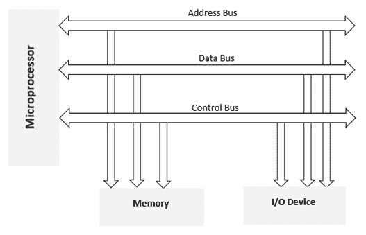
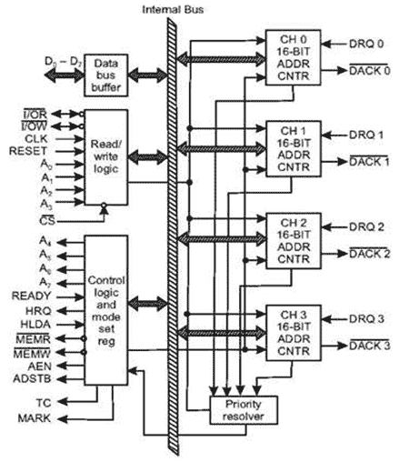
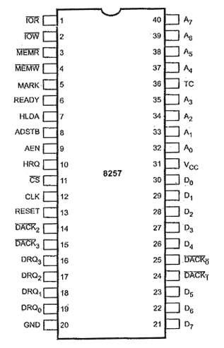

# 内存和输入输出接口

> 原文：<https://www.javatpoint.com/memory-and-io-interfacing>

几个存储芯片和输入输出设备连接到一个微处理器。

下图显示了将存储芯片和输入/输出设备连接到微处理器的示意图。

## 存储器接口

当我们执行任何指令时，存储单元或输入输出设备的地址由微处理器发出。相应的存储芯片或输入输出设备由解码电路选择。

存储器需要一些信号来读取和写入寄存器，微处理器传输一些信号来读取或写入数据。

接口过程包括将存储器要求与微处理器信号相匹配。因此，接口电路的设计应使存储器信号要求与微处理器信号相匹配。

## 输入输出接口

众所周知，键盘和显示器被用作与外界沟通的渠道。因此，我们有必要将键盘和显示器与微处理器连接起来。这被称为输入输出接口。对于这种类型的接口，我们使用锁存器和缓冲器来连接键盘和显示器与微处理器。

但是这种接口的主要缺点是微处理器只能执行一种功能。

## 8279 可编程键盘

英特尔 8279 是一款可编程键盘接口设备。数据输入和显示是微处理器套件和基于微处理器的系统的组成部分。

8279 专为 8 位英特尔微处理器设计。

8279 有两个部分，即**键盘部分**和**显示部分**。

**键盘部分**的功能是对接作为微处理器输入设备的键盘。它还可以连接拨动开关或拇指开关。

**显示部分**的目的是驱动字母数字显示器或指示灯。它直接连接到微处理器总线。

微处理器免去了扫描键盘或刷新显示器的负担。

**一些重要特征是:**

*   同时键盘显示操作
*   扫描传感器模式
*   扫描键盘模式
*   8 字符键盘先进先出
*   选通输入输入模式
*   双键锁定或带触点去抖的 N 键翻转
*   单个 16 字符显示器
*   双 8 或 16 位数字显示
*   键输入时中断输出
*   可从中央处理器编程的可编程扫描时序和模式

## 8257 直接存储器存取控制器

通过累加器将数据从快速输入/输出设备传输到内存或从内存传输到输入/输出设备是一个耗时的过程。对于这种情况，首选**直接内存访问(DMA)** 技术。在直接存储器存取数据传输方案中，数据直接从输入输出设备传输到随机存取存储器或从随机存取存储器传输到输入输出设备。

使用直接存储器存取控制器，设备请求中央处理器保存其地址、数据和控制总线，因此设备可以自由地直接向/从存储器传输数据。只有在从中央处理器接收到 HLDA 信号后，才启动 DMA 数据传输。

## DMA 操作是如何执行的？

以下是直接存储器存取执行的操作:

*   最初，设备必须向 DMA 控制器发送 DMA 请求(DRQ)，以便在设备和存储器之间发送数据。
*   直接存储器存取控制器向中央处理器发送保持请求(HRQ)，并等待中央处理器进行高级数据存取。
*   当中央处理器获得 HLDA 信号时，它将控制权留给总线，并通过 HLDA 信号确认保持请求。
*   现在，中央处理器处于保持状态，DMA 控制器必须管理中央处理器、内存和输入/输出设备之间的总线操作。

### 英特尔 8257

*   **英特尔 8257 是一款可编程 DMA 控制器**。
*   它是一个 4 通道可编程**直接存储器存取(DMA)** 控制器。
*   它是一个 40 引脚的集成电路封装，工作需要+5V 电源。
*   它可以执行三个操作，即读取、写入和验证。
*   每个通道包含两个 16 位寄存器，即 DMA 地址寄存器和字节计数寄存器。
*   每个通道可以传输高达 64kb 的数据，并且可以独立编程。
*   它有两种工作模式:主模式和从模式。

### 8257 架构

下图是英特尔 8257 的架构:

### 8257 引脚描述

**DRQ0-DRQ3:**这些是 DMA 请求行。输入/输出设备在这些线路中的一条上发送直接存储器存取请求。在线上，高状态产生直接存储器存取请求。

**DACK0-DACK3:**这些是 DMA 确认线路。英特尔 8257 通过其中一条线路发送确认信号，通知输入/输出设备它已被选择用于直接存储器存取数据传输。在线上，低表示输入输出设备。

**A 0 - A 7 :** 这些是地址线。A 0 - A 3 为双向线路。这些线路承载 8257 在主机模式下产生的 4 LSb 16 位存储器地址。在从机模式下，这些线都是输入线。输入从要读取或编程的寄存器中选择一个。A 4 - A 7 线给出了主模式下的三态输出，携带英特尔 8257 产生的 16 位内存地址的 4 到 7 位。

**D 0 - D 7 :** 这些是数据线。这是双向三态线。对控制器进行编程时，中央处理器通过这些数据线向直接存储器存取地址寄存器、字节计数寄存器和模式设置寄存器发送数据。

**AEN:** 地址锁存使能。

**ADSTB:** 该线路上的高电平锁存地址的 8 兆位字节，这些字节通过数据总线发送到为此目的而连接的英特尔 8212。

**CS:** 是筹码选择。

**(I/OR) :** I/O 读。这是一条双向线路。在输出模式下，它用于在直接存储器存取写周期期间从输入/输出设备访问数据。

**(I/OW) :** I/O 写。这是一条双向线路。在输出模式下，它允许在直接存储器存取读取周期期间向输入/输出设备传输数据。数据从存储器传输。

**MEMR :** 记忆读取

**MEMW :** 记忆写入

**TC:** 字节计数(终端计数)。

**标记:**模 128 标记。

**CLK:** 时钟

**HRQ:** 保持请求

**HLDA:** 保持确认