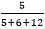
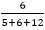
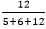
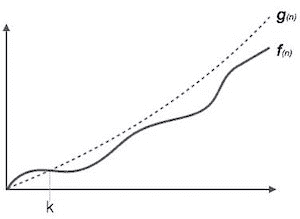
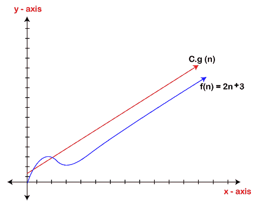
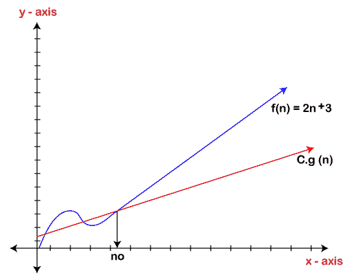
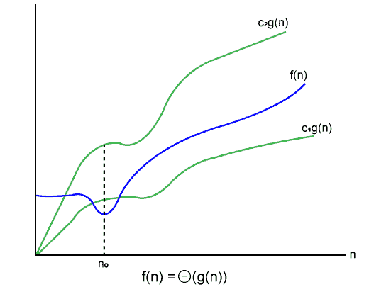

# 渐近分析

> 原文：<https://www.javatpoint.com/data-structure-asymptotic-analysis>

正如我们所知，数据结构是有效组织数据的一种方式，效率是用时间或空间来衡量的。因此，理想的数据结构是占用尽可能少的时间来执行所有操作和内存空间的结构。我们的重点是找到时间复杂度，而不是空间复杂度，通过找到时间复杂度，我们可以决定哪种数据结构最适合算法。

我们脑海中出现的主要问题是，我们应该在什么基础上比较数据结构的时间复杂性？。时间复杂度可以根据对它们执行的操作进行比较。让我们考虑一个简单的例子。

假设我们有一个 100 个元素的数组，我们想在数组的开头插入一个新元素。这变成了一个非常繁琐的任务，因为我们首先需要向右移动元素，并且我们将在数组的开始处添加新元素。

假设我们将链表视为一个数据结构，在开始时添加元素。链表包含两部分，即下一个节点的数据和地址。我们只需在新节点中添加第一个节点的地址，头指针现在将指向新添加的节点。因此，我们得出结论，在链表的开头添加数据比数组更快。通过这种方式，我们可以比较数据结构，并选择最佳的数据结构来执行操作。

### 如何找到执行操作的时间复杂性或运行时间？

实际运行时间的测量根本不实际。执行任何操作的运行时间取决于输入的大小。让我们通过一个简单的例子来理解这个说法。

假设我们有一个由五个元素组成的数组，我们想在数组的开头添加一个新元素。为了实现这一点，我们需要将每个元素向右移动，假设每个元素花费一个时间单位。有五个元素，所以需要五个时间单位。假设一个数组中有 1000 个元素，那么移位需要 1000 个时间单位。结论是时间复杂度取决于输入大小。

因此，如果输入大小为 n，则 f(n)是表示时间复杂度的 n 的函数。

### 如何计算 f(n)？

对于较小的程序，计算 f(n)的值很容易，但是对于较大的程序，就没那么容易了。我们可以通过比较它们的 f(n)值来比较数据结构。我们可以通过比较它们的 f(n)值来比较数据结构。我们将找到 f(n)的增长率，因为对于较小的输入大小，一个数据结构可能比另一个更好，但对于较大的输入大小，则不是这样。现在，如何找到 f(n)。

让我们看一个简单的例子。

f(n) = 5n 2 + 6n + 12

其中 n 是执行的指令数，它取决于输入的大小。

当 n=1 时

5n 2 =  * 100 = 21.74%的运行时间百分比

6n =  * 100 = 26.09%的运行时间百分比

由于 12 =  * 100 = 52.17%导致的运行时间百分比

从上面的计算中，观察到大部分时间由 12 占用。但是，我们必须找到 f(n)的增长率，我们不能说最大时间量是 12。让我们假设 n 的不同值，以找到 f(n)的增长率。

| n | 5n 2 | 6n | Twelve |
| one | 21.74% | 26.09% | 52.17% |
| Ten | 87.41% | 10.49% | 2.09% |
| One hundred | 98.79% | 1.19% | 0.02% |
| One thousand | 99.88% | 0.12% | 0.0002% |

从上表中我们可以观察到，随着 n 值的增加，5n 2 的运行时间增加，而 6n 和 12 的运行时间也减少。因此，观察到对于较大的 n 值，平方项消耗了几乎 99%的时间。由于 n 2 项贡献了大部分时间，所以我们可以去掉剩下的两个项。

**因此，**

f(n) = 5n 2

在这里，我们得到了近似的时间复杂度，其结果非常接近实际结果。这个时间复杂度的近似度量被称为渐近复杂度。这里，我们不是在计算确切的运行时间，我们是在消除不必要的项，我们只是在考虑占用大部分时间的项。

在数学分析中，算法的渐近分析是定义其运行时性能的数学界限的一种方法。利用渐近分析，我们可以很容易地得出算法的平均情况、最佳情况和最坏情况。

它用于数学计算算法内部任何操作的运行时间。

**例:**一个操作的运行时间为 x(n)，另一个操作的运行时间计算为 f(n2)。指第一次操作的运行时间会随着‘n’的增加而线性增加，第二次操作的运行时间会呈指数级增加。同样，如果 n 非常小，两个操作的运行时间将相同。

通常，算法所需的时间分为三种类型:

**最差情况:**它定义了算法花费大量时间的输入。

**平均情况:**程序执行需要平均时间。

**最佳情况:**它定义了算法花费最少时间的输入

### 渐近符号

用于计算算法运行时间复杂度的常用渐近符号如下:

*   大哦符号(？)
*   Omega 符号(ω)
*   θ符号(θ)

### 大哦符号(0)

*   大 O 符号是一种渐近符号，它通过简单地提供函数的增长顺序来衡量算法的性能。
*   这种表示法为函数提供了一个上限，确保函数的增长永远不会超过上限。所以，它给出了一个函数的最小上界，所以这个函数永远不会比这个上界增长得更快。

它是表达算法运行时间上限的形式化方法。它衡量时间复杂性的最坏情况或算法完成操作的最长时间。如下所示:

**例如:**

如果 **f(n)** 和 **g(n)** 是为正整数定义的两个函数，

那么 **f(n)** = **O(g(n))** 作为 **f(n)是 g(n)** 的大 oh 或者 f(n)是 g(n)的数量级)如果存在常数 c 并且没有这样的常数:

**f(n)≤c.g(n)所有 n≥否**

这意味着 f(n)的增长速度并不比 g(n)快，或者 g(n)是函数 f(n)的上限。在这种情况下，我们正在计算函数的增长率，最终计算出函数的最差时间复杂度，即一个算法可以执行的最差程度。

**我们通过例子来了解一下**

例 1: f(n)=2n+3，g(n)=n

现在，我们要找到**是 f(n)=O(g(n))？**

要检查 f(n)=O(g(n))，它必须满足给定的条件:

**f(n) < =c.g(n)**

首先，我们用 2n+3 代替 f(n)，用 n 代替 g(n)。

2n+3 <= c.n

让我们假设 c=5，n=1

2*1+3<=5*1

5<=5

对于 n=1，上述条件成立。

如果 n=2

2*2+3<=5*2

7<=10

对于 n=2，上述条件成立。

我们知道，对于 n 的任意值，它都会满足上述条件，即 2n+3<=c.n，如果 c 的值等于 5，那么它就会满足条件 2n+3<=c.n，我们可以从 1 开始取 n 的任意值，它总会满足。因此，我们可以说，对于某些常数 c，对于某些常数 n0，它将总是满足 2n+3<=c.n，由于它满足上述条件，所以 f(n)是 g(n)的大 oh，或者我们可以说 f(n)线性增长。因此，它的结论是 c.g(n)是 f(n)的上限。它可以用图形表示为:

使用大 o 符号的想法是给出一个特定函数的上界，最终导致给出最坏时间复杂度。它保证一个特定的函数不会突然表现为二次或三次形式，它只是在最坏的情况下以线性方式表现。

### Omega 符号(ω)

*   它基本上描述了与大 o 符号相反的最佳情况。
*   这是表示算法运行时间下限的形式方法。它衡量算法完成可能需要的最佳时间量或最佳时间复杂度。
*   它决定了一个算法能运行的最快时间。

如果我们要求一个算法至少花费一定的时间而不使用上限，我们使用大ω符号，即希腊字母“ω”。它用于限制大输入规模运行时间的增长。

如果 **f(n)** 和 **g(n)** 是为正整数定义的两个函数，

那么**f(n)=ω(g(n))**作为 **f(n)是 g(n)** 的ω，或者 f(n)是 g(n)的量级，如果存在常数 c 并且没有这样的常数:

**f(n) > =c.g(n)对于所有 n≥no 和 c > 0**

**我们来考虑一个简单的例子。**

如果 f(n) = 2n+3，g(n) = n，

是 f(n)=**ω**(g(n))？

它必须满足以下条件:

**f(n) > =c.g(n)**

为了检查上述条件，我们首先用 2n+3 替换 f(n)，用 n 替换 g(n)。

**2n+3 > =c*n**

假设 c=1

**2n+3 > =n** (这个等式对于从 1 开始的任何 n 值都成立)。

因此，证明了 g(n)是 2n+3 函数的大ω。

从上图中我们可以看出，当 c 的值等于 1 时，g(n)函数是 f(n)函数的下界。因此，这种表示法给出了最快的运行时间。但是，我们对找到最快的运行时间并不感兴趣，我们感兴趣的是计算最坏的情况，因为我们想检查我们的算法是否有更大的输入，即它将花费的最坏时间，以便我们可以在进一步的过程中做出进一步的决定。

### θ符号(θ)

*   theta 符号主要描述平均案例场景。
*   它代表了算法的实际时间复杂度。每一次，一个算法都不会表现的最差或者最好，在现实问题中，算法主要是在最坏情况和最好情况之间波动，这就给了我们算法的平均情况。
*   大θ主要用于最坏情况和最好情况的值相同时。
*   它是表达算法运行时间上限和下限的形式化方法。

让我们从数学上理解大θ符号:

设 f(n)和 g(n)是 n 的函数，其中 n 是执行程序所需的步骤，然后:

**f(n)=μg(n)**

只有在下列情况下，才满足上述条件

**C1 . g(n)<= f(n)<= C2 . g(n)**

其中，函数由两个极限(即上限和下限)界定，f(n)介于两者之间。当且仅当 c1.g(n)小于或等于 f(n)且 c2.g(n)大于或等于 f(n)时，条件 **f(n)= θg(n)** 成立。θ符号的图示如下:

让我们考虑相同的例子，其中
f(n)=2n+3
g(n)=n

由于 c1.g(n)应小于 f(n)，因此 c1 必须为 1，而 c2.g(n)应大于 f(n)，因此 c2 等于 5。C1 g(n)是 f(n)的下限，而 C2 g(n)是 f(n)的上限。

c1.g(n)<=f(n)<=c2.g(n)

用 n 代替 g(n ),用 2n+3 代替 f(n)

c1.n <=2n+3<=c2.n

如果 c1=1，c2=2，n=1

1*1 <=2*1+3 <=2*1

**1**<=**5**<=**2**//对于 n=1，满足条件 c1.g(n) < =f(n) < =c2.g(n)

**如果 n=2**

1*2<=2*2+3<=2*2

2<=7<=4 //对于 n=2，它满足条件 c1.g(n)<=f(n)<=c2.g(n)

因此，我们可以说，对于 n 的任何值，它都满足条件 c1.g(n)<=f(n)<=c2.g(n)。因此，证明了 f(n)是 g(n)的大θ。所以，这是一个提供现实时间复杂性的一般情况。

### 为什么我们有三种不同的渐近分析？

我们知道，大ω代表最佳情况，大 oh 代表最差情况，而大θ代表平均情况。现在，我们将找出线性搜索算法的平均值、最坏情况和最佳情况。

假设我们有一个由 n 个数字组成的数组，我们希望使用线性搜索找到数组中的特定元素。在线性搜索中，每个元素都与每次迭代中搜索到的元素进行比较。假设，如果仅在第一次迭代中找到匹配，则最佳情况是ω(1)，如果元素与最后一个元素(即数组的第 n 个元素)匹配，则最差情况是 O(n)。平均情况是最好和最坏情况的中间，所以它变成 **θ(n/1)。在时间复杂度中可以忽略常数项，因此平均情况为θ(n)** 。

因此，三种不同的分析提供了实际函数之间的适当界限。这里，边界意味着我们有上限和下限，这保证了算法将仅在这些限制之间运行，即它不会超出这些限制。

### 常见的渐近符号

| 常数 | - | ? (1) |
| 线性的 | - | ？(n) |
| 对数的 | - | ？(对数 n) |
| 对数 | - | ？(对数) |
| 指数的 | - | 2?(n) |
| 立方体的 | - | ？(n3) |
| 多项式 | - | n？(1) |
| 二次的 | - | ？(n2) |

* * *