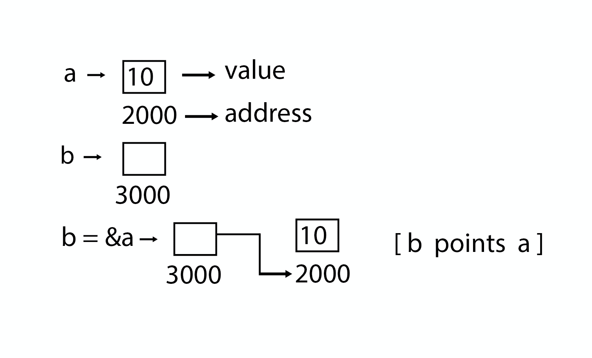

# 指针

> 原文：<https://www.javatpoint.com/data-structure-pointer>

指针用于指向存储在计算机内存中任意位置的值的地址。获取存储在该位置的值称为指针解引用。指针提高了重复过程的性能，例如:

*   遍历字符串
*   查找表
*   控制表
*   树形结构


## 指针详细信息

*   **指针算术:**指针中可以使用的算术运算符有四种:++、-、+、-
*   **指针数组:**可以定义数组来保存多个指针。
*   **指针指向指针:** C 允许你在指针上有指针等等。
*   **传递指向 C 语言中函数的指针:**通过引用或地址传递参数，使得被调用的函数可以在调用函数中更改传递的参数。
*   **从 C 中的函数返回指针:** C 允许函数返回指向局部变量、静态变量以及动态分配的内存的指针。



### 程序

#### 指针

```
#include <stdio.h>

int main( )
{
int a = 5;
int *b;
b = &a;

printf ("value of a = %d\n", a);
printf ("value of a = %d\n", *(&a));
printf ("value of a = %d\n", *b);
printf ("address of a = %u\n", &a);
printf ("address of a = %d\n", b);
printf ("address of b = %u\n", &b);
printf ("value of b = address of a = %u", b);
return 0;
}

```

#### 输出

```
value of a = 5                                                                                                                 
value of a = 5                                                                                                                 
address of a = 3010494292                                                                                                      
address of a = -1284473004                                                                                                     
address of b = 3010494296                                                                                                      
value of b = address of a = 3010494292

```

### 程序

#### 指针指向指针

```
#include <stdio.h>

int main( )
{
int a = 5;
int *b;
int **c;
b = &a;
c = &b;
printf ("value of a = %d\n", a);
printf ("value of a = %d\n", *(&a));
printf ("value of a = %d\n", *b);
printf ("value of a = %d\n", **c);
printf ("value of b = address of a = %u\n", b);
printf ("value of c = address of b = %u\n", c);
printf ("address of a = %u\n", &a);
printf ("address of a = %u\n", b);
printf ("address of a = %u\n", *c);
printf ("address of b = %u\n", &b);
printf ("address of b = %u\n", c);
printf ("address of c = %u\n", &c);
return 0;
}

```

#### 指针指向指针

```
value of a = 5                                                                                                                 
value of a = 5                                                                                                                 
value of a = 5                                                                                                                 
value of a = 5                                                                                                                 
value of b = address of a = 2831685116                                                                                         
value of c = address of b = 2831685120
address of a = 2831685116                                                                                                      
address of a = 2831685116                                                                                                      
address of a = 2831685116                                                                                                      
address of b = 2831685120                                                                                                      
address of b = 2831685120                                                                                                      
address of c = 2831685128   

```