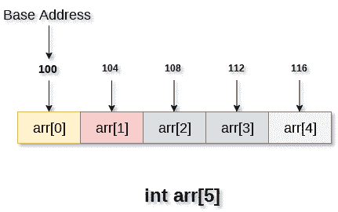

# 排列

> 原文：<https://www.javatpoint.com/data-structure-array>

## 定义

*   数组被定义为存储在连续内存位置的相似类型数据项的集合。
*   数组是 C 编程语言中的派生数据类型，可以存储 int、char、double、float 等数据的基元类型。
*   数组是最简单的数据结构，其中每个数据元素都可以通过使用其索引号来随机访问。
*   例如，如果我们想存储一个学生在 6 个科目中的分数，那么我们不需要为不同科目的分数定义不同的变量。取而代之的是，我们可以定义一个数组，将每个主题中的标记存储在相邻的存储位置。

数组**标记【10】**定义了学生在 10 个不同科目中的标记，其中每个科目标记位于数组中的特定下标，即**标记【0】**表示第一科目中的标记，**标记【1】**表示第二科目中的标记，依此类推。

## 数组的属性

1.  每个元素都是相同的数据类型，并携带相同的大小，即 int = 4 字节。
2.  阵列的元素存储在连续的存储位置，其中第一个元素存储在最小的存储位置。
3.  数组的元素可以被随机访问，因为我们可以用给定的基地址和数据元素的大小来计算数组中每个元素的地址。

例如，在 C 语言中，声明数组的语法如下:

```

int arr[10]; char arr[10]; float arr[5] 

```

## 需要使用阵列

在计算机编程中，大多数情况下需要存储大量相似类型的数据。为了存储如此大量的数据，我们需要定义大量的变量。在编写程序时，记住所有变量的名称是非常困难的。与其用不同的名称命名所有的变量，不如定义一个数组并将所有的元素存储到其中。

下面的示例说明了数组在为特定问题编写代码时是如何有用的。

在下面的例子中，我们有一个学生在六个不同科目上的分数。这道题旨在计算学生所有分数的平均值。

为了说明数组的重要性，我们创建了两个程序，一个是不使用数组，另一个涉及使用数组来存储标记。

**无数组程序:**

```

#include <stdio.h>
void main ()
{
	int marks_1 = 56, marks_2 = 78, marks_3 = 88, marks_4 = 76, marks_5 = 56, marks_6 = 89; 
	float avg = (marks_1 + marks_2 + marks_3 + marks_4 + marks_5 +marks_6) / 6 ; 
	printf(avg); 
}

```

**使用数组编程:**

```

#include <stdio.h>
void main ()
{
	int marks[6] = {56,78,88,76,56,89);
	int i;  
	float avg;
	for (i=0; i<6; i++ ) 
	{
		avg = avg + marks[i]; 
	}  
	printf(avg); 
} 

```

## 阵列操作的复杂性

下表描述了各种阵列操作的时间和空间复杂性。

### 时间复杂性

| 算法 | 平均案例 | 最坏情况 |
| 接近 | O(1) | O(1) |
| 搜索 | O(n) | O(n) |
| 插入 | O(n) | O(n) |
| 删除 | O(n) | O(n) |

### 空间复杂性

在数组中，最坏情况下的空间复杂度为 **O(n)** 。

## 阵列的优势

*   数组为同一类型的变量组提供了单一名称，因此，记住数组中所有元素的名称很容易。
*   遍历数组是一个非常简单的过程，我们只需要增加数组的基址，以便逐个访问每个元素。
*   数组中的任何元素都可以通过使用索引直接访问。

## 数组的内存分配

正如我们已经提到的，一个数组的所有数据元素都存储在主内存中的连续位置。数组的名称代表主内存中第一个元素的基址或地址。数组的每个元素都由一个适当的索引来表示。

数组的索引可以用三种方式定义。

1.  0(从零开始的索引) :数组的第一个元素将是 arr[0]。
2.  1(基于一的索引) :数组的第一个元素将是 arr[1]。
3.  n(基于 n 的索引) :数组的第一个元素可以驻留在任何随机的索引号上。

在下图中，我们展示了大小为 5 的数组 arr 的内存分配。该数组遵循基于 0 的索引方法。数组的基址是第 100 个字节。这将是 arr[0]的地址。这里，int 的大小是 4 个字节，因此每个元素将占用内存中的 4 个字节。



在基于 0 的索引中，如果数组的大小是 n，那么一个元素的最大索引号是 **n-1** 。然而，如果我们使用基于 **1** 的索引，它将是 n。

## 访问数组的元素

要访问数组中的任意随机元素，我们需要以下信息:

1.  数组的基址。
2.  以字节为单位的元素大小。
3.  哪种类型的索引，数组紧随其后。

1D 数组中任何元素的地址都可以通过以下公式计算:

```

Byte address of element A[i]  = base address + size * ( i - first index) 

```

**示例:**

```

In an array, A[-10 ..... +2 ], Base address (BA) = 999, size of an element = 2 bytes, 
find the location of A[-1].
L(A[-1]) = 999 + [(-1) - (-10)] x 2
	   = 999 + 18 
	   = 1017 

```

## 将数组传递给函数:

正如我们前面提到的，数组的名称代表数组第一个元素的起始地址。使用基地址可以遍历数组的所有元素。

下面的示例说明了如何将数组传递给函数。

**示例:**

```

#include <stdio.h>
int summation(int[]);
void main ()
{
	int arr[5] = {0,1,2,3,4};
	int sum = summation(arr); 
	printf("%d",sum); 
} 

int summation (int arr[]) 
{
	int sum=0,i; 
	for (i = 0; i<5; i++) 
	{
		sum = sum + arr[i]; 
	} 
	return sum; 
}

```

上面的程序定义了一个名为求和的函数，它接受一个数组作为参数。该函数计算数组中所有元素的总和并返回。