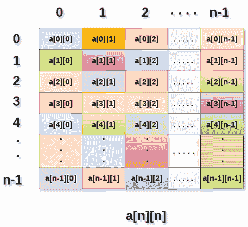
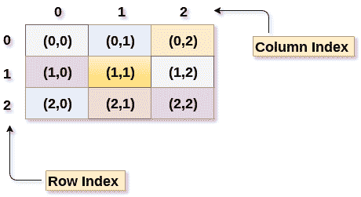
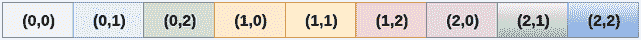
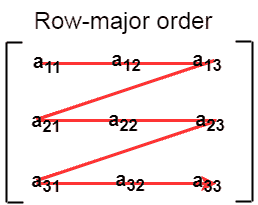
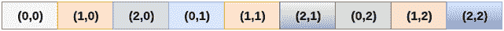

# 2D 阵列

> 原文：<https://www.javatpoint.com/data-structure-2d-array>

2D 数组可以定义为数组的数组。2D 阵列被组织成矩阵，可以表示为行和列的集合。

然而，创建 2D 数组是为了实现一个看起来像关系数据库的数据结构。它提供了一次性保存大量数据的便利，这些数据可以在任何需要的地方传递给任何数量的函数。

## 如何声明 2D 数组

声明二维数组的语法与一维数组非常相似，如下所示。

```

int arr[max_rows][max_columns]; 

```

然而，它产生的数据结构如下所示。



上图显示了二维数组，元素以行和列的形式组织。第一行的第一个元素由[0][0]表示，其中第一个索引中显示的数字是该行的数字，而第二个索引中显示的数字是该列的数字。

## 我们如何访问 2D 阵列中的数据

因为 2D 阵列的元素可以被随机访问。类似于一维阵列，我们可以通过使用单元的索引来访问 2D 阵列中的单个单元。特定单元格有两个索引，一个是其行号，另一个是其列号。

但是，我们可以使用以下语法将存储在 2D 数组的任何特定单元中的值存储到某个变量 x 中。

```

int x = a[i][j]; 

```

其中 I 和 j 分别是单元格的行号和列号。

我们可以使用以下代码将 2D 数组的每个单元指定为 0:

```

for ( int i=0; i<n ;i++)
{
	for (int j=0; j<n; j++) 
	{
		a[i][j] = 0; 
	}
}

```

## 初始化 2D 阵列

我们知道，当我们在 C 编程中同时声明和初始化一维数组时，我们不需要指定数组的大小。然而，这不适用于 2D 阵列。我们至少要定义数组的第二维度。

声明和初始化 2D 数组的语法如下。

```

int arr[2][2] = {0,1,2,3}; 

```

2D 数组中可以出现的元素数量将始终等于(**行数*列数**)。

**示例:**将用户数据存储到 2D 数组中并打印。

**C 例:**

```

#include <stdio.h>
void main ()
{
	int arr[3][3],i,j; 
	for (i=0;i<3;i++)
	{
		for (j=0;j<3;j++)
		{
			printf("Enter a[%d][%d]: ",i,j);			
			scanf("%d",&arr[i][j]);
		}
	}
	printf("\n printing the elements ....\n"); 
	for(i=0;i<3;i++)
	{
		printf("\n");
		for (j=0;j<3;j++)
		{
			printf("%d\t",arr[i][j]);
		}
	}
}

```

### Java 示例

```

import java.util.Scanner;
publicclass TwoDArray {
publicstaticvoid main(String[] args) {
	int[][] arr = newint[3][3];
	Scanner sc = new Scanner(System.in);
	for (inti =0;i<3;i++)
	{
		for(intj=0;j<3;j++)
		{
			System.out.print("Enter Element");
			arr[i][j]=sc.nextInt();
			System.out.println();
		}
	}
	System.out.println("Printing Elements...");
	for(inti=0;i<3;i++)
	{ 
		System.out.println();
		for(intj=0;j<3;j++)
		{
			System.out.print(arr[i][j]+"\t");
		}
	}
}
}

```

### C#示例

```

using System;

public class Program
{
	public static void Main()
	{
		int[,] arr = new int[3,3];
		for (int i=0;i<3;i++)
		{
			for (int j=0;j<3;j++)
			{
				Console.WriteLine("Enter Element");
				arr[i,j]= Convert.ToInt32(Console.ReadLine());
			}
		}
		Console.WriteLine("Printing Elements...");
		for (int i=0;i<3;i++)
		{
			Console.WriteLine();
			for (int j=0;j<3;j++)
			{
				Console.Write(arr[i,j]+" ");
			}
		}
	}
}

```

## 将 2D 阵列映射到 1D 阵列

当涉及到映射二维数组时，我们大多数人可能会想为什么需要这种映射。然而，从用户的角度来看，二维数组是存在的。2D 数组的创建是为了实现一个类似关系数据库表的数据结构，在计算机内存中，2D 数组的存储技术类似于一维数组。

二维数组的大小等于数组中行数和列数的乘积。我们确实需要将二维数组映射到一维数组，以便将它们存储在内存中。

下图显示了一个 3×3 的二维数组。但是，这个数组需要映射到一维数组，以便将其存储到内存中。



将 2D 阵列元素存储到内存中有两种主要技术

### 1.行主要排序

在行主排序中，2D 阵列的所有行被连续存储到存储器中。考虑到上图所示的阵列，其按行主顺序的内存分配如下所示。



首先，将数组的第 1 <sup>st</sup> 行完全存储到内存中，然后将数组的第 2 <sup>nd</sup> 行完全存储到内存中，以此类推，直到最后一行。



### 2.列主要排序

根据列主顺序，2D 阵列的所有列都被连续存储到存储器中。上图中所示的阵列内存分配如下。



首先，将数组的第 1 <sup>st</sup> 列完全存储到内存中，然后将数组的第 2 <sup>nd</sup> 行完全存储到内存中，以此类推，直到数组的最后一列。


## 计算 2D 阵列随机元素的地址

由于将二维阵列存储到存储器中有两种不同的技术，因此有两种不同的公式来计算 2D 阵列的随机元素的地址。

### 按行主要顺序

如果数组由[m][n]声明，其中 m 是行数，而 n 是列数，则以行主顺序存储的数组的元素 a[i][j]的地址计算如下:

```

Address(a[i][j]) = B. A. + (i * n + j) * size 

```

其中，B. A .是基地址或数组 a[0][0]的第一个元素的地址。

**示例:**

```

a[10...30, 55...75], base address of the array (BA) = 0, size of an element = 4 bytes . 
Find the location of a[15][68]. 

Address(a[15][68]) = 0 + 
((15 - 10) x (68 - 55 + 1) + (68 - 55)) x 4

= (5 x 14 + 13) x 4
= 83 x 4 
= 332 answer 

```

### 按列主要顺序

如果数组由[m][n]声明，其中 m 是行数，而 n 是列数，则以行主顺序存储的数组的元素 a[i][j]的地址计算如下:

```

Address(a[i][j]) = ((j*m)+i)*Size + BA 

```

其中 BA 是阵列的基址。

**示例:**

```

A [-5 ... +20][20 ... 70], BA = 1020, Size of element = 8 bytes. Find the location of a[0][30]. 

Address [A[0][30]) = ((30-20) x 24 + 5)  x 8 + 1020   =  245 x 8 + 1020 = 2980 bytes 

```

* * *