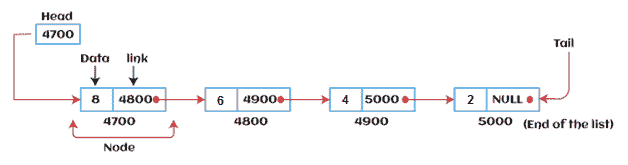

# 合框架

> 原文：<https://www.javatpoint.com/ds-linked-list>

在本文中，我们将看到链表的介绍。

链表是一种线性数据结构，包括一系列相连的节点。链表可以定义为随机存储在内存中的节点。链表中的节点包含两部分，即第一部分是数据部分，第二部分是地址部分。列表的最后一个节点包含指向 null 的指针。链表是仅次于数组的第二大数据结构。在链接列表中，每个链接都包含到另一个链接的连接。

### 链表的表示

链表可以表示为节点的连接，其中每个节点都指向链表的下一个节点。链表的表示如下所示-



到目前为止，我们一直使用数组数据结构来组织要单独存储在内存中的元素组。但是，Array 有几个优点和缺点，必须知道这些优点和缺点才能决定整个程序将使用的数据结构。

现在，问题出现了，为什么我们应该使用链表而不是数组？

### 为什么使用链表而不是数组？

链表是一种克服数组局限性的数据结构。让我们先来看看数组的一些限制-

*   在程序中使用之前，必须事先知道数组的大小。
*   增加阵列的大小是一个耗时的过程。几乎不可能在运行时扩展数组的大小。
*   数组中的所有元素都需要连续存储在内存中。在数组中插入一个元素需要移动它的所有前置元素。

链表很有用，因为-

*   它动态分配内存。链表的所有节点都不连续地存储在内存中，并在指针的帮助下链接在一起。
*   在链表中，大小不再是一个问题，因为我们不需要在声明时定义它的大小。列表根据程序的需求而增长，并且受限于可用的内存空间。

### 如何声明链表？

声明数组很简单，因为它是单一类型的，而链表的声明比数组更典型一点。链表包含两个部分，两者类型不同，一个是简单变量，一个是指针变量。我们可以使用用户定义的数据类型**结构来声明链表。**

链表的声明如下-

```

struct node
{
int data;
struct node *next;
}

```

在上面的声明中，我们定义了一个名为**节点**的结构，它包含两个变量，一个是整数类型的**数据**，另一个是包含下一个节点地址的指针 **next** 。

现在，让我们转向链表的类型。

### 链表的类型

链表分为以下几种类型-

*   **单链表-** 单链表可以定义为元素有序集合的集合。单链表中的节点由两部分组成:数据部分和链接部分。节点的数据部分存储将由节点表示的实际信息，而节点的链接部分存储其直接后继者的地址。
*   **双向链表-** 双向链表是一种复杂类型的链表，其中一个节点包含指向序列中前一个和下一个节点的指针。因此，在双链表中，一个节点由三部分组成:节点数据、指向序列中下一个节点的指针(下一个指针)和指向上一个节点的指针(上一个指针)。
*   **循环单链表-** 在循环单链表中，列表的最后一个节点包含指向列表第一个节点的指针。我们可以有循环单链表和循环双链表。
*   **循环双链表-** 循环双链表是一种更复杂的数据结构类型，其中一个节点包含指向其前一个节点以及下一个节点的指针。循环双向链表在任何节点中都不包含空值。列表的最后一个节点包含列表第一个节点的地址。列表的第一个节点还包含其前一个指针中最后一个节点的地址。

现在，让我们看看使用链表的好处和局限性。

### 链表的优点

使用链表的优点如下-

*   **动态数据结构-** 链表的大小可以根据需求变化。链表没有固定的大小。
*   **插入和删除-** 与数组不同，链表中的插入和删除更容易。数组元素存储在连续的位置，而链表中的元素存储在随机的位置。要在数组中插入或删除元素，我们必须移动元素来创建空间。然而，在链表中，我们只需要更新节点指针的地址，而不是移位。
*   **内存高效-** 链表的大小可以根据需求增长或缩小，所以链表中的内存消耗是高效的。
*   **实现-** 我们可以使用链表实现栈和队列。

### 链表的缺点

使用链表的限制如下-

*   **内存使用情况-** 在链表中，节点占用的内存比数组多。链表的每个节点占用两种类型的变量，一种是简单变量，另一种是指针变量。
*   **遍历-** 在链表中遍历并不容易。如果我们必须访问链表中的一个元素，我们不能随机访问它，而在数组的情况下，我们可以通过索引随机访问它。例如，如果我们想要访问第三个节点，那么我们需要遍历它之前的所有节点。因此，访问特定节点所需的时间很长。
*   **反向遍历-** 回溯或反向遍历在链表中比较困难。在双向链表中，存储反向指针更容易，但需要更多的内存。

### 链表的应用

链表的应用如下-

*   在链表的帮助下，多项式可以被表示，我们也可以对多项式进行运算。
*   链表可以用来表示稀疏矩阵。
*   学生详细信息、员工详细信息或产品详细信息等各种操作可以使用链表来实现，因为链表使用的结构数据类型可以保存不同的数据类型。
*   使用链表，我们可以实现堆栈、队列、树和其他各种数据结构。
*   图是边和顶点的集合，图可以表示为邻接矩阵和邻接表。如果我们想将图表示为邻接矩阵，那么它可以实现为数组。如果我们想将图表示为邻接表，那么它可以实现为链表。
*   链表可以用来实现动态内存分配。动态内存分配是在运行时完成的内存分配。

### 对链表执行的操作

列表支持的基本操作如下-

*   **插入-** 执行此操作是为了向列表中添加一个元素。
*   **删除-** 执行从列表中删除操作。
*   **显示-** 显示列表的元素。
*   **搜索-** 使用给定的关键字从列表中搜索元素。

### 链表的复杂性

现在，让我们看看用于搜索、插入和删除操作的链表的时间和空间复杂性。

### 1.时间复杂性

| 操作 | 平均案例时间复杂度 | 最坏情况时间复杂度 |
| 插入 | O(1) | O(1) |
| **删除** | O(1) | O(1) |
| **搜索** | O(n) | O(n) |

其中“n”是给定树中的节点数。

### 2.空间复杂性

| 操作 | 空间复杂性 |
| 插入 | O(n) |
| **删除** | O(n) |
| **搜索** | O(n) |

链表的空间复杂度为 **O(n)。**

所以，这就是链表的引入。希望文章对你有所帮助和启发。

* * *