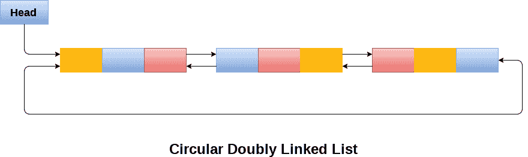
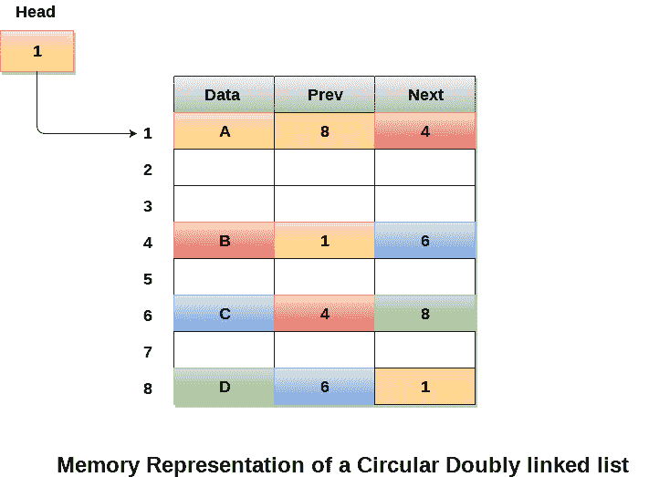

# 循环双向链表

> 原文：<https://www.javatpoint.com/circular-doubly-linked-list>

循环双向链表是一种更复杂的数据结构，其中一个节点包含指向其前一个节点和下一个节点的指针。循环双向链表在任何节点中都不包含空值。列表的最后一个节点包含列表第一个节点的地址。列表的第一个节点也包含其前一个指针中最后一个节点的地址。

下图显示了一个循环双向链表。



由于循环双链表的结构包含三个部分，因此每个节点需要更多的空间和更昂贵的基本操作。然而，循环双链表提供了对指针的简单操作，搜索效率提高了一倍。

## 循环双链表的内存管理

下图显示了为循环双向链表分配内存的方式。变量头包含列表第一个元素的地址，即 1，因此列表的起始节点包含存储在地址 1 的数据 A。因为列表的每个节点被认为具有三个部分，所以列表的起始节点包含最后一个节点即 8 和下一个节点即 4 的地址。存储在地址 8 并包含数据 6 的列表的最后一个节点包含列表的第一个节点的地址，如图像 1 所示。在循环双向链表中，最后一个节点由存储在最后一个节点的下一部分中的第一个节点的地址来标识，因此包含第一个节点地址的节点实际上是链表的最后一个节点。



## 循环双链表上的操作:

有各种操作可以在循环双链表上执行。循环双向链表的节点结构类似于双向链表。但是，下表描述了循环双链表的操作。

| 塞内加尔 | 操作 | 描述 |
| one | [开始插入](insertion-in-circular-doubly-linked-list-at-beginning) | 在循环双向链表的开头添加一个节点。 |
| Two | [末端插入](insertion-in-circular-doubly-linked-list-at-end) | 在循环双链表的末尾添加一个节点。 |
| three | [开头删除](deletion-in-circular-doubly-linked-list-at-beginning) | 从开始移除循环双向链表中的节点。 |
| four | [结尾删除](deletion-in-circular-doubly-linked-list-at-end) | 删除循环双链表中末尾的节点。 |

循环双链表中的遍历和搜索类似于循环单链表中的遍历和搜索。

## 实现循环双链表所有操作的 c 程序

```

#include<stdio.h>
#include<stdlib.h>
struct node
{
    struct node *prev;
    struct node *next;
    int data;
};
struct node *head;
void insertion_beginning();
void insertion_last();
void deletion_beginning();
void deletion_last();
void display();
void search();
void main ()
{
int choice =0;
	while(choice != 9)
	{
		printf("\n*********Main Menu*********\n");
		printf("\nChoose one option from the following list ...\n");
		printf("\n===============================================\n");
		printf("\n1.Insert in Beginning\n2.Insert at last\n3.Delete from Beginning\n4.Delete from last\n5.Search\n6.Show\n7.Exit\n");
		printf("\nEnter your choice?\n");
		scanf("\n%d",&choice);
		switch(choice)
		{
			case 1:
			insertion_beginning();
			break;
			case 2:
            		insertion_last();
			break;
			case 3:
			deletion_beginning();
			break;
			case 4:
			deletion_last();
			break;
			case 5:
			search();
			break;
			case 6:
			display();
			break;
			case 7:
			exit(0);
			break;
			default:
			printf("Please enter valid choice..");
		}
	}
}
void insertion_beginning()
{
   struct node *ptr,*temp; 
   int item;
   ptr = (struct node *)malloc(sizeof(struct node));
   if(ptr == NULL)
   {
       printf("\nOVERFLOW");
   }
   else
   {
    printf("\nEnter Item value");
    scanf("%d",&item);
    ptr->data=item;
   if(head==NULL)
   {
      head = ptr;
      ptr -> next = head; 
      ptr -> prev = head; 
   }
   else 
   {
       temp = head; 
	while(temp -> next != head)
	{
		temp = temp -> next; 
	}
	temp -> next = ptr;
	ptr -> prev = temp;
	head -> prev = ptr;
	ptr -> next = head;
	head = ptr;
   }
   printf("\nNode inserted\n");
}

}
void insertion_last()
{
   struct node *ptr,*temp;
   int item;
   ptr = (struct node *) malloc(sizeof(struct node));
   if(ptr == NULL)
   {
       printf("\nOVERFLOW");
   }
   else
   {
       printf("\nEnter value");
       scanf("%d",&item);
        ptr->data=item;
       if(head == NULL)
       {
           head = ptr;
      	   ptr -> next = head; 
     	   ptr -> prev = head; 
       }
       else
       {
          temp = head;
          while(temp->next !=head)
          {
              temp = temp->next;
          }
          temp->next = ptr;
          ptr ->prev=temp;
          head -> prev = ptr;
	  ptr -> next = head;
        }
   }
     printf("\nnode inserted\n");
}

void deletion_beginning()
{
    struct node *temp;
    if(head == NULL)
	{
		printf("\n UNDERFLOW");
	}
	else if(head->next == head)
	{
		head = NULL; 
		free(head);
		printf("\nnode deleted\n");
	}
	else
	{
		temp = head; 
		while(temp -> next != head)
		{
			temp = temp -> next;
		}
		temp -> next = head -> next;
		head -> next -> prev = temp;
		free(head);
		head = temp -> next;
	}

}
void deletion_last()
{
    struct node *ptr;
    if(head == NULL)
	{
		printf("\n UNDERFLOW");
	}
	else if(head->next == head)
	{
		head = NULL; 
		free(head);	
		printf("\nnode deleted\n");
	}
	else 
	{
		ptr = head; 
		if(ptr->next != head)
		{
			ptr = ptr -> next; 
		}
		ptr -> prev -> next = head;
		head -> prev = ptr -> prev;  
		free(ptr);
		printf("\nnode deleted\n");
	}
}

void display()
{
	struct node *ptr;
	ptr=head;
	if(head == NULL)
	{
		printf("\nnothing to print");
	}	
	else
	{
		printf("\n printing values ... \n");

		while(ptr -> next != head)
		{

			printf("%d\n", ptr -> data);
			ptr = ptr -> next;
		}
		printf("%d\n", ptr -> data);
	}

}

void search()
{
	struct node *ptr;
	int item,i=0,flag=1;
	ptr = head; 
	if(ptr == NULL)
	{
		printf("\nEmpty List\n");
	}
	else
	{ 
		printf("\nEnter item which you want to search?\n"); 
		scanf("%d",&item);
		if(head ->data == item)
		{
		printf("item found at location %d",i+1);
		flag=0;
		}
		else 
		{
		while (ptr->next != head)
		{
			if(ptr->data == item)
			{
				printf("item found at location %d ",i+1);
				flag=0;
				break;
			} 
			else
			{
				flag=1;
			}
			i++;
			ptr = ptr -> next;
		}
		}
		if(flag != 0)
		{
			printf("Item not found\n");
		}
	}	

}

```

**输出:**

```
*********Main Menu*********

Choose one option from the following list ...

===============================================

1.Insert in Beginning
2.Insert at last
3.Delete from Beginning
4.Delete from last
5.Search
6.Show
7.Exit

Enter your choice?
1

Enter Item value123

Node inserted

*********Main Menu*********

Choose one option from the following list ...

===============================================

1.Insert in Beginning
2.Insert at last
3.Delete from Beginning
4.Delete from last
5.Search
6.Show
7.Exit

Enter your choice?
2

Enter value234

node inserted

*********Main Menu*********

Choose one option from the following list ...

===============================================

1.Insert in Beginning
2.Insert at last
3.Delete from Beginning
4.Delete from last
5.Search
6.Show
7.Exit

Enter your choice?
1

Enter Item value90

Node inserted

*********Main Menu*********

Choose one option from the following list ...

===============================================

1.Insert in Beginning
2.Insert at last
3.Delete from Beginning
4.Delete from last
5.Search
6.Show
7.Exit

Enter your choice?
2

Enter value80

node inserted

*********Main Menu*********

Choose one option from the following list ...

===============================================

1.Insert in Beginning
2.Insert at last
3.Delete from Beginning
4.Delete from last
5.Search
6.Show
7.Exit

Enter your choice?
3

*********Main Menu*********

Choose one option from the following list ...

===============================================

1.Insert in Beginning
2.Insert at last
3.Delete from Beginning
4.Delete from last
5.Search
6.Show
7.Exit

Enter your choice?
4

node deleted

*********Main Menu*********

Choose one option from the following list ...

===============================================

1.Insert in Beginning
2.Insert at last
3.Delete from Beginning
4.Delete from last
5.Search
6.Show
7.Exit

Enter your choice?
6

 printing values ... 
123

*********Main Menu*********

Choose one option from the following list ...

===============================================

1.Insert in Beginning
2.Insert at last
3.Delete from Beginning
4.Delete from last
5.Search
6.Show
7.Exit

Enter your choice?
5

Enter item which you want to search?
123
item found at location 1
*********Main Menu*********

Choose one option from the following list ...

============================================

1.Insert in Beginning
2.Insert at last
3.Delete from Beginning
4.Delete from last
5.Search
6.Show
7.Exit

Enter your choice?
7

```