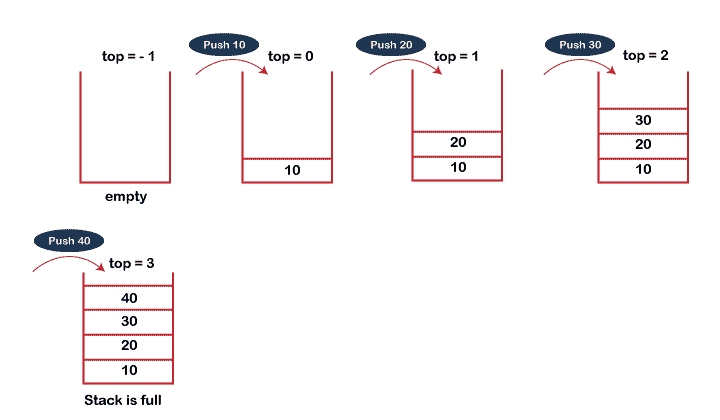
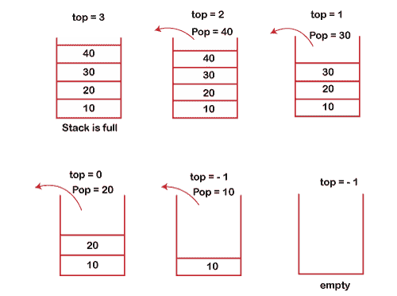

# 什么是堆栈？

> 原文：<https://www.javatpoint.com/data-structure-stack>

堆栈是遵循**后进先出**原则的线性数据结构。堆栈有一端，而队列有两端(**前端和后端**)。它只包含一个指向堆栈最顶层元素的指针**顶部指针**。每当一个元素被添加到堆栈中时，它就被添加到堆栈的顶部，并且该元素只能从堆栈中删除。换句话说， ***堆栈可以定义为一个容器，在该容器中可以从称为堆栈顶部的一端进行插入和删除。***

### 与堆栈相关的一些要点

*   它之所以被称为堆栈，是因为它的行为类似于现实世界中的堆栈、成堆的书籍等。
*   堆栈是一种具有预定义容量的抽象数据类型，这意味着它可以存储有限大小的元素。
*   它是一种数据结构，按照某种顺序插入和删除元素，该顺序可以是后进先出法或后进先出法。

### 堆栈的工作

堆栈在后进先出模式下工作。如下图所示，堆栈中有五个内存块；因此，堆栈的大小为 5。

假设我们希望将元素存储在堆栈中，并且假设堆栈是空的。我们取了如下所示的大小为 5 的堆栈，其中我们一个接一个地推动元素，直到堆栈变满。


因为我们的堆栈是满的，因为堆栈的大小是 5。在上述情况下，我们可以观察到，当我们在堆栈中输入新元素时，它是从顶部到底部的。堆栈从底部到顶部填满。

当我们在堆栈上执行删除操作时，只有一种进入和退出方式，因为另一端是关闭的。它遵循后进先出模式，这意味着首先输入的值将在最后移除。在上述情况下，首先输入值 5，因此只有在删除所有其他元素后才会删除它。

### 标准堆栈操作

**以下是在栈上实现的一些常见操作:**

*   **push():** 当我们在堆栈中插入一个元素时，这个操作被称为 push。如果堆栈已满，则会出现溢出情况。
*   **pop():** 当我们从堆栈中删除一个元素时，这个操作被称为 pop。如果堆栈为空意味着堆栈中不存在元素，这种状态称为下溢状态。
*   **isEmpty():** 判断堆栈是否为空。
*   **isFull():** 判断堆栈是否已满。'
*   **peek():** 返回给定位置的元素。
*   **count():** 返回堆栈中可用元素的总数。
*   **change():** 改变给定位置的元素。
*   **display():** 它打印堆栈中所有可用的元素。

### 推送操作

**PUSH 操作涉及的步骤如下:**

*   在堆栈中插入元素之前，我们检查堆栈是否已满。
*   如果我们尝试在堆栈中插入元素，而堆栈已满，则会出现 ***溢出*** 的情况。
*   初始化堆栈时，我们将 top 的值设置为-1，以检查堆栈是否为空。
*   当新元素被推入堆栈时，首先，顶部的值递增，即**顶部=顶部+1，**，该元素将被放置在**顶部**的新位置。
*   元素将被插入，直到我们达到堆栈的最大*大小。*

*

### POP 操作

**POP 操作涉及的步骤如下:**

*   在从堆栈中删除元素之前，我们检查堆栈是否为空。
*   如果我们试图从空堆栈中删除元素，则会出现*下溢的情况。*
**   如果堆栈不是空的，我们首先访问由 ***顶部*** 指向的元素*   一旦执行弹出操作，顶部递减 1，即**顶部=顶部-1** 。*

*

### 栈的应用

**以下是堆栈的应用:**

*   **符号平衡:**堆叠用于平衡一个符号。例如，我们有以下程序:

```

int main()
{
   cout<
```

我们知道，每个程序都有*一个开*和*一个关*的大括号；当左大括号出现时，我们将大括号推入堆栈，当右大括号出现时，我们将左大括号从堆栈中弹出。因此，净值出来是零。如果任何符号留在堆栈中，这意味着程序中出现了一些语法。

*   **倒弦:** Stack 也用于倒弦。例如，我们想要反转一个“**JavaPoint**”字符串，因此我们可以借助堆栈来实现这一点。
    首先，我们将字符串的所有字符放入堆栈中，直到到达空字符。
    推完所有角色后，我们开始逐个取出角色，直到到达堆叠的底部。
*   **撤销/重做:**也可用于执行撤销/重做操作。例如，我们有一个编辑器，我们在其中写“a”，然后写“b”，然后写“c”；因此，在编辑器中编写的文本是 abc。因此，有三种状态，a、ab 和 abc，它们存储在一个堆栈中。将有两个堆栈，其中一个堆栈显示 UNDO 状态，另一个显示 REDO 状态。
    如果我们想要执行 UNDO 操作，并且想要达到‘ab’状态，那么我们实现 pop 操作。
*   **递归:**递归是指函数再次调用自己。为了保持先前的状态，编译器创建了一个系统堆栈，在该堆栈中保持了函数的所有先前记录。
*   **DFS(深度优先搜索):**该搜索在 Graph 上实现，Graph 使用堆栈数据结构。
*   **回溯:**假设我们必须创建一条路径来解决一个迷宫问题。如果我们走在一条特定的道路上，我们意识到我们走错了路。为了在路径的开头创建一个新的路径，我们必须使用堆栈数据结构。
*   **表达式转换:**栈也可以用于表达式转换。这是 stack 最重要的应用之一。表达式转换列表如下:

    ```
    Infix to prefix
    Infix to postfix
    Prefix to infix
    Prefix to postfix
    Postfix to infix
    ```

*   **内存管理:**栈管理内存。内存分配在连续的内存块中。内存被称为堆栈内存，因为所有变量都在函数调用堆栈内存中分配。编译器知道分配给程序的内存大小。创建函数时，其所有变量都在堆栈内存中分配。当函数完成执行时，堆栈中分配的所有变量都被释放。

* * ***