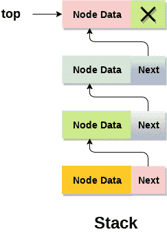
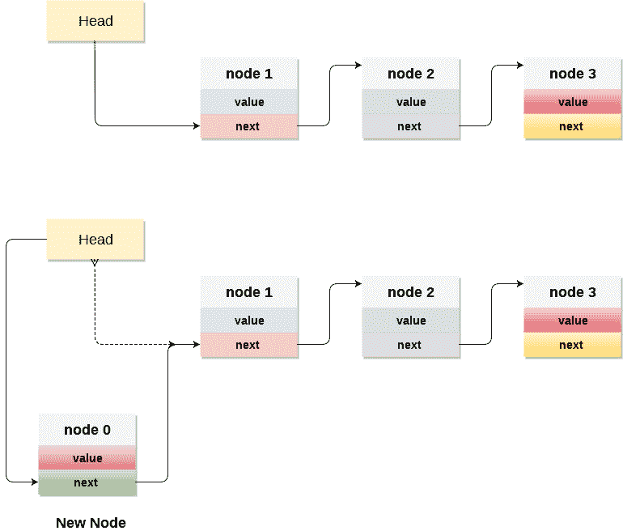

# 栈的链表实现

> 原文：<https://www.javatpoint.com/ds-linked-list-implementation-of-stack>

除了使用数组，我们还可以使用链表来实现堆栈。链表动态分配内存。然而，在这两种情况下，所有操作(即推送、弹出和查看)的时间复杂度是相同的。

在栈的链表实现中，节点在内存中保持不连续。每个节点都包含一个指向堆栈中其直接后继节点的指针。如果内存堆中剩余的空间不足以创建一个节点，就称堆栈溢出。



堆栈中最上面的节点在其地址字段中总是包含 null。让我们讨论在堆栈的链表实现中执行每个操作的方式。

## 向堆栈添加节点(推送操作)

向堆栈中添加一个节点被称为**推**操作。在链表实现中将元素推送到堆栈不同于数组实现。为了将一个元素推到堆栈上，需要执行以下步骤。

1.  首先创建一个节点，并为其分配内存。
2.  如果列表为空，则将该项作为列表的开始节点。这包括给节点的数据部分赋值，给节点的地址部分赋值为 null。
3.  如果列表中已经有一些节点，那么我们必须在列表的开头添加新元素(为了不违反堆栈的属性)。为此，将起始元素的地址分配给新节点的地址字段，并使新节点成为列表的起始节点。

**时间复杂度:o(1)**



### c .实施:

```

void push ()
{
	int val;
	struct node *ptr =(struct node*)malloc(sizeof(struct node)); 
	if(ptr == NULL)
	{
		printf("not able to push the element");	
	}
	else 
	{
		printf("Enter the value");
		scanf("%d",&val);
		if(head==NULL)
		{		
			ptr->val = val;
			ptr -> next = NULL;
			head=ptr;
		} 
		else 
		{
			ptr->val = val;
			ptr->next = head;
			head=ptr;

		}
		printf("Item pushed");

	}
}

```

## 从堆栈中删除节点(POP 操作)

从栈顶删除一个节点称为**弹出**操作。从堆栈的链表实现中删除节点不同于在数组实现中删除节点。为了从堆栈中弹出一个元素，我们需要遵循以下步骤:

1.  **检查下溢条件:**当我们试图从已经空的堆栈中弹出时，下溢条件出现。如果列表的头指针指向空，堆栈将为空。
2.  **相应调整头指针:**在堆栈中，元素只从一端弹出，因此必须删除头指针中存储的值，释放节点。头节点的下一个节点现在成为头节点。

**时间复杂度:o(n)**

### 执行情况

```

void pop()
{
	int item;
	struct node *ptr;
	if (head == NULL)
	{
		printf("Underflow");
	}
	else
	{
		item = head->val;
		ptr = head;
		head = head->next;
		free(ptr);
		printf("Item popped");

	}
}

```

## 显示节点(遍历)

显示堆栈的所有节点需要遍历以堆栈形式组织的链表的所有节点。为此，我们需要遵循以下步骤。

1.  将头指针复制到临时指针中。
2.  将临时指针移动到列表的所有节点，并打印附加到每个节点的值字段。

**时间复杂度:o(n)**

### 实施

```

void display()
{
	int i;
	struct node *ptr;
	ptr=head;
	if(ptr == NULL)
	{
		printf("Stack is empty\n");
	}
	else
	{
		printf("Printing Stack elements \n");
		while(ptr!=NULL)
		{
			printf("%d\n",ptr->val);
			ptr = ptr->next;
		}
	}
}

```

### C 语言中的菜单驱动程序，使用链表实现所有堆栈操作:

```

#include <stdio.h>
#include <stdlib.h>
void push();
void pop();
void display();
struct node 
{
int val;
struct node *next;
};
struct node *head;

void main ()
{
	int choice=0;	
	printf("\n*********Stack operations using linked list*********\n");
	printf("\n----------------------------------------------\n");
	while(choice != 4)
	{
		printf("\n\nChose one from the below options...\n");
		printf("\n1.Push\n2.Pop\n3.Show\n4.Exit");
		printf("\n Enter your choice \n");		
		scanf("%d",&choice);
		switch(choice)
		{
			case 1:
			{ 
				push();
				break;
			}
			case 2:
			{
				pop();
				break;
			}
			case 3:
			{
				display();
				break;
			}
			case 4: 
			{
				printf("Exiting....");
				break; 
			}
			default:
			{
				printf("Please Enter valid choice ");
			} 
	};
}
}
void push ()
{
	int val;
	struct node *ptr = (struct node*)malloc(sizeof(struct node)); 
	if(ptr == NULL)
	{
		printf("not able to push the element");	
	}
	else 
	{
		printf("Enter the value");
		scanf("%d",&val);
		if(head==NULL)
		{		
			ptr->val = val;
			ptr -> next = NULL;
			head=ptr;
		} 
		else 
		{
			ptr->val = val;
			ptr->next = head;
			head=ptr;

		}
		printf("Item pushed");

	}
}

void pop()
{
	int item;
	struct node *ptr;
	if (head == NULL)
	{
		printf("Underflow");
	}
	else
	{
		item = head->val;
		ptr = head;
		head = head->next;
		free(ptr);
		printf("Item popped");

	}
}
void display()
{
	int i;
	struct node *ptr;
	ptr=head;
	if(ptr == NULL)
	{
		printf("Stack is empty\n");
	}
	else
	{
		printf("Printing Stack elements \n");
		while(ptr!=NULL)
		{
			printf("%d\n",ptr->val);
			ptr = ptr->next;
		}
	}
}

```