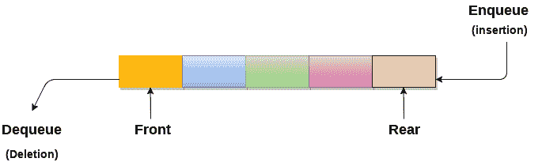

# 长队

> 原文：<https://www.javatpoint.com/data-structure-queue>

1.队列可以被定义为一个有序列表，它使得插入操作能够在称为**后端**的一端执行，而删除操作能够在称为**前端**的另一端执行。

2.队列被称为先进先出列表。

3.例如，排队买火车票的人排起了长队。

## 队列的应用

由于队列是在先进先出的基础上执行操作的，这对于操作的排序是相当公平的。下面讨论队列的各种应用。

1.  队列被广泛用作单个共享资源(如打印机、磁盘、中央处理器)的等待列表。
2.  队列用于异步数据传输(两个进程之间的数据传输速率不同)，例如管道、文件输入输出和套接字。
3.  队列在大多数应用程序中用作缓冲区，如 MP3 媒体播放器、光盘播放器等。
4.  队列用于维护媒体播放器中的播放列表，以便在播放列表中添加和删除歌曲。
5.  队列在操作系统中用于处理中断。

## 复杂性

| 数据结构 | 时间复杂性 | 空间复杂性 |
|  | **平均值** | **最差** | **最差** |
|  | 接近 | 搜索 | 插入 | 删除 | 接近 | 搜索 | 插入 | 删除 |  |
| 长队 | θ（n） | θ（n） | θ(1 个) | θ(1 个) | O(n) | O(n) | O(1) | O(1) | O(n) |