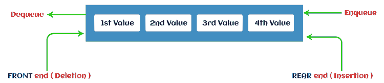
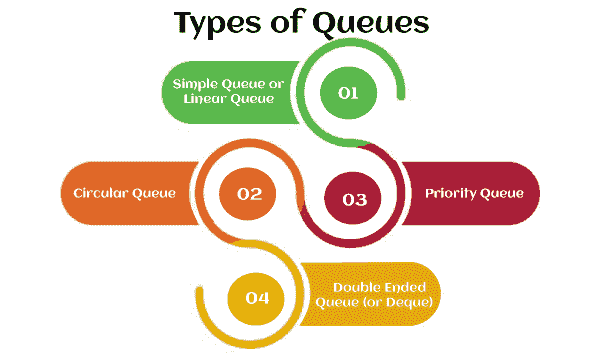
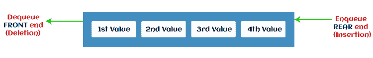
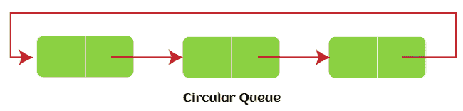
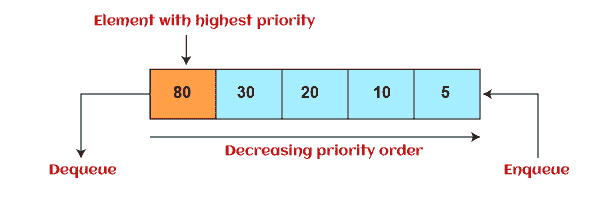
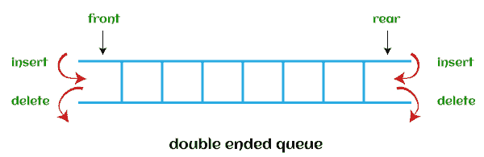

# 队列的类型

> 原文：<https://www.javatpoint.com/ds-types-of-queues>

在本文中，我们将讨论队列的类型。但是在进入类型之前，我们应该先讨论一下队列的简要介绍。

### 什么是队列？

队列是类似于现实世界中队列的数据结构。队列是一种数据结构，在这种结构中，先到者先出，它遵循先进先出的策略。队列也可以定义为列表或集合，其中插入是从队列的一端**后端**或**尾部**完成的，而删除是从队列的另一端**前端**或**头部**完成的。

真实世界中排队的例子是电影院大厅外的售票队列，在这个队列中最先进入的人先拿到票，最后进入队列的人最后拿到票。数据结构中的队列也遵循类似的方法。

队列的表示如下图所示-

现在，让我们转向队列的类型。

### 队列的类型

下面列出了四种不同类型的队列

*   简单队列或线性队列
*   循环队列
*   优先级队列
*   双端队列

让我们讨论每种类型的队列。

### 简单队列或线性队列

在线性队列中，插入发生在一端，而删除发生在另一端。发生插入的一端称为后端，发生删除的一端称为前端。它严格遵循先进先出规则。

使用线性队列的主要缺点是只能从后端插入。如果从队列中删除前三个元素，即使线性队列中有可用空间，我们也无法插入更多元素。在这种情况下，线性队列显示溢出情况，因为尾部指向队列的最后一个元素。

想了解更多数据结构中的队列，可以点击链接-[https://www.javatpoint.com/data-structure-queue](https://www.javatpoint.com/data-structure-queue)

### 循环队列

在循环队列中，所有节点都表示为循环。它类似于线性队列，只是队列的最后一个元素连接到第一个元素。它也被称为环形缓冲区，因为所有的末端都连接到另一端。循环队列的表示如下图所示-

使用循环队列克服了线性队列中出现的缺点。如果循环队列中有可用的空白空间，只需增加 rear 的值，就可以在空白空间中添加新元素。使用循环队列的主要优点是更好的内存利用率。

想了解更多关于循环队列的信息，可以点击链接-[https://www.javatpoint.com/circular-queue](https://www.javatpoint.com/circular-queue)

### 优先级队列

这是一种特殊类型的队列，其中的元素是根据优先级排列的。这是一种特殊类型的队列数据结构，其中每个元素都有一个与之关联的优先级。假设一些元素以相同的优先级出现，它们将根据先进先出原则进行排列。优先级队列的表示如下图所示-

优先级队列中的插入基于到达发生，而优先级队列中的删除基于优先级发生。优先级队列主要用于实现 CPU 调度算法。

优先级队列有两种类型，讨论如下-

*   **升序优先级队列-** 在升序优先级队列中，元素可以任意顺序插入，但只能先删除最小的。假设一个数组的元素 7、5 和 3 的顺序相同，那么，插入可以用相同的顺序完成，但是删除元素的顺序是 3、5、7。
*   **降序优先级队列-** 在降序优先级队列中，可以任意顺序插入元素，但只能先删除最大的元素。假设一个数组的元素 7、3 和 5 的顺序相同，那么，插入可以用相同的顺序完成，但是删除元素的顺序是 7、5、3。

要了解更多关于优先级队列的信息，您可以点击链接-[https://www.javatpoint.com/ds-priority-queue](https://www.javatpoint.com/ds-priority-queue)

### 双端队列

在队列或双端队列中，插入和删除可以从队列的两端进行，也可以从前面或后面进行。这意味着我们可以从队列的前端和后端插入和删除元素。Deque 可以用作回文检查器，这意味着如果我们从两端读取字符串，那么字符串将是相同的。

Deque 既可以用作堆栈，也可以用作队列，因为它允许两端的插入和删除操作。因为堆栈遵循后进先出原则，插入和删除只能从一端进行，所以可以认为是堆栈。并且在德格中，可以从一端进行插入和删除，德格不遵循先进先出原则。

下图显示了 deque 的表示形式-

想了解更多关于德格的信息，可以点击链接-[https://www.javatpoint.com/ds-deque](https://www.javatpoint.com/ds-deque)

有两种类型的德奎讨论如下

*   **输入受限德格-** 顾名思义，在输入受限队列中，只能在一端进行插入操作，而可以从两端进行删除。
    T3】
*   **输出受限德格-** 顾名思义，在输出受限队列中，只能在一端进行删除操作，而可以从两端进行插入。
    T3】

现在，让我们看看对队列执行的操作。

## 对队列执行的操作

可以对队列执行的基本操作如下-

*   **入队:**入队操作用于将元素插入队列的后端。它返回空。
*   **出列:**从队列前端执行删除。它还返回已经从前端移除的元素。它返回一个整数值。
*   **Peek:** 这是第三个返回元素的操作，该元素由队列中的前指针指向，但不删除它。
*   **队列溢出(isfull):** 显示队列完全满时的溢出情况。
*   **队列下溢(isempty):** 显示队列为空时的下溢情况，即队列中没有元素。

现在，让我们看看实现队列的方法。

## 实现队列的方法

实现队列有两种方式:

*   **使用数组实现:**队列中的顺序分配可以使用数组实现。更多详情，请点击以下链接:[https://www.javatpoint.com/array-representation-of-queue](https://www.javatpoint.com/array-representation-of-queue)
*   **使用链表实现:**队列中的链表分配可以使用链表实现。更多详情，请点击以下链接:[https://www . javatpoint . com/链表-队列实现](https://www.javatpoint.com/linked-list-implementation-of-queue)

所以，这就是文章的全部内容。希望，文章会对你有所帮助和启发。

* * *