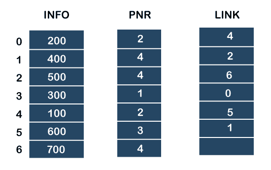
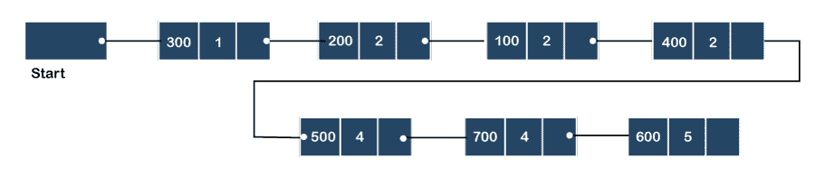
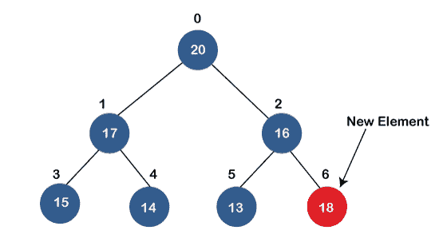
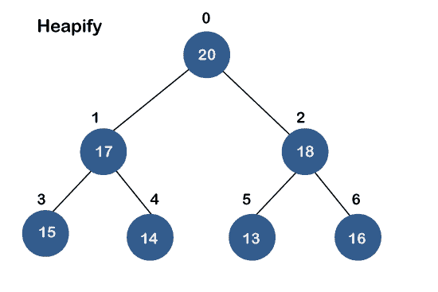
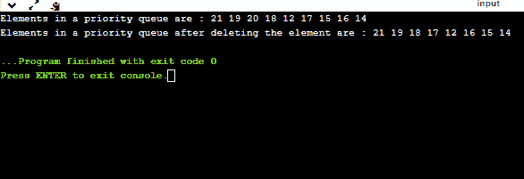

# 什么是优先级队列？

> 原文：<https://www.javatpoint.com/ds-priority-queue>

优先级队列是一种抽象数据类型，其行为类似于正常队列，只是每个元素都有一些优先级，即优先级最高的元素在优先级队列中排在第一位。优先级队列中元素的优先级将决定从优先级队列中移除元素的顺序。

优先级队列只支持可比较的元素，这意味着元素要么按升序排列，要么按降序排列。

例如，假设我们在优先级队列中插入了一些值，如 1、3、4、8、14、22，对这些值的排序是从最小到最大。因此，1 将具有最高优先级，而 22 将具有最低优先级。

### 优先级队列的特征

优先级队列是包含以下特征的队列的扩展:

*   优先级队列中的每个元素都有相关的优先级。
*   具有较高优先级的元素将在删除较低优先级的元素之前被删除。
*   如果优先级队列中的两个元素具有相同的优先级，它们将使用先进先出原则进行排列。

**我们通过一个例子来了解优先级队列。**

我们有一个包含以下值的优先级队列:

**1、3、4、8、14、22**

所有值都按升序排列。现在，我们将观察执行以下操作后优先级队列的外观:

*   **poll():** 该函数将从优先级队列中删除优先级最高的元素。在上述优先级队列中，“1”元素具有最高优先级，因此它将从优先级队列中删除。
*   **添加(2):** 该函数将在优先级队列中插入‘2’元素。因为 2 是所有数字中最小的元素，所以它将获得最高优先级。
*   **poll():** 它将从优先级队列中删除“2”元素，因为它具有最高优先级队列。
*   **添加(5):** 它会在 4 之后插入 5 个元素，因为 5 大于 4 小于 8，所以它会获得优先级队列中的第三高优先级。

### 优先级队列的类型

**优先级队列有两种:**

*   **升序优先级队列:**在升序优先级队列中，优先级较低的编号被赋予较高的优先级。比如，我们取 1 到 5 之间的数字，按照 1，2，3，4，5 这样的升序排列；因此，最小的数字，即 1，被赋予优先级队列中的最高优先级。
    T3】
*   **降序优先级队列:**在降序优先级队列中，较高的优先级号被赋予优先级中较高的优先级。例如，我们取从 1 到 5 的数字，按降序排列，如 5，4，3，2，1；因此，最大的数字，即 5，被给予优先级队列中的最高优先级。
    T3】

### 优先级队列的表示

现在，我们将看到如何通过单向列表来表示优先级队列。

我们将使用下面给出的列表创建优先级队列，其中 **INFO** 列表包含数据元素， **PRN** 列表包含 **INFO** 列表中可用的每个数据元素的优先级编号，LINK 基本包含下一个节点的地址。



**让我们逐步创建优先级队列。**

**在优先级队列的情况下，较低的优先级数被认为是较高的优先级，即**较低的优先级数=较高的优先级。

**步骤 1:** 在列表中，优先级较低的数字为 1，其数据值为 333，因此将插入列表中，如下图所示:

**步骤 2:** 在插入 333 之后，优先级号 2 具有更高的优先级，并且与该优先级相关联的数据值是 222 和 111。因此，这些数据将根据先进先出原则插入；因此，将首先添加 222，然后添加 111。

**步骤 3:** 插入优先级 2 的元素后，下一个更高的优先级编号为 4，与 4 个优先级编号相关联的数据元素为 444、555、777。在这种情况下，将根据先进先出原则插入元素；因此，将首先添加 444，然后添加 555，然后添加 777。

**第四步:**插入优先级 4 的元素后，下一个更高的优先级数是 5，与优先级 5 关联的值是 666，所以会插入到队列的末尾。



### 优先级队列的实现

优先级队列可以通过四种方式实现，包括数组、链表、堆数据结构和二叉查找树。堆数据结构是实现优先级队列的最有效方式，因此我们将在本主题中使用堆数据结构来实现优先级队列。现在，我们首先理解为什么堆是所有其他数据结构中最有效的方式。

**使用不同实现分析复杂性**

| 履行 | 增加 | 移动 | 偷看 |
| 合框架 | O(1) | O(n) | O(n) |
| 二进制堆 | O(logn) | O(logn) | O(1) |
| 二叉查找树 | O(logn) | O(logn) | O(1) |

### 什么是堆？

堆是一种基于树的数据结构，它形成一个完整的二叉树，并满足堆属性。如果 A 是 B 的父节点，那么对于堆中的所有节点 A 和 B，A 相对于节点 B 是有序的。这意味着父节点的值可以大于或等于子节点的值，或者父节点的值可以小于或等于子节点的值。因此，我们可以说有两种类型的堆:

*   **最大堆:**最大堆是父节点的值大于子节点的值的堆。
    T3】
*   **最小堆:**最小堆是父节点的值小于子节点的值的堆。
    T3】

这两个堆都是二进制堆，因为每个堆都正好有两个子节点。

### 优先级队列操作

我们可以对优先级队列执行的常见操作是插入、删除和查看。让我们看看如何维护堆数据结构。

*   **将元素插入优先级队列(最大堆)**

如果我们在优先级队列中插入一个元素，它将从上到下、从左到右移动到空槽。

如果元素不在正确的位置，则将其与父节点进行比较；如果发现顺序不对，则交换元素。这个过程一直持续到元素被放置在正确的位置。




*   **从优先级队列中移除最小元素**

我们知道，在最大堆中，最大元素是根节点。当我们移除根节点时，它会创建一个空插槽。最后插入的元素将被添加到这个空槽中。然后，将该元素与子节点(即，左子节点和右子节点)进行比较，并与两者中较小的一个进行交换。它一直向下移动，直到堆属性恢复。

### 优先级队列的应用

**以下是优先级队列的应用:**

*   它用于迪克斯特拉最短路径算法。
*   它用在 prim 的算法中
*   它用于数据压缩技术，如霍夫曼码。
*   它用于堆排序。
*   它也用于操作系统，如优先级调度、负载平衡和中断处理。

**使用二进制最大堆创建优先级队列的程序。**

```

#include #include <stdio.h>int heap[40];
int size=-1;

// retrieving the parent node of the child node
int parent(int i) 
{ 

    return (i - 1) / 2; 
} 

// retrieving the left child of the parent node.
int left_child(int i)
{
 return i+1; 
}
// retrieving the right child of the parent
int right_child(int i)
{
 return i+2; 
}
// Returning the element having the highest priority
int get_Max()
{
    return heap[0];
}
//Returning the element having the minimum priority
int get_Min()
{
    return heap[size];
}
// function to move the node up the tree in order to restore the heap property.
void moveUp(int i) 
{ 
    while (i > 0) 
    {
        // swapping parent node with a child node
        if(heap[parent(i)] < heap[i]) { 

        int temp;
        temp=heap[parent(i)];
        heap[parent(i)]=heap[i];
        heap[i]=temp;

    } 
       // updating the value of i to i/2 
       i=i/2;
    }
} 

//function to move the node down the tree in order to restore the heap property.
void moveDown(int k)
{
    int index = k; 

    // getting the location of the Left Child 
    int left = left_child(k); 

    if (left <= size && heap[left] > heap[index]) { 
        index = left; 
    } 

    // getting the location of the Right Child 
    int right = right_child(k); 

    if (right <= size && heap[right] > heap[index]) { 
        index = right; 
    } 

    // If k is not equal to index 
    if (k != index) { 
      int temp;
      temp=heap[index];
      heap[index]=heap[k];
      heap[k]=temp;
        moveDown(index); 
    } 
}

// Removing the element of maximum priority
void removeMax()
{
    int r= heap[0];
    heap[0]=heap[size];
    size=size-1;
    moveDown(0);
}
//inserting the element in a priority queue
void insert(int p) 
{ 
    size = size + 1; 
    heap[size] = p; 

    // move Up to maintain heap property 
    moveUp(size); 
} 

//Removing the element from the priority queue at a given index i.
void delete(int i) 
{ 
    heap[i] = heap[0] + 1; 

   // move the node stored at ith location is shifted to the root node
    moveUp(i); 

    // Removing the node having maximum priority 
    removeMax(); 
} 
int main()
{
    // Inserting the elements in a priority queue

    insert(20);
    insert(19);
    insert(21);
    insert(18);
    insert(12);
    insert(17);
    insert(15);
    insert(16);
    insert(14);
    int i=0;

 printf("Elements in a priority queue are : ");
 for(int i=0;i<=size;i++)
    {
       printf("%d ",heap[i]);
    }
    delete(2); // deleting the element whose index is 2.
    printf("\nElements in a priority queue after deleting the element are : ");
    for(int i=0;i<=size;i++)
    {
       printf("%d ",heap[i]);
    }
int max=get_Max();
    printf("\nThe element which is having the highest priority is %d: ",max);

    int min=get_Min();
        printf("\nThe element which is having the minimum priority is : %d",min);
    return 0;
}</stdio.h> 
```

**在上面的程序中，我们已经创建了以下功能:**

*   **int parent(int i):** 这个函数返回子节点的父节点的索引，即
*   **int left_child(int i):** 此函数返回给定索引的左子索引，即
*   **int right_child(int i):** 该函数返回给定索引的右子索引，即
*   **void moveUp(int i):** 这个函数将继续在树中向上移动节点，直到堆属性恢复。
*   **void moveDown(int i):** 这个函数将继续沿着树向下移动节点，直到堆属性恢复。
*   **void removeMax():** 该函数删除优先级最高的元素。
*   **void insert(int p):** 它在优先级队列中插入元素，该元素作为参数在函数**中传递。**
*   **void delete(int i):** 它从给定索引的优先级队列中删除元素。
*   **int get_Max():** 它返回优先级最高的元素，我们知道在 Max 堆中，根节点包含了值最大、优先级最高的元素。
*   **int get_Min():** 它返回优先级最低的元素，我们知道在 max 堆中，最后一个节点包含优先级最低、值最小的元素。

**输出**



* * *