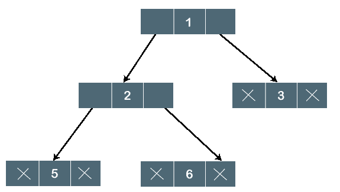
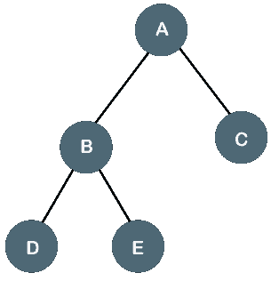
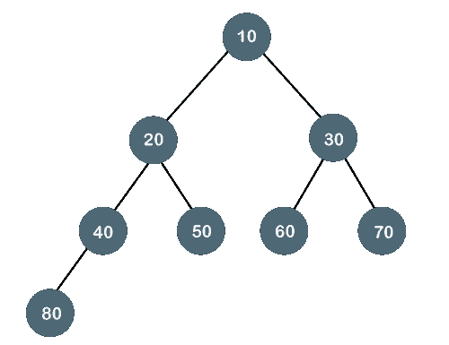
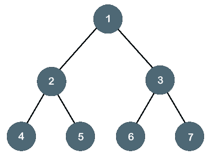
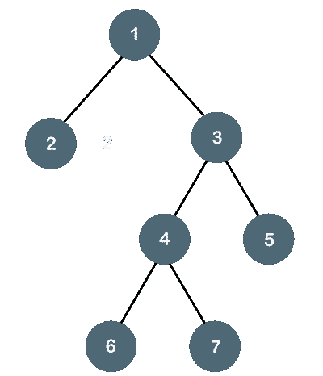
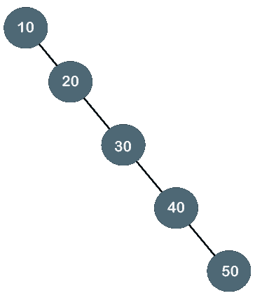
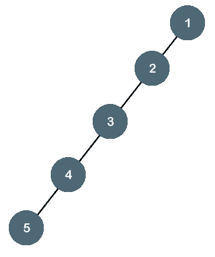
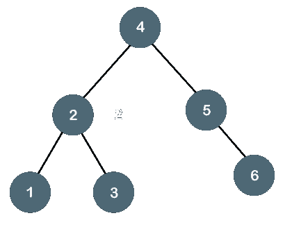
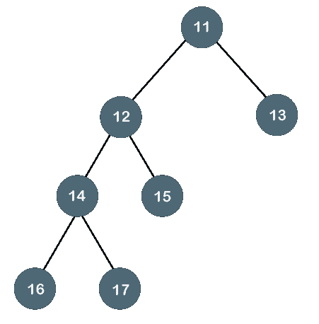

# 二叉树

> 原文：<https://www.javatpoint.com/binary-tree>

二叉树意味着节点最多可以有两个子节点。这里，二进制名称本身就暗示‘二’；因此，每个节点可以有 0、1 或 2 个子节点。

**我们通过一个例子来理解二叉树。**


上面的树是二叉树，因为每个节点最多包含两个子节点。上述树的逻辑表示如下:



在上面的树中，节点 1 包含两个指针，即分别指向左节点和右节点的左指针和右指针。节点 2 包含两个节点(左节点和右节点)；因此，它有两个指针(左和右)。节点 3、5 和 6 是叶节点，因此所有这些节点在左右两侧都包含**空**指针。

### 二叉树的性质

*   在 I 的每个级别，最大节点数为 2 <sup>i</sup> 。
*   树的高度被定义为从根节点到叶节点的最长路径。上面显示的树的高度等于 3。因此，高度 3 处的最大节点数等于(1+2+4+8) = 15。一般来说，高度 h 处可能的最大节点数为(2<sup>0</sup>+2<sup>1</sup>+2<sup>2</sup>+…. 2<sup>h</sup>)= 2<sup>h+1</sup>-1。
*   高度 h 处可能的最小节点数等于 **h+1** 。
*   如果节点的数量是最小的，那么树的高度将是最大的。相反，如果节点数最大，则树的高度最小。

如果二叉树中有 n 个节点。

**最小高度可计算为:**

我们知道，

n = 2 <sup>h+1</sup> -1

n+1 = 2 <sup>h+1</sup>

从两边取原木，

log<sub>2</sub>(n+1)= log 2(2<sup>h+1</sup>)

log <sub>2</sub> (n+1) = h+1

**h = log <sub>2</sub> (n+1) - 1**

**最大高度可计算为:**

我们知道，

n = h+1

**h= n-1**

### 二叉树的类型

**二叉树有四种类型:**

*   **完全/适当/严格二叉树**
*   **完全二叉树**
*   **完美二叉树**
*   **退化二叉树**
*   **平衡二叉树**

**1。完全/适当/严格二叉树**

全二叉树也称为严格二叉树。如果每个节点必须包含 0 或 2 个子节点，则该树只能被视为完全二叉树。完全二叉树也可以定义为这样的树，其中除了叶节点之外，每个节点必须包含 2 个子节点。

**我们来看看全二叉树的简单例子。**



在上面的树中，我们可以观察到每个节点要么包含零个子节点，要么包含两个子节点；因此，它是一棵完全二叉树。

**全二叉树的属性**

*   叶节点数等于内部节点数加 1。在上面的例子中，内部节点的数量是 5；因此，叶节点的数量等于 6。
*   最大节点数与二叉树中的节点数相同，即 2 <sup>h+1</sup> -1。
*   完全二叉树中的最小节点数是 2*h-1。
*   全二叉树的最小高度为 **log <sub>2</sub> (n+1) - 1。**
*   完整二叉树的最大高度可以计算为:

n= 2*h - 1

n+1 = 2*h

**h = n+1/2**

**完全二叉树**

完全二叉树是指除最后一级节点外，所有节点都被完全填充的树。在最后一层，所有的节点必须尽可能地保留。在完整的二叉树中，节点应该从左边开始添加。

让我们创建一个完整的二叉树。



上面的树是一个完整的二叉树，因为所有的节点都被完全填充了，最后一级的所有节点都是先加在左边的。

**完全二叉树的性质**

*   完全二叉树的最大节点数为 2 <sup>h+1</sup> - 1。
*   完全二叉树的最小节点数为 2 <sup>h</sup> 。
*   完整二叉树的最小高度为 **log <sub>2</sub> (n+1) - 1。**
*   完整二叉树的最大高度是

**完美二叉树**

如果所有内部节点都有 2 个子节点，并且所有叶节点都在同一级别，那么树就是一棵完美的二叉树。



**我们来看一个完美二叉树的简单例子。**

下面的树不是一棵完美的二叉树，因为所有的叶子节点不在同一层。



#### 注意:所有的完美二叉树是完全二叉树，也是完全二叉树，但反之不成立，即所有的完全二叉树和完全二叉树都是完美二叉树。

### 退化二叉树

退化二叉树是所有内部节点只有一个子节点的树。

**我们通过例子来理解退化二叉树。**



上面的树是一个退化的二叉树，因为所有的节点只有一个子节点。它也被称为右斜树，因为所有节点只有一个右子节点。



上面的树也是退化的二叉树，因为所有的节点只有一个子节点。它也被称为左倾树，因为所有节点都只有一个左子节点。

**平衡二叉树**

平衡二叉树是一种左右树相差 1 的树。比如***【AVL】******红黑树*** 就是平衡二叉树。

**我们通过例子来理解平衡二叉树。**



上面的树是平衡二叉树，因为左子树和右子树的差别为零。



上面的树不是平衡二叉树，因为左子树和右子树的差大于 1。

### 二叉树实现

二叉树是在指针的帮助下实现的。树中的第一个节点由根指针表示。树中的每个节点由三部分组成，即数据、左指针和右指针。要创建二叉树，我们首先需要创建节点。我们将创建如下所示的自定义节点:

```

struct node
{
   int data,
   struct node *left, *right;
}

```

在上面的结构中，**数据**为数值，**左指针**包含左节点的地址，**右指针**包含右节点的地址。

**C 中的二叉树程序**

```

#include struct node
     {
          int data;
          struct node *left, *right;
      }
      void main()
    {
       struct node *root;
       root = create();
    }
struct node *create()
{
   struct node *temp;
   int data;
   temp = (struct node *)malloc(sizeof(struct node));
   printf("Press 0 to exit");
   printf("\nPress 1 for new node");
   printf("Enter your choice : ");
   scanf("%d", &choice); 
   if(choice==0)
{
return 0;
}
else
{
   printf("Enter the data:");
   scanf("%d", &data);
   temp->data = data;
   printf("Enter the left child of %d", data);
   temp->left = create();
printf("Enter the right child of %d", data);
temp->right = create();
return temp; 
}
} 
```

上面的代码递归调用 create()函数，并在每次递归调用时创建新节点。当所有的节点都被创建后，它就形成了一个二叉树结构。访问节点的过程称为树遍历。有三种类型的遍历用于访问节点:

*   有序遍历
*   前序遍历
*   后序遍历

* * *