# 树

> 原文：<https://www.javatpoint.com/avl-tree>

AVL 树是通用汽车公司阿德尔森-维尔斯基和 EM Landis 在 1962 年发明的。这棵树被命名为 AVL，以纪念它的发明者。

AVL Tree 可以定义为高度平衡二叉查找树，其中每个节点都与一个平衡因子相关联，该平衡因子是通过从其左子树的高度减去其右子树的高度来计算的。

如果每个节点的平衡因子在-1 到 1 之间，就说树是平衡的，否则树会不平衡，需要平衡。

## 平衡系数(k) =高度(左(k)) -高度(右(k))

如果任一节点的平衡因子为 1，则表示左子树比右子树高一级。

如果任意节点的平衡因子为 0，则表示左子树和右子树包含相等的高度。

如果任一节点的平衡因子为-1，则表示左子树比右子树低一级。

下图给出了一个 AVL 树。我们可以看到，与每个节点相关联的平衡因子在-1 和+1 之间。因此，它是 AVL 树的一个例子。

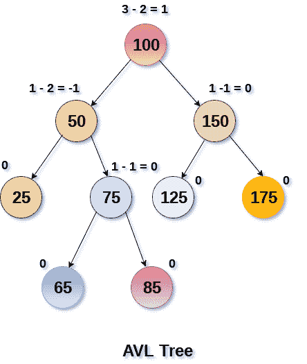

## 复杂性

| 算法 | 平均案例 | 最坏情况 |
| 空间 | o(n) | o(n) |
| 搜索 | o(对数 n) | o(对数 n) |
| 插入 | o(对数 n) | o(对数 n) |
| 删除 | o(对数 n) | o(对数 n) |

## 对 AVL 树的操作

由于 AVL 树也是二叉查找树树，因此所有操作的执行方式与在二叉查找树树中执行的方式相同。搜索和遍历不会导致违反 AVL 树的属性。但是，插入和删除是可能违反该属性的操作，因此需要重新访问它们。

| 塞内加尔 | 操作 | 描述 |
| one | 插入 | 在 AVL 树中插入的执行方式与在二叉查找树中执行的方式相同。但是，这可能会导致违反 AVL 树属性，因此树可能需要平衡。这棵树可以通过旋转来平衡。 |
| Two | [删除](deletion-in-avl-tree) | 删除也可以以与在二叉查找树相同的方式执行。删除也可能会扰乱树的平衡，因此，使用各种类型的旋转来重新平衡树。 |

## 为什么是 AVL 树？

AVL 树通过不让二叉查找树倾斜来控制它的高度。在高度为 h 的二叉查找树中进行所有操作所需的时间为 **O(h)** 。然而，如果 BST 变得偏斜(即最坏的情况)，它可以扩展到 **O(n)** 。通过将该高度限制为 log n，AVL 树将每个操作的上限设置为 **O(log n)** ，其中 n 是节点数。

## AVL 旋转

只有当平衡因子不是 **-1、0 和 1** 时，我们才在 AVL 树中执行旋转。基本上有以下四种类型的旋转:

1.  L L 旋转:插入的节点在 A 的左子树的左子树中
2.  R R 旋转:插入的节点在 A 的右子树的右子树中
3.  左右旋转:插入的节点在 A 的左子树的右子树中
4.  左旋转:插入的节点在 A 的右子树的左子树中

其中节点 A 是平衡因子不是-1，0，1 的节点。

前两次旋转 LL 和 RR 是单次旋转，后两次旋转 LR 和 RL 是双次旋转。一棵树要不平衡，最小高度必须至少为 2。让我们了解每一次旋转

### 1.右后旋转

当 BST 变得不平衡时，由于一个节点被插入到 A 的右子树的右子树中，那么我们执行 RR 旋转， [RR 旋转](https://www.javatpoint.com/rr-rotation-in-avl-tree)是逆时针旋转，应用在平衡因子为-2 的节点下面的边上

在上面的例子中，节点 A 具有平衡因子-2，因为节点 C 被插入到 A 右子树的右子树中。我们在 a 以下的边上执行 RR 旋转。

### 2.LL 旋转

当 BST 变得不平衡时，由于一个节点被插入到 C 的左子树的左子树中，那么我们执行 LL 旋转， [LL 旋转](https://www.javatpoint.com/ll-rotation-in-avl-tree)是顺时针旋转，应用在平衡因子为 2 的节点下面的边上。

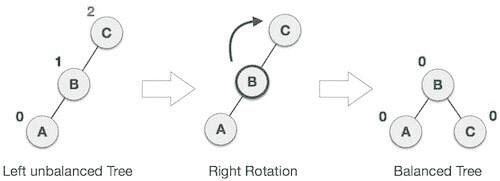

在上面的例子中，节点 C 具有平衡因子 2，因为节点 A 被插入到 C 左子树的左子树中。我们在 a 下面的边上执行 LL 旋转。

### 3.LR 旋转

双旋转比上面已经解释过的单旋转更难。LR 旋转= RR 旋转+ LL 旋转，即先对子树进行 RR 旋转，再对全树进行 LL 旋转，全树我们指的是平衡因子不是-1、0 或 1 的插入节点路径的第一个节点。

**让我们非常清楚地了解每一步:**

| 状态 | 行动 |
| 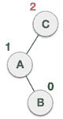 | 节点 B 已经被插入到 A 的右子树和 C 的左子树中，因此 C 已经成为具有平衡因子 2 的不平衡节点。这种情况是 L R 旋转，其中:插入的节点在 C 的左子树的右子树中 |
| 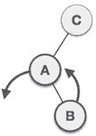 | 由于左后旋转=右后+左后旋转，因此首先执行以 A 为根的子树上的右后(逆时针)。通过做 RR 旋转，节点 **A** 变成了 **B** 的左子树。 |
| 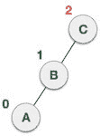 | 执行 RR 旋转后，节点 C 仍然不平衡，即平衡系数为 2，因为插入的节点 A 位于 **C** 的左侧 |
| 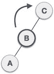 | 现在我们对全树进行 LL 顺时针旋转，也就是在节点 C 上，节点 **C** 现在变成了节点 B 的右子树，A 是 B 的左子树 |
|  | 现在每个节点的平衡因子要么是-1，要么是 0，要么是 1，也就是说现在 BST 是平衡的。 |

### 4.RL 旋转

正如已经讨论过的，双旋转比上面已经解释过的单旋转更难。 [R L 旋转](https://www.javatpoint.com/rl-rotation-in-avl-tree) = LL 旋转+ RR 旋转，即先对子树进行 LL 旋转，再对全树进行 RR 旋转，全树我们指的是平衡因子不是-1、0 或 1 的插入节点路径的第一个节点。

| 状态 | 行动 |
| 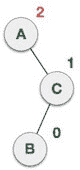 | 一个节点 **B** 已经被插入到 **C** 的左子树中 **A** 的右子树中，正因为如此，A 变成了一个平衡因子为- 2 的不平衡节点。这种情况是 RL 旋转，其中:插入的节点在 A 的右子树的左子树中 |
| 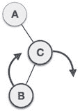 | 由于 RL 旋转= LL 旋转+ RR 旋转，因此，首先在以 **C** 为根的子树上执行 LL(顺时针)。通过做 RR 旋转，节点 **C** 变成了 **B** 的右子树。 |
|  | 执行 LL 旋转后，节点 **A** 仍然不平衡，即具有平衡因子-2，这是因为右子树节点 A 的右子树 |
| 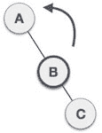 | 现在我们对全树进行 RR 旋转(逆时针旋转)，即在节点 A 上，节点 **C** 现在已经成为节点 B 的右子树，节点 A 已经成为节点 B 的左子树。 |
| 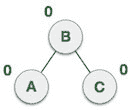 | 现在每个节点的平衡因子要么是-1，要么是 0，要么是 1，也就是说现在 BST 是平衡的。 |

### 问:构建一个包含以下元素的 AVL 树

**H、I、J、B、A、E、C、F、D、G、K、L**

**1。插入 H、I、J**

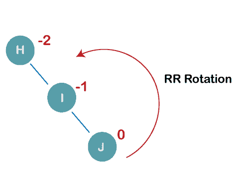

在插入上述元素时，特别是在 H 的情况下，由于 H 的平衡因子为-2，BST 变得不平衡。由于 BST 是右偏的，我们将在节点 h 上执行 RR 旋转

**生成的平衡树为:**

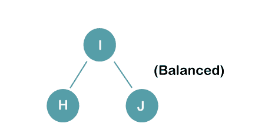

**2。插入 B、A**

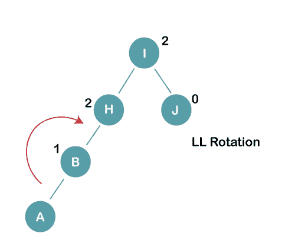

在插入上述元素时，特别是在 A 的情况下，由于 H 和 I 的平衡因子为 2，BST 变得不平衡，我们考虑从最后插入的节点即 H 开始的第一个节点。由于来自 H 的 BST 是左偏的，我们将在节点 H 上执行 ll 旋转

**生成的平衡树为:**

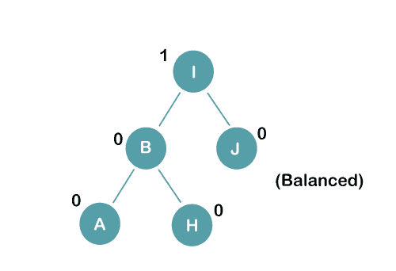

**3。插入 E**

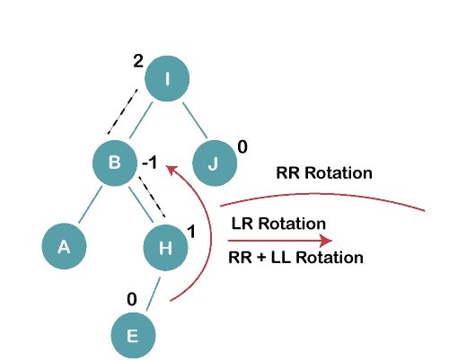

在插入 E 时，由于 I 的平衡因子为 2，BST 变得不平衡，因为如果我们从 E 行进到 I，我们发现它被插入到 I 的右子树的左子树中，我们将在节点 I 上执行 LR 旋转。LR = RR + LL 旋转

**3 a)我们首先在节点 B 上执行 RR 旋转**

**RR 旋转后的结果树为:**

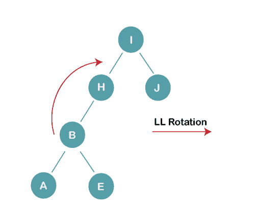

**3b)我们首先在节点 I 上执行 LL 旋转**

**LL 旋转后得到的平衡树为:**

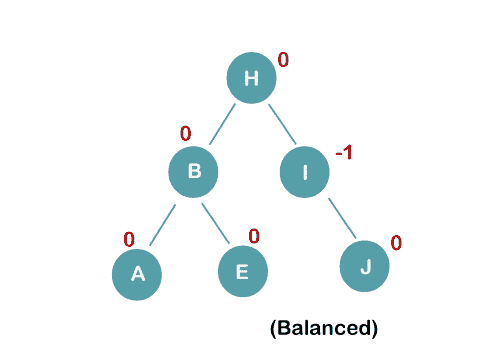

**4。插入 C、F、D**

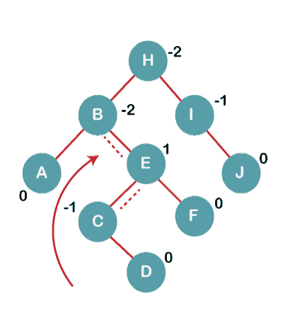

在插入 C、F、D 时，由于 B 和 H 的平衡因子为-2，BST 变得不平衡，因为如果我们从 D 行进到 B，我们发现它被插入到 B 的左子树的右子树中，我们将在节点 I 上执行 RL 旋转。RL = LL + RR 旋转。

**4a)我们首先在节点 E 上执行 LL 旋转**

**LL 旋转后的结果树为:**

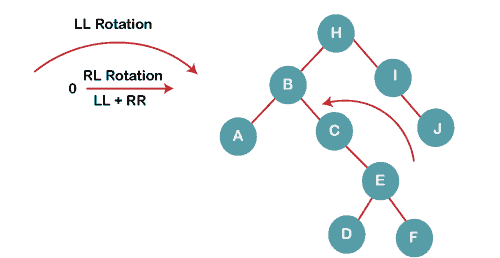

**4b)然后我们在节点 B 上执行 RR 旋转**

**RR 旋转后得到的平衡树为:**

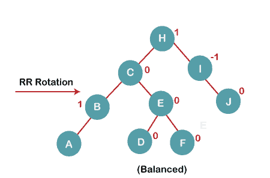

**5。插入 G**

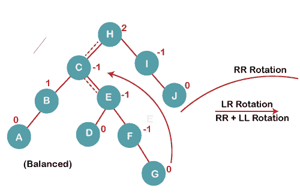

在插入 G 时，由于 H 的平衡因子为 2，BST 变得不平衡，因为如果我们从 G 行进到 H，我们发现它被插入 H 的右子树的左子树中，我们将在节点 I 上执行 LR 旋转。LR = RR + LL 旋转。

**5 a)我们首先在节点 C 上执行 RR 旋转**

**RR 旋转后的结果树为:**

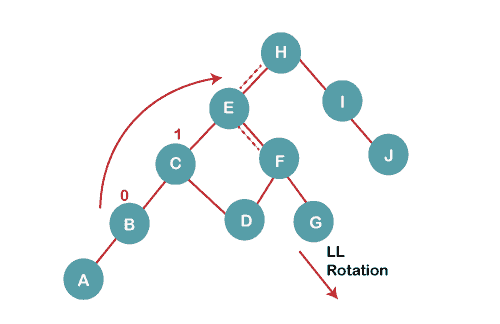

**5 b)然后我们在节点 H 上执行 LL 旋转**

**LL 旋转后得到的平衡树为:**

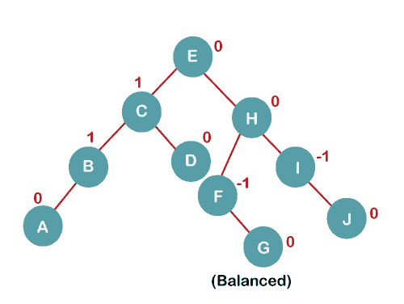

**6。插入 K**

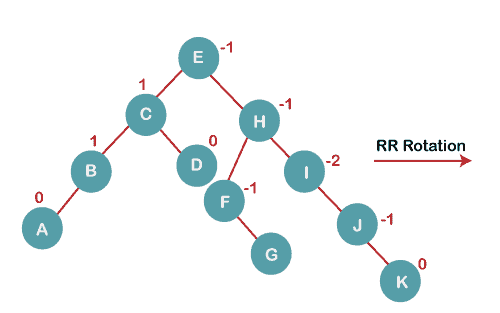

当插入 K 时，由于 I 的平衡因子为-2，BST 变得不平衡。由于 BST 从 I 到 K 是右偏的，因此我们将在节点 I 上执行 RR 旋转

**RR 旋转后得到的平衡树为:**

**7。插入 L**

在插入时，L 树仍然是平衡的，因为每个节点的平衡因子现在是-1，0，+1。因此，该树是一个平衡的 AVL 树

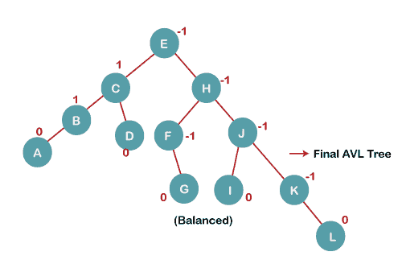

* * *