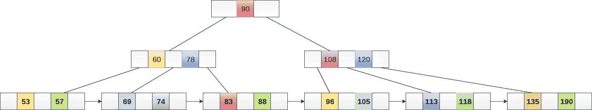
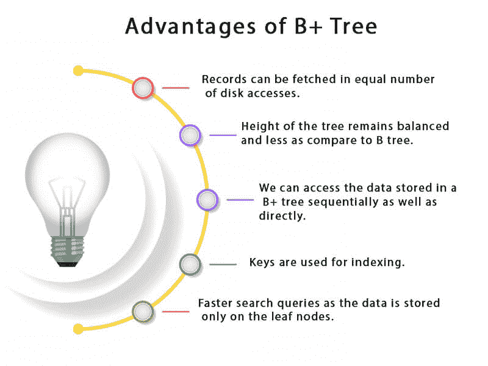
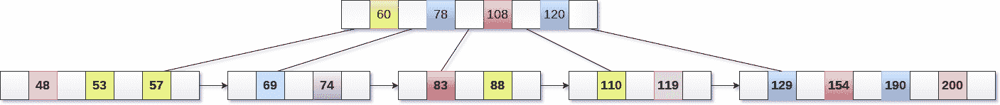
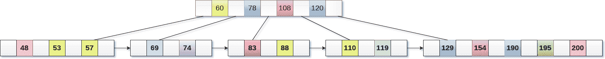
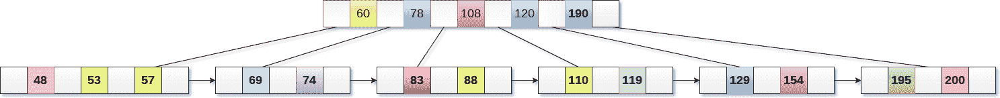
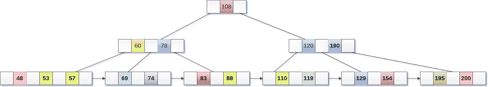
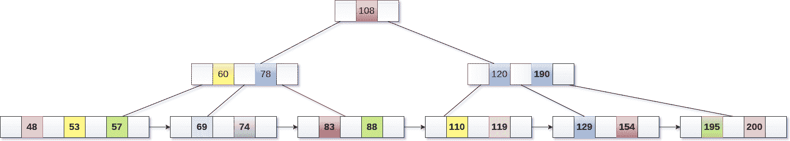
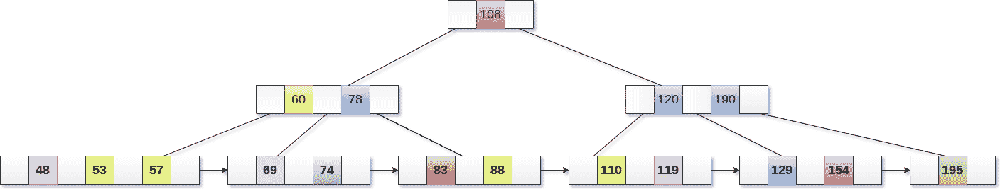
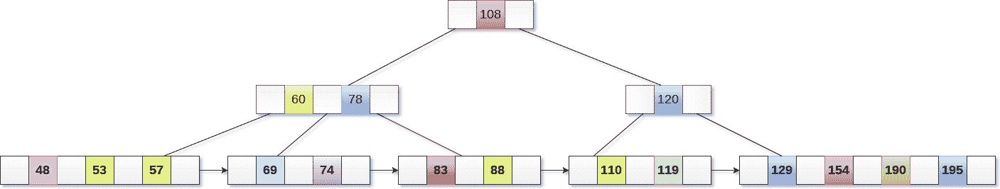
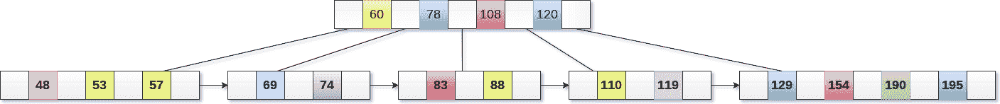

# B+树

> 原文：<https://www.javatpoint.com/b-plus-tree>

B+树是 B 树的扩展，允许有效的插入、删除和搜索操作。

在 B 树中，键和记录都可以存储在内部节点和叶节点中。然而，在 B+树中，记录(数据)只能存储在叶节点上，而内部节点只能存储键值。

B+树的叶节点以单链表的形式链接在一起，使搜索查询更加高效。

B+ Tree 用于存储大量无法存储在主存中的数据。由于主存储器的大小总是有限的，B+树的内部节点(访问记录的键)存储在主存储器中，而叶节点存储在辅助存储器中。

B+树的内部节点通常称为索引节点。下图显示了一个 3 阶的 B+树。

## B+树的优势

1.  记录可以以相等的磁盘访问次数被提取。
2.  与 B 树相比，树的高度保持平衡且较小。
3.  我们可以按顺序或者直接访问存储在 B+树中的数据。
4.  键用于索引。
5.  更快的搜索查询，因为数据只存储在叶节点上。

## B 树 VS B+树

| 塞内加尔 | b 树 | B+树 |
| one | 搜索关键字不能重复存储。 | 可能存在冗余的搜索关键字。 |
| Two | 数据可以存储在叶节点和内部节点中 | 数据只能存储在叶节点上。 |
| three | 搜索一些数据是一个较慢的过程，因为数据可以在内部节点和叶节点上找到。 | 搜索相对较快，因为数据只能在叶节点上找到。 |
| four | 删除内部节点是如此复杂和耗时。 | 删除永远不会是一个复杂的过程，因为元素永远会从叶节点中删除。 |
| five | 叶节点不能链接在一起。 | 叶节点被链接在一起，以使搜索操作更加有效。 |

## B+树中的插入

**步骤 1:** 插入新节点作为叶节点

**第二步:**如果叶子没有需要的空间，拆分节点，将中间节点复制到下一个索引节点。

**第三步:**如果索引节点没有需要的空间，拆分节点，将中间元素复制到下一个索引页。

### 示例:

将值 195 插入下图所示的 5 阶 B+树。

195 将被插入到 190 之后的 120 的右子树中。将其插入所需位置。

该节点包含的元素多于最大数量，即 4 个，因此将其拆分，并将中间节点放置到父节点。

现在，索引节点包含 6 个子节点和 5 个键，这违反了 B+树属性，因此我们需要拆分它，如下所示。

## B+树中的删除

**第一步:**从叶子中删除密钥和数据。

**步骤 2:** 如果叶节点包含的元素少于最小数量，则向下合并该节点及其同级节点，并删除它们之间的键。

**第 3 步:**如果索引节点包含的元素少于最小数量，则将该节点与同级合并，并在它们之间向下移动键。

### 例子

从下图所示的 B+树中删除键 200。

200 出现在 190 的右子树中，在 195 之后。删除它。

使用 195、190、154 和 129 合并这两个节点。

现在，元素 120 是节点中存在的违反 B+树属性的单个元素。因此，我们需要使用 60、78、108 和 120 来合并它。

现在，B+树的高度将减少 1。

