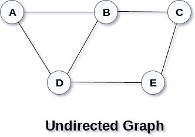
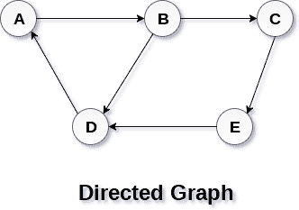

# 图表

> 原文：<https://www.javatpoint.com/ds-graph>

一个图可以被定义为一组顶点和用于连接这些顶点的边。一个图可以看作是一个循环树，其中的顶点(节点)保持它们之间的任何复杂关系，而不是父子关系。

## 定义

图 G 可以定义为有序集 G(V，E)，其中 V(G)表示顶点集，E(G)表示用于连接这些顶点的边集。

下图是一个有 5 个顶点(A，B，C，D，E)和 6 条边((A，B)，(B，C)，(C，E)，(E，D)，(D，B)，(D，A))的图 G(V，E)。

## 有向图和无向图

图可以是有向的，也可以是无向的。然而，在无向图中，边与方向无关。上图显示了一个无向图，因为它的边没有任何方向。如果一条边存在于顶点 A 和 B 之间，那么这些顶点可以从 B 穿越到 A，也可以从 A 穿越到 B

在有向图中，边形成有序对。边表示从某个顶点 A 到另一个顶点 B 的特定路径。节点 A 称为初始节点，而节点 B 称为终端节点。

下图显示了一个有向图。

## 图形术语

### 小路

路径可以被定义为为了从初始节点 u 到达某个终端节点 V 而遵循的节点序列

### 通路

如果初始节点与终端节点相同，路径将被称为闭合路径。如果 V 0 =V N ，则一条路径将是闭合路径。

### 简单通路

如果图的所有节点都是不同的，除了 V 0 =V N ，那么这样的路径 P 被称为封闭简单路径。

### 循环

循环可以定义为除了第一个和最后一个顶点之外，没有重复的边或顶点的路径。

### 连通图

连通图是在 v 中每两个顶点(u，v)之间存在某种路径的图。连通图中没有孤立的节点。

### 完全图

完整的图是每个节点都与所有其他节点相连的图。一个完整的图包含 n(n-1)/2 条边，其中 n 是图中的节点数。

### 加权图

在加权图中，每条边都分配有一些数据，如长度或重量。边 e 的权重可以用 w(e)表示，w(e)必须是正(+)值，表示遍历边的成本。

### 连字

有向图是一种有向图，其中图的每条边都与某个方向相关联，遍历只能在指定的方向上进行。

### 环

与相似端点相关联的边可以称为“环”。

### 相邻节点

如果两个节点 u 和 v 通过一条边 e 相连，那么节点 u 和 v 称为邻居或相邻节点。

### 节点的度

节点的度数是与该节点相连的边的数量。度数为 0 的节点称为隔离节点。