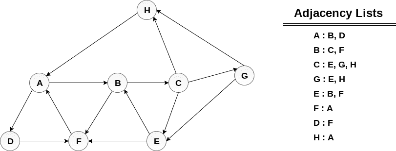

# 深度优先搜索算法

> 原文：<https://www.javatpoint.com/depth-first-search-algorithm>

深度优先搜索(DFS)算法从图 G 的初始节点开始，然后越陷越深，直到找到目标节点或没有子节点的节点。然后，该算法从死胡同回溯到尚未完全探索的最近节点。

DFS 中使用的数据结构是堆栈。这个过程类似于 BFS 算法。在 DFS 中，通向未访问节点的边称为发现边，而通向已访问节点的边称为块边。

## 算法

*   **步骤 1:** 为 G 中的每个节点设置 STATUS = 1(就绪状态)
*   **第二步:**推送堆栈上的起始节点 A，并将其 STATUS 设置为 2(等待状态)
*   **步骤 3:** 重复步骤 4 和 5，直到 STACK 为空
*   **第四步:**弹出顶节点 n，处理，设置其 STATUS = 3(已处理状态)
*   **步骤 5:** 将所有处于就绪状态(其状态= 1)的 N 个邻居推上堆栈，并设置其
    状态= 2(等待状态)
    【循环结束】
*   **第 6 步:**退出

### 示例:

考虑图 G 及其邻接表，如下图所示。使用深度优先搜索(DFS)算法，计算从节点 H 开始打印图形所有节点的顺序。



### 解决方案:

将 H 推到堆栈上

```

STACK : H 

```

弹出堆栈的顶部元素，即 H，打印它，并将 H 的所有邻居推到处于就绪状态的堆栈上。

```

Print H 
STACK : A 

```

弹出堆栈的顶部元素，即 A，打印它，并将 A 的所有邻居推到处于就绪状态的堆栈上。

```

Print A
Stack : B, D

```

弹出堆栈的顶部元素，即 D，打印它，并将 D 的所有邻居推到处于就绪状态的堆栈上。

```

Print D 
Stack : B, F 

```

弹出堆栈的顶部元素，即 F，打印它，并将 F 的所有邻居推到处于就绪状态的堆栈上。

```

Print F
Stack : B

```

弹出堆栈的顶部，即 B，并推动所有邻居

```

Print B 
Stack : C 

```

弹出堆栈的顶部，即 C，并推动所有邻居。

```

Print C 
Stack : E, G 

```

弹出堆栈的顶部，即 G，并推动其所有邻居。

```

Print G
Stack : E

```

弹出堆栈的顶部，即 E，并推动其所有邻居。

```

Print E
Stack :

```

因此，堆栈现在变成空的，图中的所有节点都被遍历了。

图表的打印顺序为:

```

H → A → D → F → B → C → G → E

```