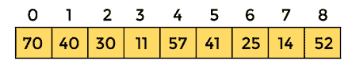
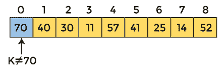
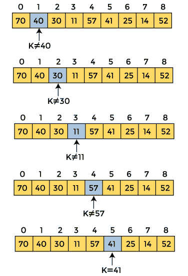
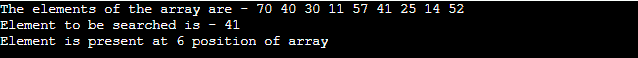
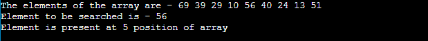
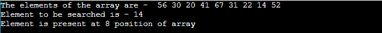
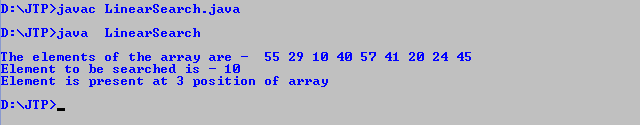
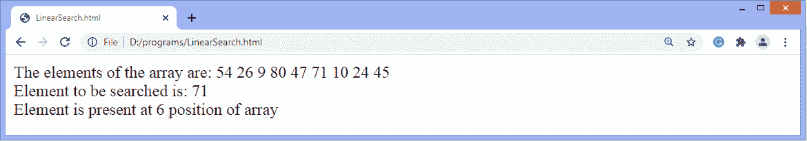

# 线性搜索算法

> 原文：<https://www.javatpoint.com/linear-search>

在本文中，我们将讨论线性搜索算法。搜索是在列表中找到某个特定元素的过程。如果该元素存在于列表中，则该过程被称为成功，并且该过程返回该元素的位置；否则，搜索被称为不成功。

两种流行的搜索方法是线性搜索和二分搜索法。因此，这里我们将讨论流行的搜索技术，即线性搜索算法。

线性搜索也称为**顺序搜索算法。**是最简单的搜索算法。在线性搜索中，我们只需遍历整个列表，并将列表中的每个元素与要找到其位置的项目进行匹配。如果找到匹配项，则返回该项的位置；否则，算法返回空值。

它被广泛用于从无序列表中搜索元素，即没有对项目进行排序的列表。线性搜索的最坏情况时间复杂度为 **O(n)。**

线性搜索的实现步骤如下-

*   首先，我们必须使用循环的**遍历数组元素。**
*   在循环**的每次迭代中，**将搜索元素与当前数组元素进行比较，并且-
    *   如果元素匹配，则返回相应数组元素的索引。
    *   如果元素不匹配，则移动到下一个元素。
*   如果给定数组中没有匹配或搜索元素不存在，返回 **-1。**

现在，让我们看看线性搜索的算法。

### 算法

```

Linear_Search(a, n, val) // 'a' is the given array, 'n' is the size of given array, 'val' is the value to search
Step 1: set pos = -1
Step 2: set i = 1
Step 3: repeat step 4 while i <= n
Step 4: if a[i] == val
set pos = i
print pos
go to step 6
[end of if]
set i = i + 1
[end of loop]
Step 5: if pos = -1
print "value is not present in the array "
[end of if]
Step 6: exit

```

## 线性搜索的工作

现在，让我们看看线性搜索算法的工作原理。

为了理解线性搜索算法的工作原理，我们来看一个未排序的数组。用一个例子就很容易理解线性搜索的工作原理。

让数组的元素是-



让要搜索的元素为 **K = 41**

现在，从第一个元素开始，将 **K** 与数组的每个元素进行比较。



**K、**即 **41、**的值与数组的第一个元素不匹配。所以，转到下一个元素。并遵循相同的过程，直到找到相应的元素。



现在，找到了要搜索的元素。因此算法将返回匹配元素的索引。

## 线性搜索复杂性

现在，让我们看看线性搜索在最佳情况、平均情况和最坏情况下的时间复杂度。我们还将看到线性搜索的空间复杂性。

### 1.时间复杂性

| 情况 | 时间复杂性 |
| **最佳情况** | O(1) |
| **平均情况** | O(n) |
| **最坏情况** | O(n) |

*   **最佳情况复杂度-** 在线性搜索中，当我们正在寻找的元素位于数组的第一个位置时，就会出现最佳情况。线性搜索的最佳时间复杂度是 **O(1)。**
*   **平均案例复杂度-** 线性搜索的平均案例时间复杂度为 **O(n)。**
*   **最坏情况复杂度-** 在线性搜索中，当我们正在寻找的元素出现在数组的末尾时，就会出现最坏情况。线性搜索的最坏情况可能是目标元素不在给定的数组中，我们必须遍历整个数组。线性搜索最差的时间复杂度是 **O(n)。**

线性搜索的时间复杂度为 **O(n)** ，因为数组中的每个元素只被比较一次。

### 2.空间复杂性

| **空间复杂度** | O(1) |

*   线性搜索的空间复杂度为 O(1)。

## 线性搜索的实现

现在，让我们看看不同编程语言的线性搜索程序。

**程序:**用 C 语言编写实现线性搜索的程序。

```

#include <stdio.h>
int linearSearch(int a[], int n, int val) {
  // Going through array sequencially
  for (int i = 0; i < n; i++)
    {
        if (a[i] == val)
        return i+1;
    }
  return -1;
}
int main() {
  int a[] = {70, 40, 30, 11, 57, 41, 25, 14, 52}; // given array
  int val = 41; // value to be searched
  int n = sizeof(a) / sizeof(a[0]); // size of array
  int res = linearSearch(a, n, val); // Store result
  printf("The elements of the array are - ");
  for (int i = 0; i < n; i++)
  printf("%d ", a[i]); 
  printf("\nElement to be searched is - %d", val);
  if (res == -1)
  printf("\nElement is not present in the array");
  else
  printf("\nElement is present at %d position of array", res);
  return 0;
}

```

**输出**



**程序:**用 C++编写一个实现线性搜索的程序。

```

#include <iostream>
using namespace std;
int linearSearch(int a[], int n, int val) {
  // Going through array linearly
  for (int i = 0; i < n; i++)
    {
        if (a[i] == val)
        return i+1;
    }
  return -1;
}
int main() {
  int a[] = {69, 39, 29, 10, 56, 40, 24, 13, 51}; // given array
  int val = 56; // value to be searched
  int n = sizeof(a) / sizeof(a[0]); // size of array
  int res = linearSearch(a, n, val); // Store result
  cout<
```

**输出**



**程序:**用 C#编写一个实现线性搜索的程序。

```

using System;
class LinearSearch {
static int linearSearch(int[] a, int n, int val) {
  // Going through array sequencially
  for (int i = 0; i < n; i++)
    {
        if (a[i] == val)
        return i+1;
    }
  return -1;
}
static void Main() {
  int[] a = {56, 30, 20, 41, 67, 31, 22, 14, 52}; // given array
  int val = 14; // value to be searched
  int n = a.Length; // size of array
  int res = linearSearch(a, n, val); // Store result
  Console.Write("The elements of the array are - ");
  for (int i = 0; i < n; i++)
  Console.Write(" " + a[i]);
  Console.WriteLine(); 
  Console.WriteLine("Element to be searched is - " + val);  
  if (res == -1)
  Console.WriteLine("Element is not present in the array");
  else
  Console.Write("Element is present at " + res +" position of array");
}
}

```

**输出**



**程序:**用 Java 写一个实现线性搜索的程序。

```

class LinearSearch {
static int linearSearch(int a[], int n, int val) {
  // Going through array sequencially
  for (int i = 0; i < n; i++)
    {
        if (a[i] == val)
        return i+1;
    }
  return -1;
}
public static void main(String args[]) {
  int a[] = {55, 29, 10, 40, 57, 41, 20, 24, 45}; // given array
  int val = 10; // value to be searched
  int n = a.length; // size of array
  int res = linearSearch(a, n, val); // Store result
  System.out.println();
  System.out.print("The elements of the array are - ");
  for (int i = 0; i < n; i++)
  System.out.print(" " + a[i]);
  System.out.println();
  System.out.println("Element to be searched is - " + val);
  if (res == -1)
  System.out.println("Element is not present in the array");
  else
  System.out.println("Element is present at " + res +" position of array");
}
}

```

**输出**



**程序:**编写一个在 JavaScript 中实现线性搜索的程序。

```

<html>  
<head>  
</head>   
<body>  
<script>   
	var a = [54, 26, 9, 80, 47, 71, 10, 24, 45]; // given array
	var val = 71; // value to be searched
	var n = a.length; // size of array	
	function linearSearch(a, n, val) {
	// Going through array sequencially
	for (var i = 0; i < n; i++)
    {
        if (a[i] == val)
        return i+1;
    }
	return -1
	}
   var res = linearSearch(a, n, val); // Store result 
   document.write("The elements of the array are: ");
   for (i = 0; i < n; i++)
   document.write(" " + a[i]);
   document.write("<br>" + "Element to be searched is: " + val);   
   if (res == -1)
   document.write("<br>" + "Element is not present in the array");
   else
   document.write("<br>" + "Element is present at " + res +" position of array"); 
    </script>   
    </body>  
</html>

```

**输出**



**程序:**编写一个在 PHP 中实现线性搜索的程序。

```

<?php
    $a = array(45, 24, 8, 80, 62, 71, 10, 23, 43); // given array
	$val = 62; // value to be searched
	$n = sizeof($a); //size of array
	function linearSearch($a, $n, $val) {
	// Going through array sequencially
	for ($i = 0; $i < $n; $i++)
    {
        if ($a[$i] == $val)
        return $i+1;
    }
	return -1;
	}
   $res = linearSearch($a, $n, $val); // Store result 
   echo "The elements of the array are: ";
   for ($i = 0; $i < $n; $i++)
   echo " " , $a[$i];
   echo "<br>" , "Element to be searched is: " , $val;   
   if ($res == -1)
   echo "<br>" , "Element is not present in the array";
   else
   echo "<br>" , "Element is present at " , $res , " position of array";
?>

```

**输出**


所以，这就是文章的全部内容。希望文章对你有所帮助和启发。

* * *