# 基数排序算法

> 原文：<https://www.javatpoint.com/radix-sort>

在本文中，我们将讨论基数排序算法。基数排序是用于整数的线性排序算法。在基数排序中，从最低有效位到最高有效位进行逐位排序。

基数排序的过程类似于根据字母顺序对学生姓名进行排序。在这种情况下，由于英语中的 26 个字母，形成了 26 个基数。在第一遍中，学生的名字按照他们名字第一个字母的升序排列。之后，在第二遍中，他们的名字按照名字第二个字母的升序排列。这个过程一直持续到我们找到排序列表。

现在，让我们看看基数排序的算法。

## 算法

```

radixSort(arr)
max = largest element in the given array
d = number of digits in the largest element (or, max)
Now, create d buckets of size 0 - 9
for i -> 0 to d
sort the array elements using counting sort (or any stable sort) according to the digits at
the ith place

```

## 基数排序算法的工作

现在，让我们看看基数排序算法的工作原理。

基数排序的排序步骤如下-

*   首先，我们必须从给定的数组中找到最大的元素(假设 **max** )。假设**‘x’**是 **max** 中的位数。计算**‘x’**是因为我们需要经过所有元素的显著位置。
*   之后，一个个走过每一个有意义的地方。在这里，我们必须使用任何稳定的排序算法来对每个重要位置的数字进行排序。

现在让我们通过一个例子来详细了解基数排序的工作原理。为了更清楚地理解它，让我们取一个未排序的数组，并尝试使用基数排序对其进行排序。这将使解释更加清晰和容易。

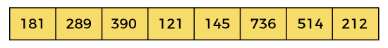

在给定的数组中，最大的元素是 **736** ，其中有 **3** 位。因此，循环将运行三次(即到达**数百个地方**)。这意味着需要三遍来排序数组。

现在，首先根据单位位数字(即 **x = 0** )对元素进行排序。这里，我们使用计数排序算法对元素进行排序。

### 传球 1:

在第一遍中，列表根据 0 处的数字进行排序。

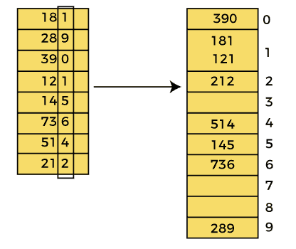

第一遍之后，数组元素是-

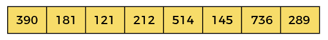

### 第二关:

在此过程中，列表根据下一个有效数字(即第 10 <sup>位的数字</sup>进行排序。

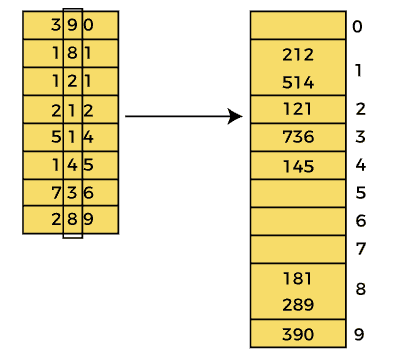

第二遍之后，数组元素是-

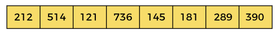

### 传球 3:

在此过程中，列表根据下一个有效数字(即第 100 <sup>位的数字</sup>进行排序。

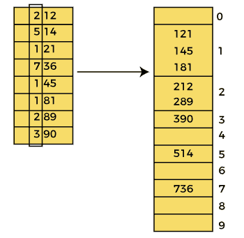

第三遍之后，数组元素是-

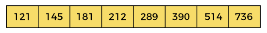

现在，数组按升序排序。

## 基数排序复杂度

现在，让我们看看在最佳情况、平均情况和最坏情况下基数排序的时间复杂度。我们还将看到基数排序的空间复杂性。

### 1.时间复杂性

| 情况 | 时间复杂性 |
| **最佳情况** | Ω（n+k） |
| **平均情况** | ο(消歧义) |
| **最坏情况** | O(nk) |

*   **最佳案例复杂度-** 当不需要排序时，即数组已经排序时出现。基数排序的最佳时间复杂度是**ω(n+k)**。
*   **平均格复杂度-** 数组元素乱序时出现，不是适当的升序，也不是适当的降序。基数排序的平均案例时间复杂度为 **θ(nk)** 。
*   **最坏情况复杂度-** 要求数组元素逆序排序时出现。这意味着假设您必须按升序对数组元素进行排序，但是它的元素是按降序排序的。基数排序的最坏情况时间复杂度是 **O(nk)** 。

基数排序是一种非比较排序算法，优于比较排序算法。其线性时间复杂度优于复杂度为 0(n logn)的比较算法。

### 2.空间复杂性

| **空间复杂度** | O(n + k) |
| **稳定** | 是 |

*   基数排序的空间复杂度为 O(n + k)。

## 基数排序的实现

现在，让我们看看不同编程语言中的基数排序程序。

**程序:**写一个用 C 语言实现基数排序的程序。

```

#include int getMax(int a[], int n) {
   int max = a[0];
   for(int i = 1; i <n i="" if="">max)
         max = a[i];
   }
   return max; //maximum element from the array
}

void countingSort(int a[], int n, int place) // function to implement counting sort
{
  int output[n + 1];
  int count[10] = {0};	

  // Calculate count of elements
  for (int i = 0; i < n; i++)
    count[(a[i] / place) % 10]++;

  // Calculate cumulative frequency
  for (int i = 1; i < 10; i++)
    count[i] += count[i - 1];

  // Place the elements in sorted order
  for (int i = n - 1; i >= 0; i--) {
    output[count[(a[i] / place) % 10] - 1] = a[i];
    count[(a[i] / place) % 10]--;
  }

  for (int i = 0; i < n; i++)
    a[i] = output[i];
}

// function to implement radix sort
void radixsort(int a[], int n) {

  // get maximum element from array
  int max = getMax(a, n);

  // Apply counting sort to sort elements based on place value
  for (int place = 1; max / place > 0; place *= 10)
    countingSort(a, n, place);
}

// function to print array elements
void printArray(int a[], int n) {
  for (int i = 0; i < n; ++i) {
    printf("%d  ", a[i]);
  }
  printf("\n");
}

int main() {
  int a[] = {181, 289, 390, 121, 145, 736, 514, 888, 122};
  int n = sizeof(a) / sizeof(a[0]);
  printf("Before sorting array elements are - \n");
  printArray(a,n);
  radixsort(a, n);
  printf("After applying Radix sort, the array elements are - \n");
  printArray(a, n);
}</n> 
```

**输出:**

执行上述代码后，输出将是-

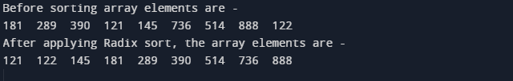

**程序:**写一个程序在 C++中实现基数排序。

```

#include 

using namespace std;

int getMax(int a[], int n) {
   int max = a[0];
   for(int i = 1; i <n i="" if="">max)
         max = a[i];
   }
   return max; //maximum element from the array
}

void countingSort(int a[], int n, int place) // function to implement counting sort
{
  int output[n + 1];
  int count[10] = {0};	

  // Calculate count of elements
  for (int i = 0; i < n; i++)
    count[(a[i] / place) % 10]++;

  // Calculate cumulative frequency
  for (int i = 1; i < 10; i++)
    count[i] += count[i - 1];

  // Place the elements in sorted order
  for (int i = n - 1; i >= 0; i--) {
    output[count[(a[i] / place) % 10] - 1] = a[i];
    count[(a[i] / place) % 10]--;
  }

  for (int i = 0; i < n; i++)
    a[i] = output[i];
}

// function to implement radix sort
void radixsort(int a[], int n) {

  // get maximum element from array
  int max = getMax(a, n);

  // Apply counting sort to sort elements based on place value
  for (int place = 1; max / place > 0; place *= 10)
    countingSort(a, n, place);
}

// function to print array elements
void printArray(int a[], int n) {
  for (int i = 0; i < n; ++i) 
    cout<</n>
```

**输出:**

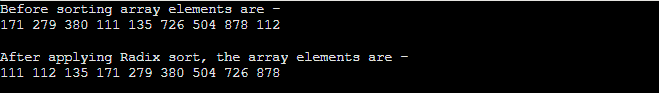

**程序:**编写一个在 C#中实现基数排序的程序。

```

using System;
class RadixSort {

static int getMax(int[] a, int n) {
   int max = a[0];
   for(int i = 1; i max)
         max = a[i];
   }
   return max; //maximum element from the array
}

static void countingSort(int[] a, int n, int place) // function to implement counting sort
{
   int[] output = new int[n+1];
 int[] count = new int[10];

  // Calculate count of elements
  for (int i = 0; i < n; i++)
    count[(a[i] / place) % 10]++;

  // Calculate cumulative frequency
  for (int i = 1; i < 10; i++)
    count[i] += count[i - 1];

  // Place the elements in sorted order
  for (int i = n - 1; i >= 0; i--) {
    output[count[(a[i] / place) % 10] - 1] = a[i];
    count[(a[i] / place) % 10]--;
  }

  for (int i = 0; i < n; i++)
    a[i] = output[i];
}

// function to implement radix sort
static void radixsort(int[] a, int n) {

  // get maximum element from array
  int max = getMax(a, n);

  // Apply counting sort to sort elements based on place value
  for (int place = 1; max / place > 0; place *= 10)
    countingSort(a, n, place);
}

// function to print array elements
static void printArray(int[] a, int n) {
  for (int i = 0; i < n; ++i) 
    Console.Write(a[i] + " ");
}

  static void Main() {
  int[] a = {161, 269, 370, 101, 125, 716, 54, 868, 12};
  int n = a.Length;
  Console.Write("Before sorting array elements are - \n");
  printArray(a,n);
  radixsort(a, n);
  Console.Write("\n\nAfter applying Radix sort, the array elements are - \n");
  printArray(a, n);
}
  } 
```

**输出:**

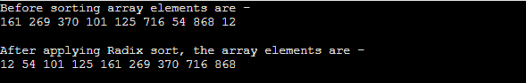

**程序:**写一个用 Java 实现基数排序的程序。

```

class RadixSort {

int getMax(int a[], int n) {
   int max = a[0];
   for(int i = 1; i max)
         max = a[i];
   }
   return max; //maximum element from the array
}

void countingSort(int a[], int n, int place) // function to implement counting 

sort
{
   int[] output = new int[n+1];
 int[] count = new int[10];

  // Calculate count of elements
  for (int i = 0; i < n; i++)
    count[(a[i] / place) % 10]++;

  // Calculate cumulative frequency
  for (int i = 1; i < 10; i++)
    count[i] += count[i - 1];

  // Place the elements in sorted order
  for (int i = n - 1; i >= 0; i--) {
    output[count[(a[i] / place) % 10] - 1] = a[i];
    count[(a[i] / place) % 10]--;
  }

  for (int i = 0; i < n; i++)
    a[i] = output[i];
}

// function to implement radix sort
void radixsort(int a[], int n) {

  // get maximum element from array
  int max = getMax(a, n);

  // Apply counting sort to sort elements based on place value
  for (int place = 1; max / place > 0; place *= 10)
    countingSort(a, n, place);
}

// function to print array elements
void printArray(int a[], int n) {
  for (int i = 0; i < n; ++i) 
    System.out.print(a[i] + " ");
}

  public static void main(String args[]) {
  int a[] = {151, 259, 360, 91, 115, 706, 34, 858, 2};
  int n = a.length;
  RadixSort r1 = new RadixSort();
  System.out.print("Before sorting array elements are - \n");
  r1.printArray(a,n);
  r1.radixsort(a, n);
  System.out.print("\n\nAfter applying Radix sort, the array elements are - 

\n");
  r1.printArray(a, n);
}
  } 
```

**输出:**

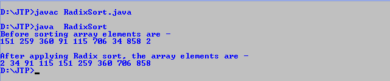

所以，这就是文章的全部内容。希望文章对你有所帮助和启发。

* * *