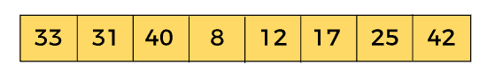
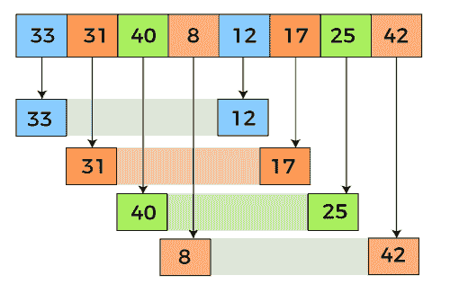
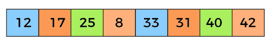
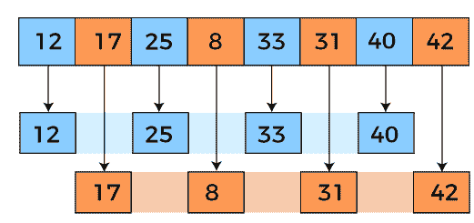
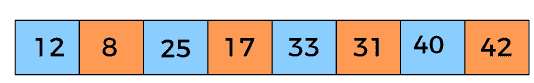
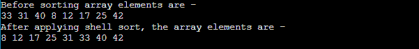
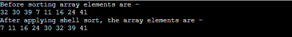
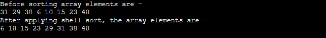
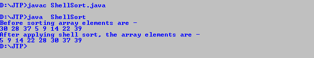

# 外壳排序算法

> 原文：<https://www.javatpoint.com/shell-sort>

在本文中，我们将讨论外壳排序算法。壳排序是插入排序的推广，它通过比较由几个位置的间隙分隔的元素来克服插入排序的缺点。

这是一种排序算法，是插入排序的扩展版本。Shell 排序提高了插入排序的平均时间复杂度。与插入排序类似，它是一种基于比较的就地排序算法。Shell 排序对于中等大小的数据集是有效的。

在插入排序中，一次只能将元素向前移动一个位置。要将一个元素移动到很远的位置，需要进行许多移动，这会增加算法的执行时间。但是壳排序克服了插入排序的这个缺点。它还允许远距离元素的移动和交换。

该算法首先对相距较远的元素进行排序，然后缩小它们之间的距离。这个间隙称为**区间。**该间隔可以通过使用下面给出的**克努斯**公式计算-

```

h = h * 3 + 1
where, 'h' is the interval having initial value 1.

```

现在，让我们看看壳排序的算法。

## 算法

实现外壳排序的简单步骤如下-

```

ShellSort(a, n) // 'a' is the given array, 'n' is the size of array
for (interval = n/2; interval > 0; interval /= 2)
for ( i = interval; i < n; i += 1)
temp = a[i];
for (j = i; j >= interval && a[j - interval] > temp; j -= interval)
a[j] = a[j - interval];	
a[j] = temp;
End ShellSort

```

## 壳排序算法的工作

现在，让我们看看外壳排序算法的工作原理。

为了理解 shell 排序算法的工作原理，我们来看一个未排序的数组。通过一个例子将更容易理解外壳分类。

让数组的元素是-



我们将使用外壳排序的原始序列，即 N/2，N/4，....，1 作为间隔。

在第一个循环中，n 等于 8(数组的大小)，因此元素位于 4 的间隔(n/2 = 4)。如果元素没有按顺序排列，将进行比较和交换。

这里，在第一个循环中，第 0<sup>位置的元素将与第 4 <sup>位置的元素进行比较。如果第 0 <sup>个</sup>元素更大，它将与第 4 <sup>个</sup>位置的元素交换。否则，它保持不变。对于其余元素，此过程将继续。</sup></sup>

以 4 为间隔，子列表为{33，12}、{31，17}、{40，25}、{8，42}。



现在，我们必须比较每个子列表中的值。比较之后，如果需要，我们必须在原始阵列中交换它们。在比较和交换之后，更新后的阵列将如下所示-



在第二个循环中，元素的间隔为 2 (n/4 = 2)，其中 n = 8。

现在，我们以 **2** 的间隔来排序数组的其余部分。间隔为 2，将生成两个子列表- {12，25，33，40}和{17，8，31，42}。



现在，我们再次必须比较每个子列表中的值。比较之后，如果需要，我们必须在原始阵列中交换它们。在比较和交换之后，更新后的阵列将如下所示-



在第三个循环中，元素的间隔为 1 (n/8 = 1)，其中 n = 8。最后，我们使用值 1 的间隔来对剩余的数组元素进行排序。在这一步中，shell sort 使用插入排序对数组元素进行排序。


现在，数组按升序排序。

## 外壳排序复杂性

现在，让我们看看在最佳情况、一般情况和最坏情况下 Shell 排序的时间复杂性。我们还将看到 Shell 排序的空间复杂性。

### 1.时间复杂性

| 情况 | 时间复杂性 |
| **最佳情况** | O(n*logn) |
| **平均情况** | O(n*log(n) <sup>2</sup> ) |
| **最坏情况** | O(n <sup>2</sup> ) |

*   **最佳案例复杂度-** 出现在不需要排序的时候，即数组已经排序。Shell 排序的最佳时间复杂度是 **O(n*logn)。**
*   **平均格复杂度-** 数组元素乱序时出现，不是适当的升序，也不是适当的降序。Shell 排序的平均案例时间复杂度为 **O(n*logn)。**
*   **最坏情况复杂度-** 要求数组元素逆序排序时出现。这意味着假设您必须按升序对数组元素进行排序，但是它的元素是按降序排序的。壳牌排序最差的时间复杂度是 **O(n <sup>2</sup> )。**

### 2.空间复杂性

| **空间复杂度** | O(1) |
| **稳定** | 不 |

*   壳排序的空间复杂度为 O(1)。

## 外壳排序的实现

现在，让我们看看不同编程语言的 Shell 排序程序。

**程序:**写一个用 C 语言实现 Shell 排序的程序。

```

#include <stdio.h>  
/* function to implement shellSort */
int shell(int a[], int n)
{
    /* Rearrange the array elements at n/2, n/4, ..., 1 intervals */
	for (int interval = n/2; interval > 0; interval /= 2)
	{
		for (int i = interval; i < n; i += 1)
		{
			/* store a[i] to the variable temp and make the ith position empty */
			int temp = a[i];
			int j;		
			for (j = i; j >= interval && a[j - interval] > temp; j -= interval)
				a[j] = a[j - interval];

			// put temp (the original a[i]) in its correct position
			a[j] = temp;
		}
	}
	return 0;
}
void printArr(int a[], int n) /* function to print the array elements */
{
	int i;
	for (i = 0; i < n; i++)
		printf("%d ", a[i]);
}  
int main()
{
	int a[] = { 33, 31, 40, 8, 12, 17, 25, 42 };
	int n = sizeof(a) / sizeof(a[0]);
    printf("Before sorting array elements are - \n");
    printArr(a, n);
    shell(a, n);
    printf("\nAfter applying shell sort, the array elements are - \n");  
    printArr(a, n);
	return 0;
}

```

**输出**

执行上述代码后，输出将是-



**程序:**用 C++编写一个实现 Shell 排序的程序。

```

#include <iostream>
using namespace std;
/* function to implement shellSort */
int shell(int a[], int n)
{
    /* Rearrange the array elements at n/2, n/4, ..., 1 intervals */
	for (int interval = n/2; interval > 0; interval /= 2)
	{
		for (int i = interval; i < n; i += 1)
		{
			/* store a[i] to the variable temp and make the ith position empty */
			int temp = a[i];
			int j;		
			for (j = i; j >= interval && a[j - interval] > temp; j -= interval)
				a[j] = a[j - interval];

			// put temp (the original a[i]) in its correct position
			a[j] = temp;
		}
	}
	return 0;
}
void printArr(int a[], int n) /* function to print the array elements */
{
	int i;
	for (i = 0; i < n; i++)
		cout<<a[i]<<" ";
}    
int main()
{
	int a[] = { 32, 30, 39, 7, 11, 16, 24, 41 };
	int n = sizeof(a) / sizeof(a[0]);
    cout<<"Before sorting array elements are - \n";
    printArr(a, n);
    shell(a, n);
    cout<<"\nAfter applying shell sort, the array elements are - \n";  
    printArr(a, n);
	return 0;
}

```

**输出**

执行上述代码后，输出将是-



**程序:**用 C#编写一个实现 Shell 排序的程序。

```

using System;
class ShellSort {
/* function to implement shellSort */
static void shell(int[] a, int n)
{
    /* Rearrange the array elements at n/2, n/4, ..., 1 intervals */
	for (int interval = n/2; interval > 0; interval /= 2)
	{
		for (int i = interval; i < n; i += 1)
		{
			/* store a[i] to the variable temp and make the ith position empty */
			int temp = a[i];
			int j;		
			for (j = i; j >= interval && a[j - interval] > temp; j -= interval)
				a[j] = a[j - interval];

			/* put temp (the original a[i]) in its correct position */
			a[j] = temp;
		}
	}
}
static void printArr(int[] a, int n) /* function to print the array elements */
{
	int i;
	for (i = 0; i < n; i++)
		Console.Write(a[i] + " ");
}
static void Main() 
{
	int[] a = { 31, 29, 38, 6, 10, 15, 23, 40 };
	int n = a.Length;
    Console.Write("Before sorting array elements are - \n");
    printArr(a, n);
    shell(a, n);
    Console.Write("\nAfter applying shell sort, the array elements are - \n");  
    printArr(a, n);
}   
}

```

**输出**

执行上述代码后，输出将是-



**程序:**写一个用 Java 实现 Shell 排序的程序。

```

class ShellSort {
/* function to implement shellSort */
static void shell(int a[], int n)
{
    /* Rearrange the array elements at n/2, n/4, ..., 1 intervals */
	for (int interval = n/2; interval > 0; interval /= 2)
	{
		for (int i = interval; i < n; i += 1)
		{
			/* store a[i] to the variable temp and make 

the ith position empty */
			int temp = a[i];
			int j;		
			for (j = i; j >= interval && a[j - interval] > 
temp; j -= interval)
				a[j] = a[j - interval];

			/* put temp (the original a[i]) in its correct 
position */
			a[j] = temp;
		}
	}
}
static void printArr(int a[], int n) /* function to print the array elements */
{
	int i;
	for (i = 0; i < n; i++)
		System.out.print(a[i] + " ");
}
public static void main(String args[]) 
{
	int a[] = { 30, 28, 37, 5, 9, 14, 22, 39 };
	int n = a.length;
    System.out.print("Before sorting array elements are - \n");
    printArr(a, n);
    shell(a, n);
    System.out.print("\nAfter applying shell sort, the array elements are - \n");  
    printArr(a, n);
}    
}

```

**输出**

执行上述代码后，输出将是-



所以，这就是文章的全部内容。希望文章对你有所帮助和启发。

* * *