# 鸡尾酒排序算法

> 原文：<https://www.javatpoint.com/cocktail-sort>

在本文中，我们将讨论鸡尾酒排序算法。鸡尾酒排序是冒泡排序的变体，它交替地在两个方向上遍历列表。与冒泡排序不同的是，冒泡排序仅沿正向遍历列表，而该算法在一次迭代中沿正向和反向遍历。

鸡尾酒排序也称为**双向**气泡排序。在冒泡排序中，元素从左向右遍历，即在一个方向上遍历。在第一次迭代中，冒泡排序首先将最大的元素移动到它的正确位置，然后将第二大的元素移动到它的精确位置，依此类推。但是鸡尾酒会在两个方向交替进行。

与泡沫排序类似，鸡尾酒排序的最坏和平均情况复杂性是 **O(n <sup>2</sup> )** 。鸡尾酒排序比泡沫排序快。

鸡尾酒排序在一次迭代中有两个阶段，如下所示-

1.  在第一阶段，类似于冒泡排序，从左到右循环数组。比较相邻的元素，如果左边的元素大于右边的元素，我们就交换这些元素。列表中最大的元素被放在向前传递的数组的末尾。
2.  在第二阶段，从最右边未排序的元素到左边循环遍历数组。比较相邻的元素，如果右边的元素比左边的元素小，我们就交换这些元素。在向后传递中，列表中最小的元素被放在数组的开头。

这个过程一直持续到数组元素没有被排序。

现在，我们来看看鸡尾酒排序算法的算法。

### 算法

```

cocktailSort(a, n) // 'a' is the given array, 'n' is the size of given array
swapped = true
beg = 0
end = n-1
while(swapped)
swapped = false
for i in range from beg to end
if (a[i] > a[i + 1])
swap(a[i], a[i+1])
swapped = true
End if
End for loop
if(!swapped)
break
end if
swapped = false
end = end - 1
for i in range from end - 1 to beg
if (a[i] > a[i + 1])
swap(a[i], a[i+1])
swapped = true
End if
End for loop
start = start + 1
End while loop
End cocktailSort

```

## 鸡尾酒排序算法的工作

现在，让我们看看鸡尾酒排序算法的工作原理。

为了理解鸡尾酒排序算法的工作原理，我们来看一个未排序的数组。我们采用了一个简短而精确的数组，因为我们知道鸡尾酒种类的复杂性是 **O(n <sup>2</sup> )。**

让数组的元素是-

**数组= {4，0，3，1，7，1，2}**

**<u>迭代 1:</u>**

**第一次向前传球:**

在第一次迭代中，正向传递类似于冒泡排序。第一次迭代中正向通过的比较如下-

排序将从最初的两个元素开始。让我们比较一下，看看哪个更大。

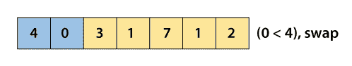

交换新阵列后将看起来像-

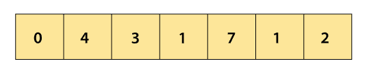

现在比较 4 和 3。


交换新阵列后将看起来像-

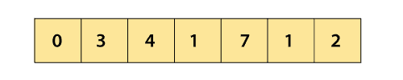

现在，比较 4 和 1。

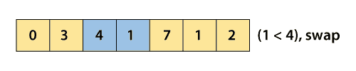

交换新阵列后将看起来像-

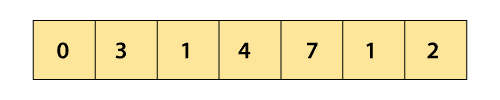

现在，比较 4 和 7。

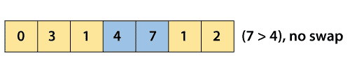

现在，比较将在 7 和 1 之间。

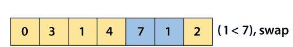

交换新阵列后将看起来像-

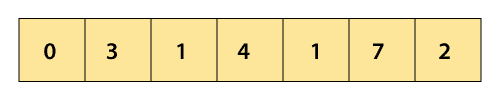

现在，比较 7 和 2。

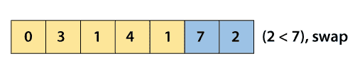

现在，我们到达数组的末尾。在交换和第一次向前传递之后，数组元素看起来像-

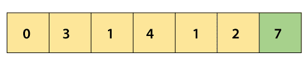

第一次向前传递后，数组中最大的元素存储在数组的最后一个位置。

**第一次后传:**

现在，开始第一次向后传球。它将从数组的最后一个索引开始，存储最大元素的索引除外。

因此，从向后的方向，将比较第一个数组元素 **2** 和 **1** 。

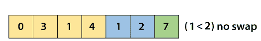

现在比较一下，1 和 4。

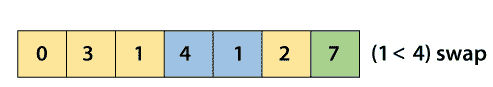

交换后，阵列将-

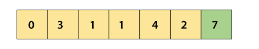

现在比较 1 和 1。

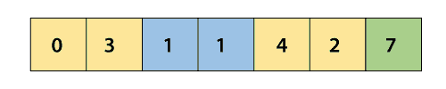

现在比较一下，3 和 1。

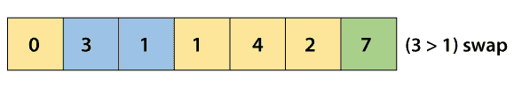

交换后，阵列将-

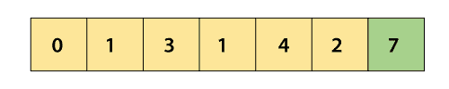

现在比较一下，0 和 1。

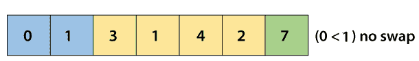

因此，在第一次向后传递后，数组中最小的元素存储在数组的第一个索引处。所以，在第一次迭代之后，数组元素将会-

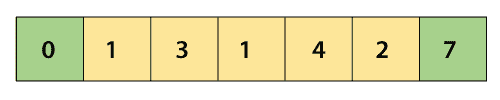

**<u>迭代 2:</u>**

**第二次向前传球:**

现在，第二个向前传球开始了。它将从数组的第一个索引开始，存储最小元素的索引除外。

所以，从正向来看，首先将比较阵元 **1** 和 **3** 。

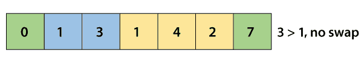
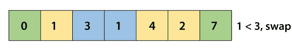
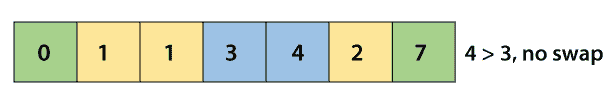
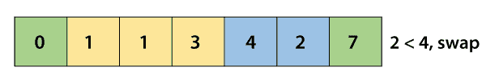

现在，我们到达数组的末尾。在第二次向前传递之后，第二大数组元素将被存储在其精确位置。在交换和第二次向前传递之后，数组元素看起来像-

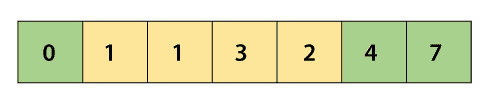

**第二次后传:**

现在，开始第二次向后传球。

因此，从向后的方向，阵列元素 **3** 和 **2** 将被比较。

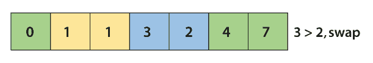

交换后，阵列将-

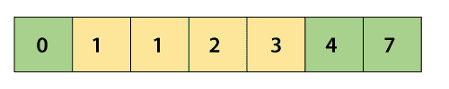

现在，数组已经完全排序，但是算法必须在没有任何**交换**的情况下完成整个过程，才能知道数组已经排序。

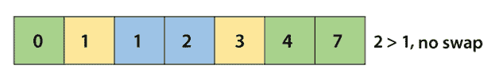
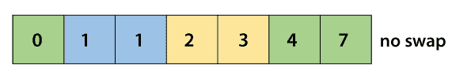

所以，在排序之后，数组元素将-

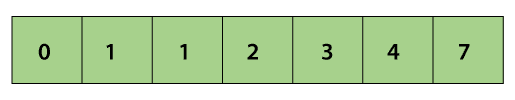

现在，数组已完全排序。

现在，数组已完全排序。

## 鸡尾酒种类复杂性

现在，让我们看看鸡尾酒排序在最佳情况、一般情况和最坏情况下的时间复杂性。我们也会看到鸡尾酒种类的空间复杂性。

### 1.时间复杂性

| 情况 | 时间复杂性 |
| **最佳封装** | O(n) |
| **平均情况** | O(n <sup>2</sup> ) |
| **最坏情况** | O(n <sup>2</sup> ) |

*   **最佳案例复杂度-** 出现在不需要排序的时候，即数组已经排序。鸡尾酒排序的最佳时间复杂度是 **O(n)** 。
*   **平均格复杂度-** 数组元素乱序时出现，不是适当的升序，也不是适当的降序。鸡尾酒类平均病例时间复杂度为 **O(n <sup>2</sup> )** 。
*   **最坏情况复杂度-** 要求数组元素逆序排序时出现。这意味着假设您必须按升序对数组元素进行排序，但是它的元素是按降序排序的。鸡尾酒排序的最坏情况时间复杂度是 **O(n <sup>2</sup> )** 。

### 2.空间复杂性

| **空间复杂度** | O(1) |
| **稳定** | 是 |

*   鸡尾酒种类的空间复杂度是 O(1)。

## 鸡尾酒分类的实现

现在，让我们看看不同编程语言的鸡尾酒排序程序。

**程序:**用 C 语言编写一个实现鸡尾酒排序的程序。

```

#include /* function to implement Cocktail sort */
void cocktail(int a[], int n)
{
	int swap = 1;
	int beg = 0;
	int end = n - 1;
    int i, temp;
	while (swap)
	{
		swap = 0;

/* Loop similar to bubble sort to compare and swap array elements starting from left to right */
		for (i = beg; i < end; ++i)
		{
			if (a[i] > a[i + 1]) {
			    temp = a[i];  
			    a[i] = a[i+1];  
			    a[i+1] = temp;   
			    swap = 1;
			}
		}

		if (!swap)
			break;

		swap = 0;

		/* decrease the 'end' point by one position. 
		It is because the item at the last position is at its correct position */
		--end;

		/* This loop starts from right to left to perform the same comparison as in the previous loop */
		for (int i = end - 1; i >= beg; --i)
		{
			if (a[i] > a[i + 1]) {
			    temp = a[i];  
			    a[i] = a[i+1];  
			    a[i+1] = temp;   
			    swap = 1;
			}
		}

		/* increase the beg point by one position. 
		It is because the item at the first position is at its correct position */
		++beg;
	}
}

 void print(int a[], int n) //function to print array elements
    {
    int i;
    for(i = 0; i < n; i++)  
    {  
        printf("%d ", a[i]);  
    }      
    }

int main()
{
    int a[] = { 40, 10, 30, 5, 70, 2, 20 };   
    int n = sizeof(a)/sizeof(a[0]); 
    printf("Before sorting array elements are - \n");
    print(a, n);
    cocktail(a, n);
    printf("\nAfter sorting array elements are - \n");  
    print(a, n);
    return 0;
} 
```

**输出:**

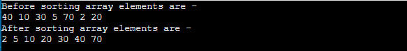

**程序:**用 C++编写一个实现鸡尾酒排序的程序。

```

#include 

using namespace std;

/* function to implement Cocktail sort */
void cocktail(int a[], int n)
{
	int swap = 1;
	int beg = 0;
	int end = n - 1;
    int i, temp;
	while (swap)
	{
		swap = 0;

/* Loop similar to bubble sort to compare and swap array elements starting from left to right */
		for (i = beg; i < end; ++i)
		{
			if (a[i] > a[i + 1]) {
			    temp = a[i];  
			    a[i] = a[i+1];  
			    a[i+1] = temp;   
			    swap = 1;
			}
		}

		if (!swap)
			break;

		swap = 0;

		/* decrease the 'end' point by one position. 
		It is because the item at the last position is at its correct position */
		--end;

		/* This loop starts from right to left to perform the same comparison as in the previous loop */
		for (int i = end - 1; i >= beg; --i)
		{
			if (a[i] > a[i + 1]) {
			    temp = a[i];  
			    a[i] = a[i+1];  
			    a[i+1] = temp;   
			    swap = 1;
			}
		}

		/* increase the beg point by one position. 
		It is because the item at the first position is at its correct position */
		++beg;
	}
}

 void print(int a[], int n) //function to print array elements
    {
    int i;
    for(i = 0; i < n; i++)  
    {  
        cout<
```

**输出:**

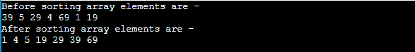

**程序:**用 C#编写一个实现鸡尾酒排序的程序。

```

using System;
class CocktailSort {

/* function to implement Cocktail sort */
static void cocktail(int[] a, int n)
{
	int swap = 1;
	int beg = 0;
	int end = n - 1;
    int i, temp;
	while (swap == 1)
	{
		swap = 0;

/* Loop similar to bubble sort to compare and swap array elements starting from left to right */
		for (i = beg; i < end; ++i)
		{
			if (a[i] > a[i + 1]) {
			    temp = a[i];  
			    a[i] = a[i+1];  
			    a[i+1] = temp;   
			    swap = 1;
			}
		}

		if (swap == 0)
			break;

		swap = 0;

		/* decrease the 'end' point by one position. 
		It is because the item at the last position is at its correct position */
		--end;

		/* This loop starts from right to left to perform the same comparison as in the previous loop */
		for (i = end - 1; i >= beg; --i)
		{
			if (a[i] > a[i + 1]) {
			    temp = a[i];  
			    a[i] = a[i+1];  
			    a[i+1] = temp;   
			    swap = 1;
			}
		}

		/* increase the beg point by one position. 
		It is because the item at the first position is at its correct position */
		++beg;
	}
}

 static void print(int[] a, int n) //function to print array elements
    {
    int i;
    for(i = 0; i < n; i++)  
    {  
        Console.Write(a[i] + " ");  
    }      
    }

static void Main() 
{
    int[] a = { 38, 4, 28, 3, 68, 0, 18 };   
    int n = a.Length; 
    Console.Write("Before sorting array elements are - \n");
    print(a, n);
    cocktail(a, n);
    Console.Write("\nAfter sorting array elements are - \n");  
    print(a, n);
}
}

```

**输出:**

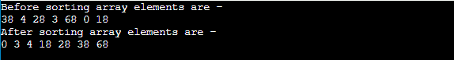

**程序:**写一个用 Java 实现鸡尾酒排序的程序。

```

class CocktailSort {

/* function to implement Cocktail sort */
static void cocktail(int a[], int n)
{
	int swap = 1;
	int beg = 0;
	int end = n - 1;
    int i, temp;
	while (swap == 1)
	{
		swap = 0;

/* Loop similar to bubble sort to compare and swap array elements starting 

from left to right */
		for (i = beg; i < end; ++i)
		{
			if (a[i] > a[i + 1]) {
			    temp = a[i];  
			    a[i] = a[i+1];  
			    a[i+1] = temp;   
			    swap = 1;
			}
		}

		if (swap == 0)
			break;

		swap = 0;

		/* decrease the 'end' point by one position. 
		It is because the item at the last position is at its 

correct position */
		--end;

		/* This loop starts from right to left to perform the 

same comparison as in the previous loop */
		for (i = end - 1; i >= beg; --i)
		{
			if (a[i] > a[i + 1]) {
			    temp = a[i];  
			    a[i] = a[i+1];  
			    a[i+1] = temp;   
			    swap = 1;
			}
		}

		/* increase the beg point by one position. 
		It is because the item at the first position is at its 

correct position */
		++beg;
	}
}

 static void print(int a[], int n) //function to print array elements
    {
    int i;
    for(i = 0; i < n; i++)  
    {  
        System.out.print(a[i] + " ");  
    }      
    }

public static void main(String args[]) 
{
    int[] a = { 37, 3, 27, 2, 67, 0, 17 };   
    int n = a.length; 
    System.out.print("Before sorting array elements are - \n");
    print(a, n);
    cocktail(a, n);
    System.out.print("\nAfter sorting array elements are - \n");  
    print(a, n);
}
}

```

**输出:**

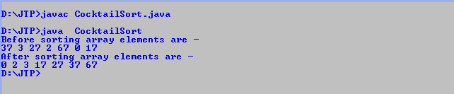

所以，这就是文章的全部内容。希望文章对你有所帮助和启发。

* * *