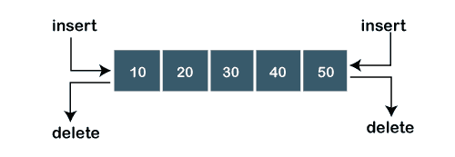
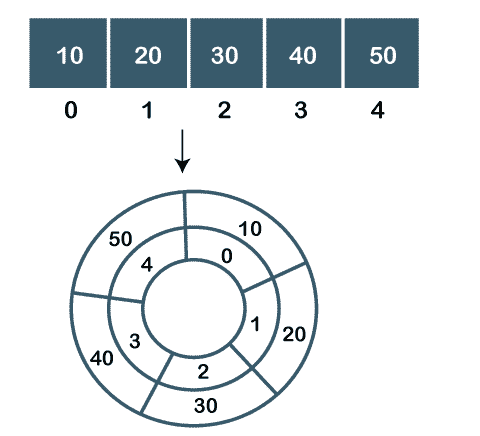
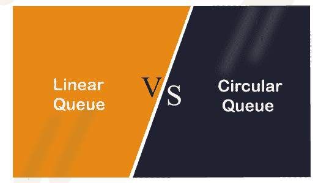

# 线性队列与循环队列

> 原文：<https://www.javatpoint.com/ds-linear-vs-circular-queue>

### 什么是线性队列？

线性队列是一种线性数据结构，它首先服务于已经到达的请求。它由以线性方式连接的数据元素组成。它有两个指针，即前指针和后指针，从前端插入，从前端删除。

### 线性队列上的运算

在线性队列上可以执行两种操作:

*   **入队:**入队操作从后端插入新元素。
*   **出列:**出列操作用于从队列前端删除现有元素。

### 什么是循环队列？

我们知道，在队列中，前指针指向第一个元素，而后指针指向队列的最后一个元素。线性队列出现的问题是，如果一些空单元出现在队列的开头，那么我们不能在空白空间插入新元素，因为后面不能进一步增加。

循环队列也是一种线性数据结构，类似于遵循先进先出原则的正常队列，但它不会结束队列；它将队列的最后一个位置连接到队列的第一个位置。如果我们想在队列的开头插入新元素，我们可以使用循环队列数据结构来插入它。

在循环队列中，当后方到达队列末端时，后方被重置为零。它有助于填充所有的空闲空间。如果队列的第一个位置在队列的最后一个位置之后，管理循环队列的问题就被克服了。

**队列为循环队列的条件**

*   前=0，后=n-1
*   前=后+1

如果满足上述任一条件，则意味着该队列是循环队列。

### 循环队列上的操作

以下是可以在循环队列上执行的两个操作:

*   **入队:**它在队列中插入一个元素。以下是插入元素时可以考虑的场景:
    1.  如果队列是空的，那么前面和后面被设置为 0 以插入一个新元素。
    2.  如果队列不为空，则后面的值递增。
    3.  如果队列不为空，并且后端等于 n-1，则后端设置为 0。
*   **出列:**在队列中执行删除操作。以下是删除元素时可以考虑的要点或情况:
    1.  如果队列中只有一个元素，在对队列执行出列操作后，队列将变为空。在这种情况下，前后值设置为-1。
    2.  如果 front 的值等于 n-1，则在执行出列操作之后，front 变量的值被设置为 0。
    3.  如果上述任一条件不满足，则前值递增。

### 线性队列和循环队列的区别

| 比较基础 | 线性队列 | 循环队列 |
| **表示** | 线性队列是一种以顺序方式包含元素的线性数据结构。 | 循环队列也是一种线性数据结构，其中队列的最后一个元素连接到第一个元素，从而创建一个圆。 |
| **插入和删除** | 在线性队列中，插入是从后端完成的，删除是从前端完成的。 | 在循环队列中，插入和删除可以从任何一端进行。 |
| **记忆空间** | 线性队列占用的内存空间比循环队列多。 | 与线性队列相比，它需要更少的内存。 |
| **内存利用率** | 内存的使用效率很低。 | 可以更有效地利用存储器。 |
| **执行顺序** | 它遵循先进先出原则来执行任务。 | 它没有具体的执行顺序。 |

* * *