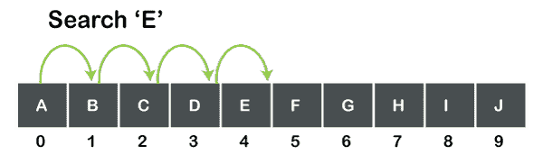
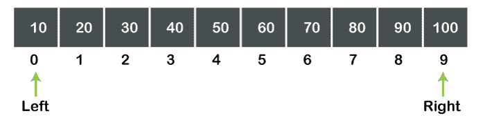
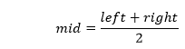
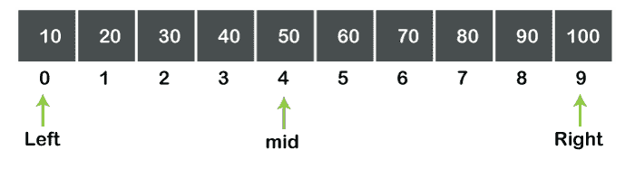
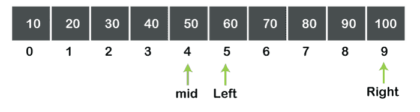
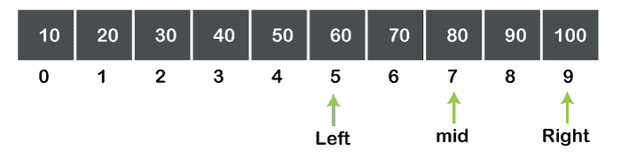
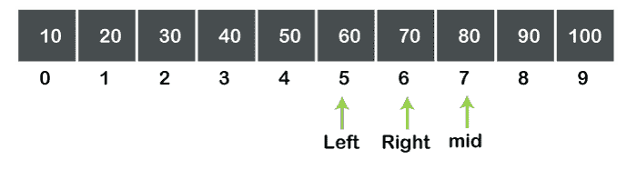
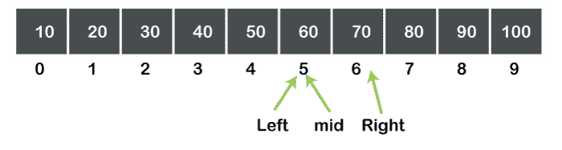
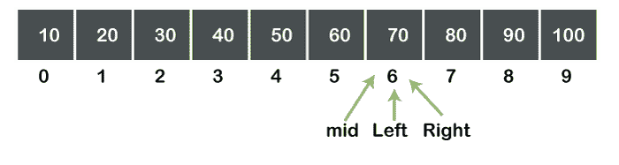
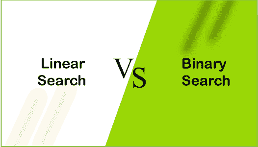

# 线性搜索与二分搜索法

> 原文：<https://www.javatpoint.com/ds-linear-search-vs-binary-search>

在了解线性和二分搜索法的区别之前，我们应该先分别了解线性搜索和二分搜索法。

### 什么是线性搜索？

线性搜索也称为顺序搜索，它只是一次扫描每个元素。假设我们想在数组或列表中搜索一个元素；我们只是简单地计算它的长度，并不跳到任何项目。

**我们来考虑一个简单的例子。**

**假设我们有一个 10 个元素的数组，如下图所示:**

上图显示了具有 10 个值的字符类型数组。如果我们想搜索“E”，那么搜索从第 0 个元素开始，扫描每个元素，直到找不到元素，即“E”。我们不能直接从第 0 个元素跳到第 4 个元素，也就是一个一个地扫描每个元素，直到找不到元素。

### 线性搜索的复杂性

因为线性搜索逐个扫描每个元素，直到找不到该元素。如果元素数量增加，则要扫描的元素数量也会增加。我们可以说 ***搜索元素所花费的时间与元素数量*** 成正比。因此，最坏情况下的复杂性是 O(n)

### 什么是二分搜索法？

二分搜索法是一种搜索，其中计算中间元素以检查它是小于还是大于要搜索的元素。使用二分搜索法的主要优点是它不会扫描列表中的每个元素。它不是扫描每个元素，而是搜索列表的一半。因此，与线性搜索相比，二分搜索法搜索元素花费的时间更少。

二分搜索法 的一个 ***先决条件是数组应该按排序顺序排列，而线性搜索对排序和未排序的数组都有效。二分搜索法算法基于分治技术，这意味着它将递归地划分数组。***

**二分搜索法有三种情况使用:**

**情况 1:数据< a【中】然后左=中+1。**

**情况 2:数据> a【中】然后右=中 1**

**情况 3:数据= a[mid] //找到元素**

在上面的例子中，' **a** '是数组的名称， **mid** 是递归计算的元素的索引， **data** 是要搜索的元素， **left** 表示数组的左元素， **right** 表示出现在数组右侧的元素。

**我们通过一个例子来了解一下二分搜索法的工作。**

假设我们有一个大小为 10 的数组，其索引从 0 到 9，如下图所示:

我们想从上面的数组中搜索 70 个元素。

**第一步:**首先，我们计算一个数组的中间元素。我们考虑两个变量，即左和右。最初，左=0，右=9，如下图所示:

中间元素值可以计算为:

因此，mid = 4，a[mid] = 50。要搜索的元素是 70，所以 a[mid]不等于 data。满足情况 2，即数据> a[mid]。

**第二步:**作为数据>a【mid】，所以左的值递增 mid+1，即左=mid+1。mid 的值是 4，所以 left 的值是 5。现在，我们得到了如下图所示的子阵列:

现在，使用上述公式计算中间值，中间值变为 7。现在，mid 可以表示为:

在上图中，我们可以观察到 a[mid]>数据，所以同样，mid 的值将在下一步计算。

**第 3 步:**作为【mid】>数据，右值递减 mid-1。mid 的值是 7，所以 right 的值是 6。该阵列可以表示为:

mid 的值将被再次计算。左边和右边的值分别是 5 和 6。因此，mid 的值为 5。现在 mid 可以表示为如下所示的数组:

**在上图中，我们可以观察到一个【中】<的数据。**

**第 4 步:**作为【mid】<数据，左值增加 mid+1。mid 的值是 5，所以 left 的值是 6。

现在用我们已经讨论过的公式再次计算 mid 的值。左右的值分别是 6 和 6，所以 mid 的值变成了 6，如下图所示:

我们可以在上图中观察到 a[mid]=数据。因此，搜索完成，元素被成功找到。

### 线性搜索与二分搜索法的区别

以下是线性搜索和二分搜索法之间的区别:

**描述**

线性搜索是一种通过顺序搜索元素直到在列表中找到元素来在列表中找到元素的搜索。另一方面，二分搜索法搜索是递归查找列表中的中间元素，直到中间元素与搜索到的元素匹配。

**两个搜索的工作**

线性搜索从第一个元素开始搜索，一次扫描一个元素，而不跳到下一个元素。另一方面，二分搜索法通过计算数组的中间元素将数组分成两半。

**实施**

线性搜索可以在任何线性数据结构上实现，例如向量、单链表、双链表。相比之下，二分搜索法可以在那些具有双向遍历(即向前和向后遍历)的数据结构上实现。

**复杂性**

线性搜索很容易使用，或者我们可以说它不太复杂，因为线性搜索的元素可以按任何顺序排列，而在二分搜索法中，元素必须按特定顺序排列。

**分类元素**

线性搜索的元素可以随机排列。在线性搜索中，元素不是必须按排序顺序排列的。另一方面，在二分搜索法，元素必须按排序顺序排列。它可以以递增或递减的顺序排列，因此，算法将会改变。由于二分搜索法使用排序数组，因此有必要在适当的位置插入元素。相比之下，线性搜索不需要排序的数组，因此新元素可以很容易地插入到数组的末尾。

**接近**

线性搜索使用迭代方法来查找元素，因此也称为顺序方法。相比之下，二分搜索法计算数组的中间元素，所以它使用分治法。

**数据集**

线性搜索不适合大数据集。如果我们想要搜索元素，也就是数组的最后一个元素，那么线性搜索将从第一个元素开始，一直搜索到最后一个元素，所以搜索元素所花费的时间会很长。另一方面，二分搜索法适合大数据集，因为它花费的时间更少。

**速度**

如果在线性搜索中数据集很大，那么计算成本会很高，并且速度会变得很慢。如果二分搜索法的数据集很大，那么与线性搜索相比，计算成本会更低，速度也会变快。

**尺寸**

线性搜索可以在单个和多维阵列上使用，而二分搜索法只能在一维阵列上实现。

**效率**

当我们考虑大数据集时，线性搜索效率较低。在大数据集的情况下，二分搜索法比线性搜索更有效。

**让我们用表格的形式来看看不同之处。**

| 比较基础 | 线性搜索 | 二进位检索 |
| **定义** | 线性搜索从第一个元素开始搜索，并将每个元素与搜索到的元素进行比较，直到没有找到该元素。 | 它通过查找数组的中间元素来查找被搜索元素的位置。 |
| **排序数据** | 在线性搜索中，元素不需要按排序顺序排列。 | 二分搜索法的先决条件是元素必须以有序的顺序排列。 |
| **实施** | 线性搜索可以在任何线性数据结构上实现，例如数组、链表等。 | 二分搜索法的实现是有限的，因为它只能在那些具有双向遍历的数据结构上实现。 |
| **接近** | 它基于顺序方法。 | 它基于分治法。 |
| **尺寸** | 它更适合小型数据集。 | 它更适合大规模数据集。 |
| **效率** | 在大规模数据集的情况下，效率较低。 | 它在大规模数据集的情况下更有效。 |
| **最坏情况** | 在线性搜索中，寻找元素的最坏情况是 O(n)。 | 在二分搜索法，寻找元素的最坏情况是 0(对数 2 n)。 |
| **最佳情况场景** | 在线性搜索中，找到列表中第一个元素的最佳情况是 O(1)。 | 在二分搜索法，找到列表中第一个元素的最佳情况是 O(1)。 |
| **维阵** | 它既可以在单个数组上实现，也可以在多维数组上实现。 | 它只能在多维数组上实现。 |

* * *