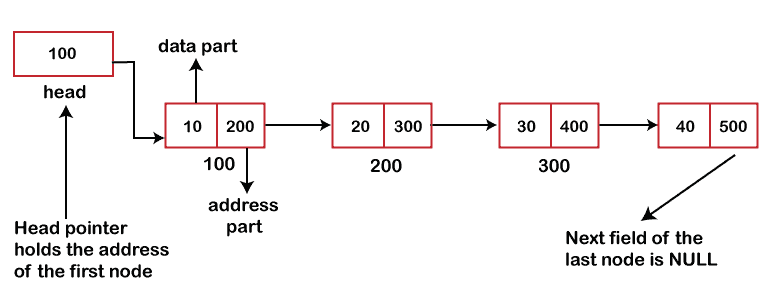
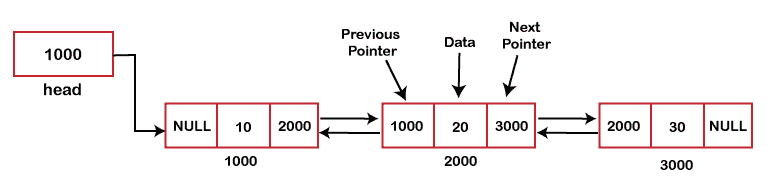

# 单链表与双链表

> 原文：<https://www.javatpoint.com/singly-linked-list-vs-doubly-linked-list>

在看单链表和双链表的区别之前，我们先分别了解一下什么是单链表和双链表。

## 什么是单链表？

一个[单链表](https://www.javatpoint.com/singly-linked-list)可以简称为一个[链表](https://www.javatpoint.com/ds-linked-list)。单链表是由一组节点组成的列表，每个节点有两部分；一部分是数据部分，另一部分是地址。由于每个节点通过其地址部分引用另一个节点，所以单链表也可以称为链。我们可以对单链表执行各种操作，比如插入、删除和遍历。

## 什么是双链表？

一个[双链表](https://www.javatpoint.com/doubly-linked-list)是链表的另一个[类型。它被称为双链表，因为它包含两个地址，而单链表包含一个地址。这个列表总共有三个部分，一个是数据部分，另外两个是指针，即上一个和下一个。上一个指针保存上一个节点的地址，下一个指针保存下一个节点的地址。因此，我们可以说列表有两个引用，即正向引用和反向引用，可以在任一方向上遍历。](https://www.javatpoint.com/ds-types-of-linked-list)

我们还可以对双向链表执行各种操作，如插入、删除和遍历。

### 单链表和双链表的区别。

单链表和双链表的区别如下:

*   **定义**

单链表是一种由节点集合组成的线性数据结构，其中一个节点由两部分组成，即一个是数据部分，另一个是地址部分。相比之下，双链表也是一种线性数据结构，其中节点由三部分组成，即一部分是数据部分，另外两部分是地址部分。

*   **方向**

我们知道，在单链表中，一个节点包含下一个节点的地址，因此元素只能在一个方向上遍历，即正向。相比之下，在双链表中，节点包含两个指针(上一个指针和下一个指针)，分别保存下一个节点的 ***地址和上一个节点的**的*地址*** ，因此元素可以双向遍历。***

*   **记忆空间**

单链表占用较少的内存空间，因为它只包含一个地址。我们知道指针变量存储地址，指针变量占用 4 个字节；因此，单链表中指针变量占用的内存空间也是 4 字节。双链表在一个节点中保存两个地址，一个是下一个节点的地址，另一个是上一个节点的地址；因此，两个指针变量占用的空间是 8 字节。

*   **插入和删除**

单链表中的插入和删除没有双链表复杂。如果我们在单链表中插入一个元素，那么我们只需要更新下一个节点的地址。另一方面，在双向链表中，我们需要更新下一个和上一个节点的地址。

**让我们用表格的形式来看看不同之处。**

| 比较基础 | 单链表 | 双向链表 |
| **定义** | 单个链表是节点的列表，其中节点有两部分，第一部分是数据部分，下一部分是指向节点序列中下一个节点的指针。 | 双向链表也是节点的集合，其中节点有三个字段，第一个字段是包含前一个节点地址的指针，第二个是数据字段，第三个是包含下一个节点地址的指针。 |
| **进入** | 单链表只能向前遍历。 | 双向链表可以双向访问。 |
| **列表指针** | 它只需要一个列表指针变量，即指向第一个节点的头指针。 | 它需要两个列表指针变量，**头**和**尾**。头指针指向第一个节点，最后一个指针指向列表的最后一个节点。 |
| **记忆空间** | 它占用更少的内存空间。 | 它利用了更多的内存空间。 |
| **效率** | 与双链表相比，它的效率较低。 | 效率更高。 |
| **实施** | 它可以在堆栈上实现。 | 它可以在堆栈、堆和二叉树上实现。 |
| **复杂性** | 在单链表中，从链表中插入和删除一个元素的时间复杂度为 **O(n)** 。 | 在双链表中，插入和删除一个元素的时间复杂度为 **O(1)** 。 |

* * *