# B 树 vs B+树

> 原文：<https://www.javatpoint.com/b-tree-vs-bplus-tree>

在了解 **B 树**和 **B+树**的区别之前，我们应该分别了解一下 B 树和 B+树。

### 什么是 B 树？

**[B 树](https://www.javatpoint.com/b-tree)** 是自平衡树，是 m 路树，其中 m 定义了树的顺序。 **Btree** 是[二叉查找树](https://www.javatpoint.com/binary-search-tree)的推广，根据 **m** 的值，一个节点可以有多个键和两个以上的子节点。在 B 树中，数据是按照排序顺序指定的，左边子树的值较低，右边子树的值较高。

**B 树的属性**

**以下是 B 树的属性:**

*   在 B 树中，所有的叶节点必须处于同一级别，而在二叉树的情况下，叶节点可以处于不同的级别。

**我们通过一个例子来理解这个性质。**

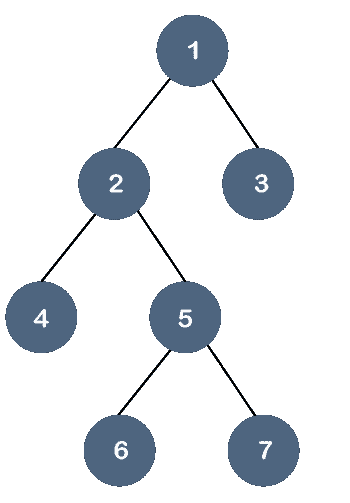

在上面的树中，所有的叶节点不在同一个级别，但是它们有最多两个子节点。因此，我们可以说上面的树是[二叉树](https://www.javatpoint.com/binary-tree)而不是 B 树。

*   如果 Btree 的阶为 m，那么每个节点最多可以有 **m** 在最小子节点的情况下，叶节点没有子节点，根节点有两个子节点，内部节点的上限为 m/2。
*   每个节点可以有最大(m-1)个密钥。例如，如果 m 的值是 5，那么键的最大值是 4。
*   根节点至少有一个键，而除了根节点之外的所有其他节点都有(m/2 减- 1 的上限)个最小键。
*   如果我们在 B 树中执行插入，那么该节点总是被插入到叶节点中。

**假设我们想要通过插入从 1 到 10 的值来创建一个 3 阶的 B 树。**

**步骤 1:** 首先，我们创建一个值为 1 的节点，如下所示:

**第二步:**下一个元素是 2，在 1 之后，如下图:

**第三步:**下一个元素是 3，插入到 2 之后，如下图:

因为我们知道每个节点最多可以有 2 个键，所以我们将通过中间元素分割这个节点。中间的元素是 2，所以它移动到它的父元素。节点 2 没有任何父节点，因此它将成为根节点，如下所示:

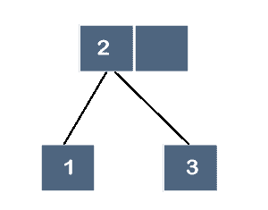

**第四步:**下一个元素是 4。由于 4 大于 2 和 3，所以它将添加在 3 之后，如下所示:

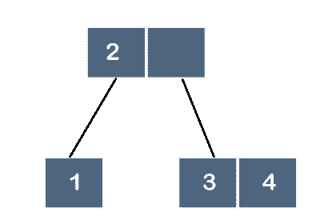

**第五步:**下一个元素是 5。由于 5 大于 2、3 和 4，因此它将添加在 4 之后，如下所示:

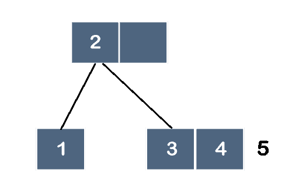

因为我们知道每个节点最多可以有 2 个键，所以我们将通过中间元素分割这个节点。中间的元素是 4，所以它移动到它的父元素。父节点是节点 2；因此，将在 2 之后添加 4，如下所示:

**第 6 步:**下一个元素是 6。因为 6 大于 2、4 和 5，所以 6 将在 5 之后，如下所示:

**第 7 步:**下一个元素是 7。因为 7 大于 2、4、5 和 6，所以 7 将在 6 之后，如下所示:

因为我们知道每个节点最多可以有 2 个键，所以我们将通过中间元素分割这个节点。中间的元素是 6，所以它移动到它的父元素，如下所示:

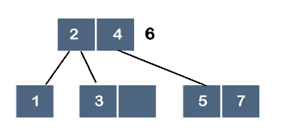

但是，6 不能在 4 之后添加，因为节点最多可以有 2 个键，所以我们将通过中间元素拆分这个节点。中间的元素是 4，所以它移动到它的父元素。由于节点 4 没有任何父节点，节点 4 将成为根节点，如下所示:

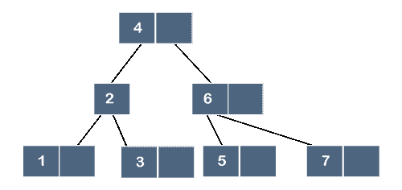

### 什么是 B+树？

[B+树](https://www.javatpoint.com/b-plus-tree)也被称为高级自平衡树，因为从树根到树叶的每条路径都有相同的长度。这里，相同的长度意味着所有的叶节点出现在相同的级别。不会发生某些叶节点出现在第三层，而某些叶节点出现在第二层的情况。

B+树索引被认为是多级索引，但 B+树结构与多级索引顺序文件并不相似。

**为什么用 B+树？**

通过使用 B+树索引结构以索引方式存储记录，B+树用于非常有效地存储记录。由于多级索引，数据访问变得更快更容易。

**B+树节点结构**

B+树的节点结构包含如下图所示的指针和键值:

从上面的 B+树节点结构中我们可以观察到，它包含 n-1 个键值(k 1 到 k n-1 )和 n 个指针(p 1 到 p n )。

放置在节点中的搜索关键字值保持排序顺序。因此，如果我<j then="" k="">我 T4【k】T2</j>

**对各种类型节点的约束**

让‘B’是 B+树的顺序。

**非叶节点**

让‘m’代表一个节点的子节点数，那么树的顺序和子节点数之间的关系可以表示为:

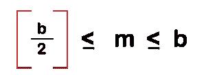

让 k 代表搜索键值。树的顺序和搜索关键字之间的关系可以表示为:

我们知道，指针的数量等于搜索键值加 1，因此从数学上讲，它可以写成:

**指针(或子指针)数量=搜索键数量+ 1**

因此，指针的最大数量将是“b”，指针的最小数量将是 b/2 的上限函数。

**叶节点**

叶节点是出现在 B+树的最后一级的节点，每个叶节点只使用一个指针来相互连接，以提供叶级的顺序访问。

在叶节点中，子节点的最大数量为:

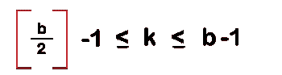

搜索关键字的最大数量为:

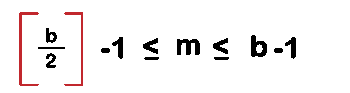

**根节点**

根节点的最大子节点数是:b

孩子的最小数量是:2 个

**b+树中的特例**

**情况 1:** 如果根节点是树中唯一的节点。在这种情况下，根节点成为叶节点。

在这种情况下，子节点的最大数量是 1，即根节点本身，而子节点的最小数量是 b-1，这与叶节点的数量相同。

**b+树中叶节点的表示**

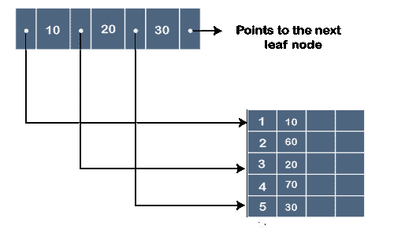

在上图中，'.'表示指针，而 10、20 和 30 是键值。指针包含存储键值的地址，如上图所示。

**b+树示例**

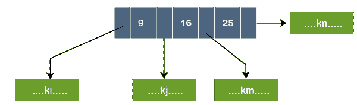

在上图中，节点包含三个键值，即 9、16 和 25。出现在 9 之前的指针包含由 k i 表示的小于 9 的键值。出现在 16 之前的指针包含大于或等于 9 但小于 16 的键值，用 kj 表示。出现在 25 之前的指针包含大于或等于 16 但小于 25 的键值，用 k n 表示。

### B 树和 B+树的区别

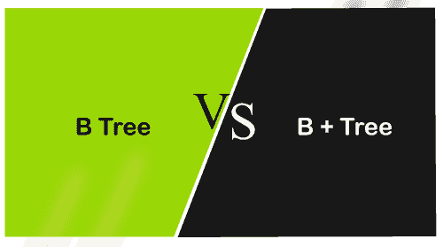

### 以下是 B 树和 B+树的区别:

| b 树 | B+树 |
| 在 B 树中，所有的键和记录都存储在内部节点和叶节点中。 | 在 B+树中，键是存储在内部节点中的索引，记录存储在叶节点中。 |
| 在 B 树中，关键字不能重复存储，这意味着不存在关键字或记录的重复。 | 在 B+树中，键的出现可能存在冗余。在这种情况下，记录存储在叶节点中，而密钥存储在内部节点中，因此冗余密钥可能存在于内部节点中。 |
| 在 Btree 中，叶节点不相互链接。 | 在 B+树中，叶节点相互链接以提供顺序访问。 |
| 在 Btree 中，搜索效率不是很高，因为记录要么存储在叶节点，要么存储在内部节点。 | 在 B+树中，搜索非常有效或更快，因为所有记录都存储在叶节点中。 |
| 删除内部节点是非常缓慢和耗时的过程，因为我们还需要考虑被删除键的子节点。 | B+树中的删除非常快，因为所有记录都存储在叶节点中，所以我们不必考虑节点的子节点。 |
| 在 Btree 中，顺序访问是不可能的。 | 在 B+树中，所有的叶节点通过指针相互连接，因此顺序访问是可能的。 |
| 在 Btree 中，由于高度相对于宽度增加，所以执行的分裂操作的数量越多， | B+树的宽度比高度大。 |
| 在 Btree 中，每个节点至少有两个分支，每个节点包含一些记录，因此我们不需要遍历直到叶节点才能获得数据。 | 在 B+树中，内部节点只包含指针，叶节点包含记录。所有的叶子节点都在同一个级别，所以我们需要遍历直到叶子节点才能得到数据。 |
| 根节点包含至少 2 到 m 个子节点，其中 m 是树的顺序。 | 根节点包含至少 2 到 m 个子节点，其中 m 是树的顺序。 |

* * *