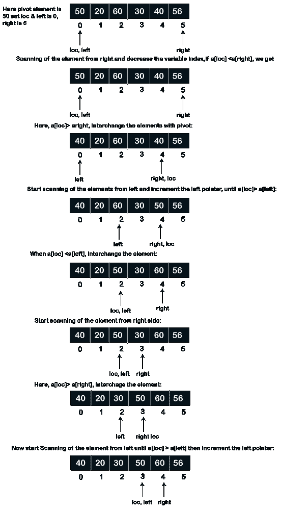
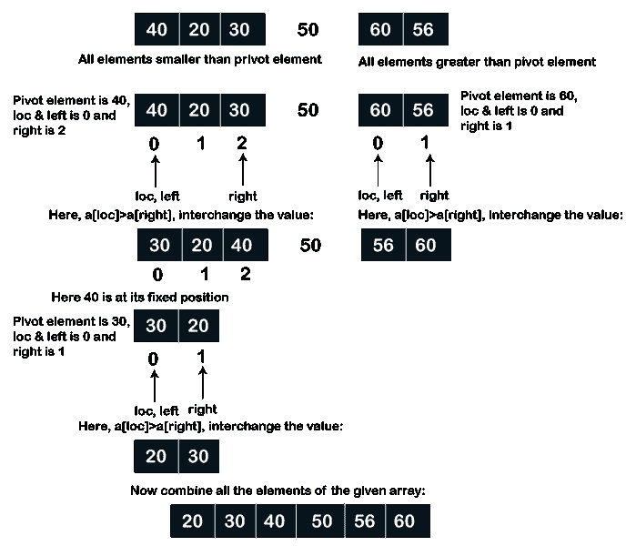
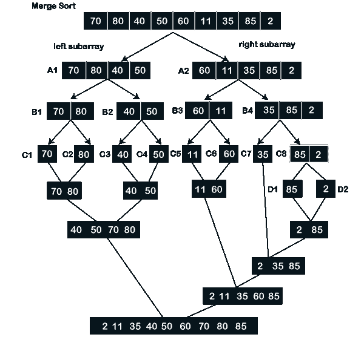

# 快速排序和合并排序的区别

> 原文：<https://www.javatpoint.com/quick-sort-vs-merge-sort>

A **排序**是将数据以特定的格式如升序或降序排列在一起。通常，它用于以排序的方式排列同类数据。使用**排序**算法，我们可以按顺序排列数据，并轻松快速地搜索元素。**排序技术**取决于两种情况，如执行程序所需的总时间和总空间。在这一节中，我们将讨论**快速排序**和**合并排序**，并对它们进行比较。


## 快速排序

[快速排序](https://www.javatpoint.com/quick-sort)是一种基于比较的排序算法，遵循分治技术对数组进行排序。在快速排序中，我们通常使用**枢轴(键)**元素来比较和交换基于某种条件的元素位置。当一个枢轴元素在数组中获得它的固定位置时，表示比较的终止&交换过程。之后，阵列分成两个子阵列。其中第一个分区包含小于 pivot (key)元素的所有元素，而其他部分包含大于 pivot 元素的所有元素。之后，它再次在每个子数组上选择一个枢轴元素，并重复相同的过程，直到数组中的所有元素都被排序到一个数组中。

### 快速排序算法

**分区(A，p，r)**

1.  X
2.  I
3.  对于 j
4.  如果 A[j] <= x，则执行
5.  那我
6.  交易所 A[i] A[j]
7.  交易所 A[I + 1] A[r]
8.  返回 I + 1

**快速排序(A，p，r)**

1.  而(p < r)
2.  做 q
3.  R
4.  而(p < r)
5.  做 q
6.  P

**使用快速排序算法对数组进行排序的步骤**

假设，我们有一个数组 X，它有元素 X[1]，X[2]，X[3]，…。，要排序的 X[n]。让我们按照以下步骤使用快速排序对数组进行排序。

**第一步:**将数组的第一个元素设置为**枢纽**或关键元素。这里，我们假设枢轴为 X[0]，**左**指针位于数组元素的第一个元素处，数组元素的最后一个**索引为**右**。**

**步骤 2:** 现在我们从右侧索引开始扫描数组元素，然后

如果 X[键]小于 X[右]或者如果 X[键]< X[右]，

1.  不断减少右端指针变量，直到它等于键。
2.  如果 X[键]> X[右]，交换键元素到 X[右]元素的位置。
3.  设置，键=右，左索引增加 1。

**第三步:**现在我们再次从左侧开始扫描元素，并将每个元素与关键元素进行比较。X[键]>X[左]或 X[键]大于 X[左]，则执行以下动作:

1.  连续比较左元素和 X[键]，并将左索引增加 1，直到键等于左。
2.  如果 X[键]< X[左]，将 X[键]的位置与 X[左]互换，进入步骤 2。

**第 4 步:**重复第 2 步和第 3 步，直到 X[左]变成等于 X[键]。所以，我们可以说，如果 X[left] = X[key]，就表示程序的终止。

**第五步:**之后，左侧的所有元素会比关键元素小，右侧的其余元素会比关键元素大。因此表明该阵列需要分成两个子阵列。

**第 6 步:**同样，我们需要对子数组重复执行上述过程，直到整个数组变得有序。

让我们看一个快速排序的例子。

**示例:考虑一个由 6 个元素组成的数组。使用快速排序对数组进行排序。**

arr[] = {50，20，60，30，40，56}



在上面的数组中，50 位于正确的位置。因此，我们将一个子数组中小于 pivot 的元素和另一个子数组中大于 pivot 的元素分开。



因此，我们得到了排序的数组。

让我们在 C 程序中实现上述逻辑。

**Quick.c**

```

#include 
int division_of_array(int x[], int st, int lt); // declaration of functions
void quick_sort(int x[], int st, int lt);
void main()
{
	int i;
	int ar[6] = {50, 20, 60, 30, 40, 56}; // given array elements
	quick_sort(ar, 0, 5);  // it contains array, starting index and last index as an parameters.
	print(" Sorted Array is : \n");
	for(i=0; i<6; i++)
	{
		printf("Array = %d\t", ar[i]);
	}
	int division_of_array(int x[], int st, int lt)
	{
		int left, right, temp, key, flag;
		key = left = st; // initially these variables are in same place.
		right = lt;
		flag = 0;
		while(flag != 1)
		{
			while((x[key] <= x[right]) && (key != right))
			right--;
			if(key == right) // if pivot element is equal to the last index.
			flag = 1;
			else if(x[key] > x[right]) // if pivot is greater than last index.
			{
				temp = x[key];
				x[key] = x[right];
				x[right] = temp;
				key = right;
			}
			if (flag != 1)
			{          /* Repeat the while loop until pivot is greater than left and equal to the left. */
				while((x[key] >= x[left]) && (key != left))
				left++;
				if(key == left)
				flag = 1;
				else if(x[key] < x[left])
				{
					temp = x[key];
					x[key] = x[left];
					x[left] = temp;
					key = left;
				}
			}
		}
		return key;
	}
}void quick_sort(int x[], int st, int lt)
{
	int key;
	if(st
```

**输出:**

```
Sorted Array is:
Array = 50  20  60  30  40  56 

```

## 合并排序

[合并排序](https://www.javatpoint.com/merge-sort)是一种最重要的排序技术，用于分治策略。这是最流行的排序技术，用于对文件中外部可用的数据进行排序。合并排序算法将给定的数组分成两半(N/2)。然后，它递归地将两个半数组元素的集合划分为单个或单独的元素，或者我们可以说直到不能再进行划分。然后，它比较相应的元素来对元素进行排序，最后，所有子元素被组合以形成最终的排序元素。

### 使用合并排序算法对数组进行排序的步骤

1.  假设我们有一个给定的数组，那么首先我们需要把这个数组分成子数组。每个子阵列可以存储 5 个元素。
2.  在这里，我们将第一个子阵列命名为 A1，并将其分为下两个子阵列 B1 和 B2。
3.  类似地，将右边的子阵列命名为 A2，并将其分成接下来的两个子阵列，即 B3 和 B4。
4.  这个过程不断重复，直到子阵列被分成单个元素，并且可能不再有分区。
5.  之后，将每个元素与对应的元素进行比较，然后开始合并过程，以升序排列每个元素。
6.  合并过程一直持续到所有元素以升序合并。

让我们看一个合并排序的例子。

**示例:考虑一个由 9 个元素组成的数组。使用合并排序对数组进行排序。**

arr[] = {70，80，40，50，60，11，35，85，2}



因此，我们使用合并排序得到排序数组。

让我们在 C 程序中实现上述逻辑。

**合并 c**

```

#include //#include <conio.h>#include <stdlib.h>void merge(int arr[], int l, int m, int end)
{
	int i, j, k;
	int a1 = m - l + 1;
	int a2 = end - m;

	// create temp subarray
	int sub1[a1], sub2[a2];

	// Store data to temp subarray subArr1[] and subArr2[]
	for (i = 0; i < a1; i++)
		sub1[i] = arr[l + i];
	for (j = 0; j < a2; j++)
		sub2[j] = arr[m + 1 + j];

	// Merge the temp array into the original array arr[]
	i = 0;
	j = 0;
	k = l;
	while (i < a1 && j < a2)
	{
		if (sub1[i] <= sub2[j])
		{
			arr[k] = sub1[i];
			i++;
		}
		else
		{
			arr[k] = sub2[j];
			j++;
		}
		k++;
	}

	// copry the rest element of subArr1[], if some element is left;
while (i < a1)
{
	arr[k] = sub1[i];
	i++;
	k++;	
}

	// copry the rest element of subArr2[], if some element is left;
while (j < a2)
{
	arr[k] = sub2[j];
	j++;
	k++;	
  }
}

/* st represents the first index and end represents the right index of the subarray of arr[] to be sorted using merge sort. */
void mergeSort(int arr[], int l, int end)
{
	if (l < end)
	{	
		int m = l + (end - l) / 2;

		mergeSort(arr, l, m);
		mergeSort(arr, m + 1, end);

		merge(arr, l, m, end);
	}
}

// Function to print the merge sort.
void mergePrint(int Ar[], int size)
{
	int i;
	for (i = 0; i < size; i++)
		printf("%d \t", Ar[i]);
	printf("\n");
}

int main()
{
	int arr[] = { 70, 80, 40, 50, 60, 11, 35, 85, 2 };
	int arr_size = sizeof(arr) / sizeof(arr[0]);

	printf(" Predefined Array is \n");
	mergePrint(arr, arr_size);

	mergeSort(arr, 0, arr_size - 1);

	printf("\n Sorted array using the Merge Sort algorithm \n");
	mergePrint(arr, arr_size);
	return 0;
}</stdlib.h></conio.h> 
```

**输出:**

```
Predefined Array is
70      80      40      50      60      11      35      85      2

 Sorted array using the Merge Sort algorithm
2       11      35      40      50      60      70      80      85

```

## 快速排序与合并排序

| 附注 | 参数 | 快速排序 | 合并排序 |
| **1。** | **定义** | 这是一种快速排序算法，通过比较和交换元素的位置，将给定的元素按升序排列。 | 这是一种合并排序算法，它使用分治技术以升序排列给定的元素集，然后与相应的元素进行比较来对数组进行排序。 |
| **2。** | **原理** | 它采用分而治之的技术。 | 它采用分而治之的技术。 |
| **3。** | **元素划分** | 在快速排序中，数组可以分成任意比例。 | 合并排序将一个数组划分为两个子数组(N/2)。 |
| **4。** | **效率** | 与合并排序相比，它在较小大小的数组中效率更高、速度更快。 | 与快速排序相比，它在更大的数据集或数组中效率更高、工作更快。 |
| **5** | **排序方式** | 这是一种内部排序方法，用于对主内存中可用的数组或数据进行排序。 | 这是一种外部排序方法，用于对外部文件中可用的数组或数据集进行排序。 |
| **6** | **时间复杂度** | 它最差的时间复杂度是 O (n2)。 | 然而，它最差的时间复杂度是 0(n ^ log n)。 |
| **7** | **首选** | 这是一种适用于大型未排序数组的排序算法。 | 而对链表进行排序的合并排序算法。 |
| **8** | **稳定性** | 快速排序是一种不稳定的排序算法。但是我们可以通过对编程代码进行一些修改来使它变得稳定。 | 合并排序是一种稳定的排序算法，在排序的输出中包含两个具有相同值的相等元素。 |
| **9** | **需要空间** | 执行快速排序不需要任何额外的空间。 | 它需要额外的空间作为临时数组来合并两个子数组。 |
| **10。** | **功能** | 将每个元素与枢轴进行比较，直到所有元素都按升序排列。 | 然而，合并排序将数组分成两部分(N/2)，并不断地分割数组，直到剩下一个元素。 |

* * *