# BFS 和美国。DFS 是什么

> 原文：<https://www.javatpoint.com/bfs-vs-dfs>

在看 BFS 和 DFS 的区别之前，我们首先要分别了解 BFS 和 DFS。

### 什么是 BFS？

[BFS](https://www.javatpoint.com/breadth-first-search-algorithm) 代表 ***广度优先搜索*** 。也称为**级序遍历**。队列数据结构用于广度优先搜索遍历。当我们在图中使用 BFS 算法进行遍历时，我们可以将任何节点视为根节点。

**让我们考虑下面的图进行广度优先搜索遍历。**

假设我们将节点 0 视为根节点。因此，遍历将从节点 0 开始。

一旦节点 0 从队列中移除，它将被打印并标记为 ***访问节点。*T3】**

一旦节点 0 从队列中移除，节点 0 的相邻节点将被插入队列，如下所示:

现在，节点 1 将从队列中删除；它被打印并标记为访问节点

一旦节点 1 从队列中移除，节点 1 的所有相邻节点将被添加到队列中。节点 1 的相邻节点是 0、3、2、6 和 5。但是我们必须在队列中只插入未访问的节点。因为节点 3、2、6 和 5 未被访问；因此，这些节点将被添加到队列中，如下所示:

下一个节点是队列中的 3。因此，节点 3 将从队列中删除，它将被打印并标记为已访问，如下所示:

一旦节点 3 从队列中移除，那么除了被访问的节点之外，节点 3 的所有相邻节点都将被添加到队列中。节点 3 的相邻节点是 0、1、2 和 4。因为节点 0、1 已经被访问，并且节点 2 存在于队列中；因此，我们只需要在队列中插入节点 4。

现在，队列中的下一个节点是 2。因此，2 将从队列中删除。它被打印并标记为已访问，如下所示:

一旦节点 2 从队列中移除，则除了被访问节点之外，节点 2 的所有相邻节点都将被添加到队列中。节点 2 的相邻节点是 1、3、5、6 和 4。因为节点 1 和 3 已经被访问，并且 4、5、6 已经被添加到队列中；因此，我们不需要在 Queue 中插入任何节点。

下一个元素是 5。因此，将从队列中删除 5 个。它被打印并标记为已访问，如下所示:

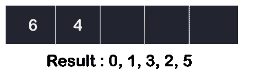

一旦节点 5 从队列中移除，则除了被访问节点之外，节点 5 的所有相邻节点都将被添加到队列中。节点 5 的相邻节点是 1 和 2。因为两个节点都已经被访问过；因此，队列中没有要插入的顶点。

下一个节点是 6。因此，6 将从队列中删除。它被打印并标记为已访问，如下所示:

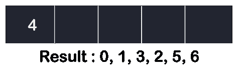

一旦节点 6 从队列中移除，则除了被访问节点之外，节点 6 的所有相邻节点都将被添加到队列中。节点 6 的相邻节点是 1 和 4。因为节点 1 已经被访问过，并且节点 4 已经被添加到队列中；因此，队列中没有要插入的顶点。

队列中的下一个元素是 4。因此，4 将从队列中删除。它会被打印出来并标记为已访问。

一旦节点 4 从队列中移除，则除了被访问节点之外，节点 4 的所有相邻节点都将被添加到队列中。节点 4 的相邻节点是 3、2 和 6。因为已经访问了所有相邻节点；因此，队列中没有要插入的顶点。

### 什么是 DFS？

[DFS](https://www.javatpoint.com/depth-first-search-algorithm) 代表深度优先搜索。在 DFS 遍历中，使用堆栈数据结构，它基于后进先出原则。在 DFS 中，遍历可以从任何节点开始，或者我们可以说任何节点都可以被认为是根节点，直到问题中没有提到根节点。

在 BFS 的情况下，从队列中删除的元素，被删除节点的相邻节点被添加到队列中。相比之下，在 DFS 中，从堆栈中删除的元素，则在堆栈中只添加已删除节点的一个相邻节点。

**让我们考虑深度优先搜索遍历的下图。**

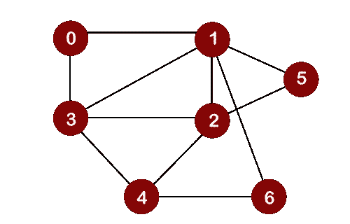

将节点 0 视为根节点。

首先，我们在堆栈中插入元素 0，如下所示:

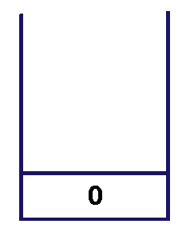

节点 0 有两个相邻的节点，即 1 和 3。现在我们只能取一个相邻的节点，1 或 3，进行遍历。假设我们考虑节点 1；因此，1 被插入堆栈中，并按如下所示进行打印:

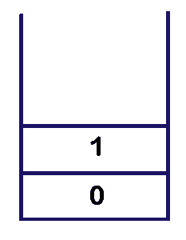

现在我们来看看节点 1 的相邻顶点。节点 1 的未访问的相邻顶点是 3、2、5 和 6。我们可以考虑这四个顶点中的任何一个。假设我们获取节点 3，并将其插入堆栈，如下所示:

考虑节点 3 的未访问的相邻顶点。节点 3 的未访问的相邻顶点是 2 和 4。我们可以取任意一个顶点，即 2 或 4。假设我们获取顶点 2，并将其插入堆栈，如下所示:

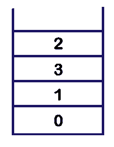

节点 2 的未访问的相邻顶点是 5 和 4。我们可以选择任意一个顶点，即 5 或 4。假设我们取顶点 4 并插入堆栈，如下所示:

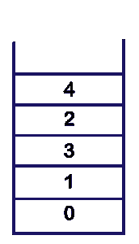

现在我们将考虑节点 4 的未访问的相邻顶点。节点 4 的未被访问的相邻顶点是节点 6。因此，元素 6 被插入堆栈，如下所示:

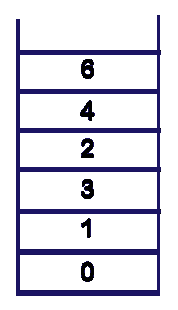

在堆栈中插入元素 6 后，我们将查看节点 6 的未访问的相邻顶点。由于节点 6 没有未访问的相邻顶点，因此我们不能移动到节点 6 之外。在这种情况下，我们将执行**回溯**。最上面的元素，即 6，将从堆栈中弹出，如下所示:

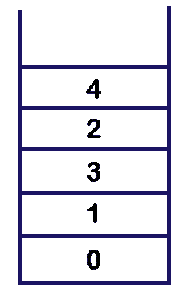

堆栈中最上面的元素是 4。因为节点 4 的左侧没有未访问的相邻顶点；因此，节点 4 从堆栈中弹出，如下所示:

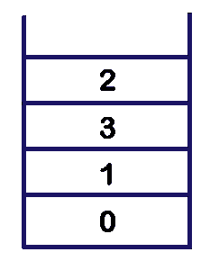
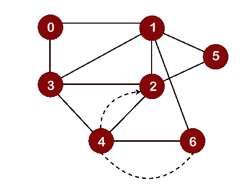

堆栈中下一个最上面的元素是 2。现在，我们来看看节点 2 的未访问的相邻顶点。由于只剩下一个未访问的节点，即 5，因此节点 5 将被推入 2 上方的堆栈中，并按如下所示进行打印:

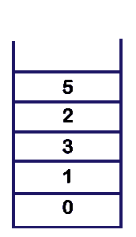

现在我们将检查节点 5 的相邻顶点，它们仍然是未被访问的。由于没有剩下要访问的顶点，所以我们从堆栈中弹出元素 5，如下所示:

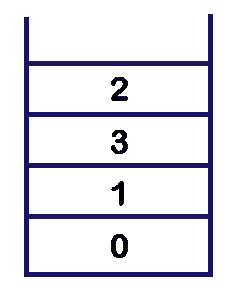

我们不能再向前移动 5，所以我们需要执行回溯。在回溯中，最顶端的元素会从堆栈中弹出。最上面的元素是 5，它将从堆栈中弹出，我们返回到节点 2，如下所示:

现在我们将检查节点 2 的未访问的相邻顶点。由于没有相邻的顶点可供访问，所以我们执行回溯。在回溯中，最顶端的元素，即 2，将从堆栈中弹出，我们回到节点 3，如下所示:

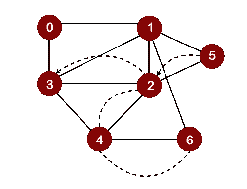
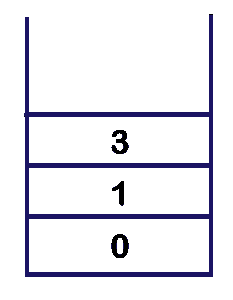

现在我们将检查节点 3 的未访问的相邻顶点。由于没有相邻的顶点可供访问，所以我们执行回溯。在回溯中，最顶端的元素，即 3，将从堆栈中弹出，我们返回到节点 1，如下所示:

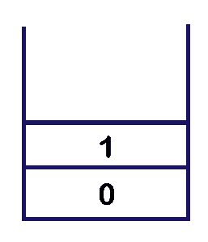

在弹出元素 3 之后，我们将检查节点 1 的未访问的相邻顶点。因为没有剩下要访问的顶点；因此，将执行回溯。在回溯中，最顶端的元素，即 1，将从堆栈中弹出，我们回到节点 0，如下所示:

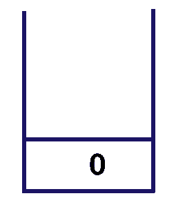
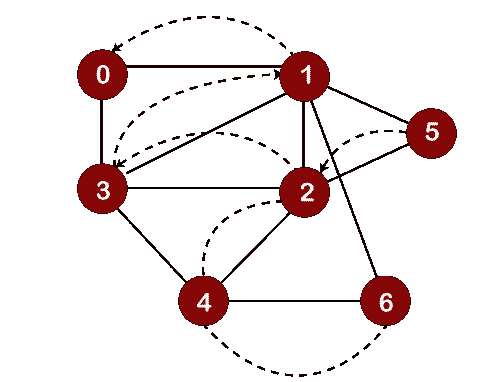

我们将检查节点 0 的相邻顶点，它们仍然未被访问。由于没有相邻的顶点可供访问，所以我们执行回溯。在这种情况下，只有一个元素，即堆栈中剩余的 0，会从堆栈中弹出，如下所示:

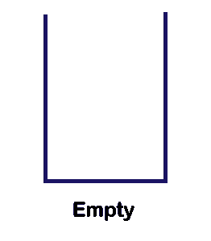

从上图中我们可以观察到堆栈是空的。所以，我们必须在这里停止 DFS 遍历，打印的元素就是 DFS 遍历的结果。

### BFS 与 DFS 的区别

以下是 BFS 和外勤支助部之间的差异:

|  | 宽度优先搜索 | 深度优先搜索 |
| **完整形式** | BFS 代表广度优先搜索。 | DFS 代表深度优先搜索。 |
| **技术** | 它是一种基于顶点的技术来寻找图中的最短路径。 | 这是一种基于边的技术，因为沿着边的顶点首先从起点到终点进行探索。 |
| **定义** | BFS 是一种遍历技术，其中首先探索同一层的所有节点，然后我们进入下一层。 | DFS 也是一种遍历技术，从根节点开始遍历，并尽可能地探索节点，直到我们到达没有未访问的相邻节点的节点。 |
| **数据结构** | 队列数据结构用于 BFS 遍历。 | 堆栈数据结构用于 BFS 遍历。 |
| **回溯** | BFS 没有使用回溯概念。 | DFS 使用回溯遍历所有未访问的节点。 |
| **边数** | BFS 找到了从源顶点到目的顶点的最短路径，该路径的边数最少。 | 在 DFS 中，从源顶点到目标顶点需要遍历更多的边。 |
| **最优性** | BFS 遍历对于那些要搜索的更靠近源顶点的顶点是最优的。 | 对于那些解远离源顶点的图，DFS 遍历是最优的。 |
| **速度** | BFS 比 DFS 慢。 | DFS 比 BFS 快。 |
| **决策树的适用性** | 它不适合决策树，因为它需要首先探索所有相邻节点。 | 它适用于决策树。基于这个决定，它探索了所有的路径。当找到目标时，它停止遍历。 |
| **内存高效** | 它的内存效率不高，因为它需要比 DFS 更多的内存。 | 它的内存效率高，因为它需要的内存比 BFS 少。 |

* * *