# 堆栈与堆

> 原文：<https://www.javatpoint.com/stack-vs-heap>

在理解堆栈和堆数据结构之间的区别之前，我们应该分别了解堆栈和堆数据结构。

### 什么是 Stack？

一个[栈是一个用于组织数据的数据结构](https://www.javatpoint.com/data-structure-stack)。堆栈类似于堆栈，是组织现实世界中对象的一种方式。真实世界的一些例子是一堆餐盘，一个数学难题，被称为河内塔，包含三个有多个圆盘的杆和一堆网球。堆栈是一个集合，其属性是必须从一端移除一个项目或对象，称为堆栈顶部的*。*

 *它不能被视为属性，而是被视为应用于堆栈的约束或限制。换句话说，我们可以说只有堆栈的顶部是可访问的，任何项目都可以从堆栈的顶部移除或插入。它遵循后进先出原则，即必须首先从堆栈中移除最近添加的元素。

堆栈是一个列表或集合，其限制是插入和删除将从称为堆栈顶部的一端进行。

### 操作

**以下是堆栈 ADT 可用的两种操作:**

*   **Push:** 在堆栈中插入元素的过程称为 Push 操作。优雅的操作可以写成:
    Push(x):它将元素 x 插入堆栈。
*   **Pop:** 从堆栈中删除元素的过程称为 Pop 操作。pop 操作可以表示为:
    **Pop():** 它从堆栈中移除最近的元素。

### 栈的表示

堆栈如下所示:

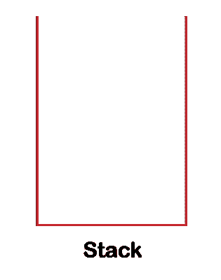

在上图中，我们可以观察到堆栈看起来像一个从一侧打开的容器。它在逻辑上可以表示为一个从一侧打开的容器的三面图形。上面的表示是一个空堆栈，让我们假设堆栈是。它是一堆整数。现在我们将在堆栈上执行推送和弹出操作。假设我们想在堆栈中插入 2 个元素。推送操作后，堆栈看起来像:


因为堆栈中只有一个元素，所以堆栈顶部会有 2 个元素。如果我们想在堆栈中插入 1 个元素，那么堆栈应该是:

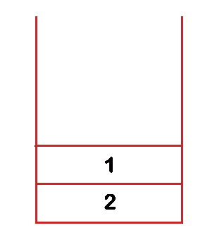

由于元素 1 位于元素 2 之上，因此元素 1 将被视为堆栈的顶部。如果我们执行 pop 操作，那么最上面的元素，即 1，将从堆栈中移除，如下所示:

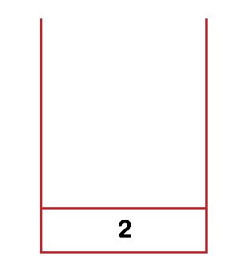

### 什么是堆？

[堆](https://www.javatpoint.com/heap-data-structure)也是一个[数据结构](https://www.javatpoint.com/data-structure-tutorial)或者是用来存储全局变量的内存。默认情况下，所有全局变量都存储在堆内存中。它允许动态内存分配。堆内存不由中央处理器管理。堆数据结构可以使用数组或树来实现。

它是满足堆属性条件的完全二叉树，其中完全二叉树是除最后一级之外所有级都被完全填充的树。在最后一层，所有的节点都尽可能的靠左。

**指针和动态内存**

在这里，我们将看到记忆的架构。了解系统如何管理内存，以及作为程序员的我们如何访问内存是非常重要的。在典型的体系结构中，分配给程序或应用程序的内存分为四个部分。存储器的一个段存储将要执行的指令。另一段内存存储全局或静态变量。全局变量是在函数外部声明的变量，其生命周期贯穿整个程序。第三段，即栈，用于存储所有的函数调用和局部变量。当调用任何函数时，它会占用内存中的一些空间，称为堆栈内存。

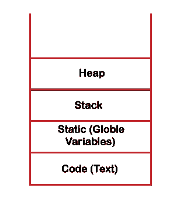

让我们通过一个例子来理解堆栈内存。

```

#include <stdio.h>
int square(int s)
{
    return s*s;
}
int sum(int x,int y)
{
    int z= x+y;
    int result = square(z);
    return result;
}
int main()
{
  int a=10;
  int b=20;
  int x = sum(a,b);
  printf("Output is : %d", x);
  return 0;
}

```

在上面的代码中，执行从 main()方法开始。因此 main()方法将在堆栈中获得一个内存，如下所示:

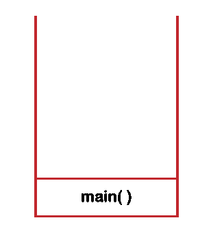

调用 sum()方法时，控制移至 **sum()** 功能。

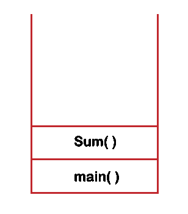

sum()方法调用 square()方法；因此，square 方法在堆栈中有一个内存，如下所示:

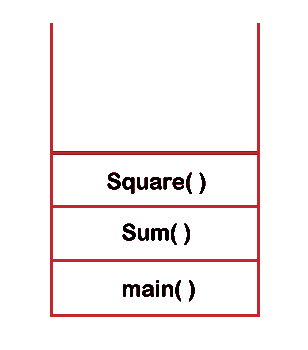

一旦 square()方法返回语句被执行，控件将移回 sum()方法，square()方法将从堆栈中移除，如下所示:

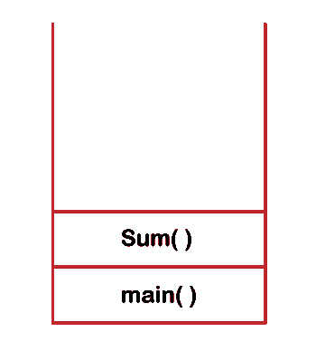

当 sum()方法的 return 语句执行时，控件移动到 main()方法，sum()方法从堆栈中移除，如下所示:

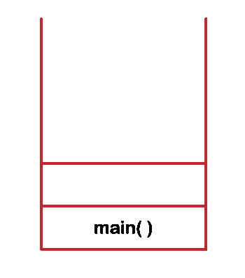

在 main()方法中，printf()函数被调用，因此它获得堆栈中的内存，如下所示:

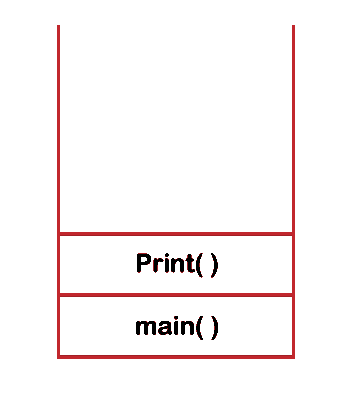

printf()语句执行完成后，printf()和 main()方法将从堆栈内存中删除，如下所示:


使用堆栈内存有一些限制。假设操作系统为程序保留 1MB 堆栈内存。如果程序继续再次调用这些函数，那么堆栈内存将不够，并导致堆栈溢出情况。堆栈溢出导致程序崩溃。因此，我们可以说堆栈内存不会在运行时增长。

堆栈的另一个限制是变量的范围不能被操纵。内存在堆栈上的分配和解除分配由规则设置，即当调用函数时，它被推到堆栈顶部，当调用 pop()操作时，元素从堆栈顶部移除。

堆栈的第三个限制是，如果我们定义大数据类型，如数组，而数组的大小在编译时没有定义。我们希望根据一些参数来定义数组的大小，而在运行时用堆栈来定义数组的大小是不可能的。

因此，为了分配大块内存并将内存保留到我们想要的时间，我们可以使用**堆**数据结构。与堆栈数据结构不同，堆内存的大小可以变化，并且在应用程序的整个生命周期中不是固定的。在堆内存中，内存的分配和释放没有固定的规则。程序员可以自己手动处理内存。对于程序员来说，抽象的方法是将堆视为一个可供使用的大量空闲内存，我们可以根据自己的需要来使用它。

堆也称为动态内存，使用堆，可以认为是动态内存分配。为了使用动态内存，我们需要使用一些函数。在 [C 语言](https://www.javatpoint.com/c-programming-language-tutorial)中，我们可以使用 malloc()和 calloc()来分配内存，使用 free()函数来解除内存分配，而在 [C++语言](https://www.javatpoint.com/cpp-tutorial)中，我们使用 new 运算符进行分配，使用 delete 运算符进行解除分配。

**我们通过一个例子来理解动态记忆。**

```

#include int main()
{
    int a; // goes onto stack.
    int *p;
    p = (int*)malloc(sizeof(int));
    *p = 11;
     free(p);
      p = (int*)malloc(sizeof(int));
      *p = 12;
} 
```

**以上代码的解释。**

首先，我们声明了“a”变量，它在堆栈中的 ***main()*** 方法的堆栈框架内被分配，如下所示:

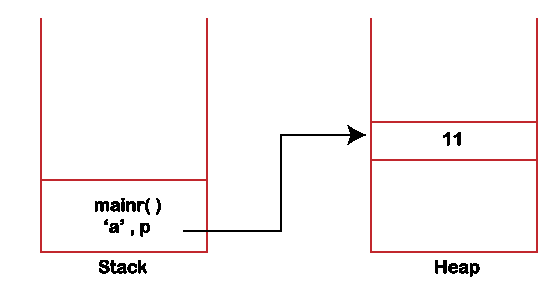

要在**堆内存**中分配一些东西，我们需要使用 malloc()函数。我们在上面的代码中使用了 malloc()函数，其中我们传递了 sizeof(int)定义了在堆内存中分配 4 字节的块。该函数返回包含块起始地址的 void 指针。“p”是函数的局部指针变量，因此它存储在堆栈中，如下所示:

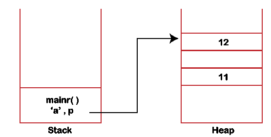

同样，我们已经分配了由“p”变量指向的新内存块，因此“p”不保存前一个块的地址。值为 11 的块是不必要的内存消耗。在堆中，内存不会自动释放，我们必须手动释放内存。因此，在上面的代码中，我们使用了 free(p)函数，在该函数中，我们传递“p”来解除分配“p”所指向的内存。

### 堆栈和堆的区别

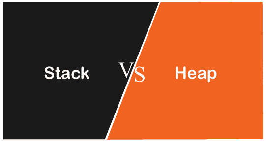

| 堆 | 许多 |
| 堆栈提供静态内存分配，即用于存储临时变量。 | 堆提供动态内存分配。默认情况下，所有全局变量都存储在堆中。 |
| 它是一种线性数据结构，意味着元素以线性方式存储，即一个接一个的数据。 | 它是分层数据结构，意味着元素以树的形式存储。 |
| 它用于访问局部变量。 | 默认情况下，它用于访问全局变量。 |
| 堆栈内存的大小是有限的，这取决于操作系统。 | 内存的大小不受限制。 |
| 因为它是线性数据结构，所以数据存储在连续的块中。 | 由于它是分层数据结构，所以元素以随机方式存储。 |
| 在堆栈中，分配和解除分配是自动管理的。 | 在堆中，内存是手动管理的。 |
| 栈的实现可以用数组、链表和动态内存三种形式完成。 | 堆的实现可以用数组和树两种形式完成。 |
| 堆栈出现的主要问题是内存不足，因为运行时无法更改内存大小。堆栈的大小在编译时确定。 | 堆出现的主要问题是内存碎片。在这里，内存碎片意味着内存被浪费。 |
| 它是固定尺寸的。 | 它使用起来很灵活，因为堆的大小可以根据我们的需要而变化。 |
| 堆栈中的访问时间更快。 | 堆中的访问时间较慢。 |
| 堆栈内存的大小由操作系统决定。 | 堆内存的大小由程序员决定。 |
| 无法更改变量的范围。 | 变量的范围可以更改。 |

* * **