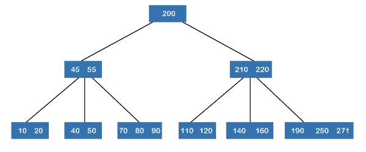
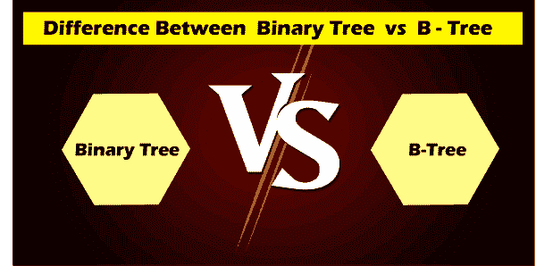

# 二叉树 vs B 树

> 原文：<https://www.javatpoint.com/binary-tree-vs-b-tree>

在了解二叉树和 btree 的区别之前，我们应该先分别了解一下**二叉树**和 **btree** 。

### 什么是二叉树？

一个[二叉树](https://www.javatpoint.com/binary-tree)是一个最多包含两个子节点的树。二叉树对节点的度有一个限制，因为二叉树中的节点不能包含两个以上的子节点。二叉树中最顶端的节点称为根节点，节点主要由两个子树组成，称为左子树和右子树。如果二叉树中的节点不包含任何子节点，那么它被称为叶节点。因此，节点可以有 0、1 或 2 个子节点。可以在二叉树上执行的操作有[插入](https://www.javatpoint.com/insertion-sort)、删除和遍历。

**二叉树可以分为以下几种类型:**

*   完全二叉树:二叉树中的每个节点可以有零个或两个子节点。
*   完美二叉树:完美二叉树是一个完整的二叉树，除了一个条件，即所有的叶节点存在于同一深度级别。
*   完全二叉树:完全二叉树是所有叶节点尽可能左对齐的树。
*   平衡二叉树:如果树的高度尽可能小，则称二叉树是平衡的。
*   二叉查找树:二叉查找树是一棵树，其中所有的键都被排序以提供更快的搜索。

它可以用来实现表达式求值、解析器、数据压缩算法、存储路由表、密码应用等。

### 什么是 BTree？

一个[树](https://www.javatpoint.com/b-tree)是一个自平衡树，因为它的节点是按照有序遍历排序的。与二叉树不同，btree 中的节点可以有两个以上的子节点。btree 的高度是 logMN，其中 M 是树的阶，N 是节点数。btree 的高度会自动调整，并且 btree 中的高度会按照特定顺序排序，左边的值最低，右边的值最高。

Btree 主要用于存储大量无法装入主内存的数据。当密钥数量增加时，数据以块的形式从磁盘中读取。众所周知，磁盘访问时间大于内存访问时间。使用 btree 背后的主要思想是减少磁盘访问的次数。在 btree 上实现的大多数操作，如搜索、删除、插入、最大、最小等，都有 O(h)个磁盘访问，其中 h 是树的高度。树是一棵非常宽的树。通过在 btree 节点中附加最大数量的键来保持树的高度尽可能低，从而构建 btree。btree 节点的大小主要等于磁盘块大小。由于树的高度很低，因此与平衡二叉查找树(如 AVL 树、红黑树等)相比，磁盘访问显著减少。

**与 btree 相关的一些重要事实如下:**

*   btree 中的所有叶节点必须处于同一级别。
*   叶节点上方不应存在任何空的子树。
*   btree 的高度应尽可能低。

在上图中，我们可以观察到所有的叶节点都存在于同一级别，并且所有的非叶节点都是非空的子树，它们的键比它们的子树少一个。

**我们用表格的形式来了解一下二叉树和 btree 的区别。**

| B 树 | 二叉树 |
| b 树中的节点可以有最大“M”个子节点，其中 M 是树的顺序。 | 与 btree 不同，二叉树最多可以有两个子树或两个子树。 |
| btree 是一个排序树，因为它的节点是按顺序遍历排序的。 | 二叉树不是排序树一棵树可以按顺序、前序或后序遍历排序。 |
| btree 的高度是 logMN，其中 M 是树的阶，N 是节点数。 | 二叉树的高度是 log2N，其中 N 是节点数。 |
| 当数据存储在磁盘中时，就实现了 Btree。 | 当数据存储在内存中时，就实现了二叉树。 |
| 它用于数据库管理系统。 | 它用于霍夫曼编码和代码优化。 |
| 在 btree 中插入数据或密钥比二叉树更复杂。 | 与 btree 相比，在二叉树中插入数据更容易。 |
