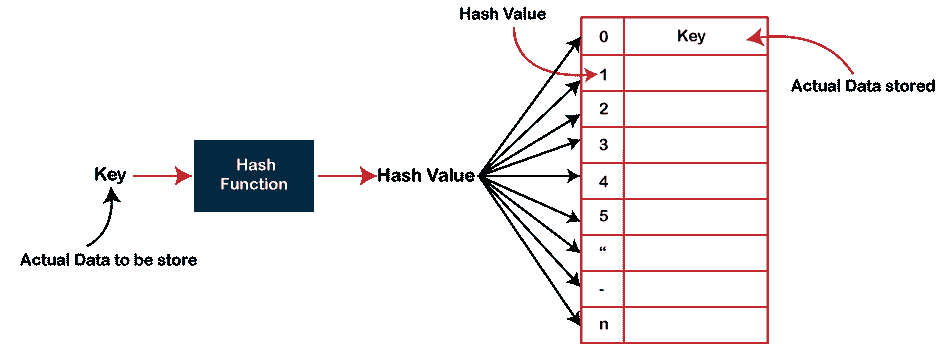
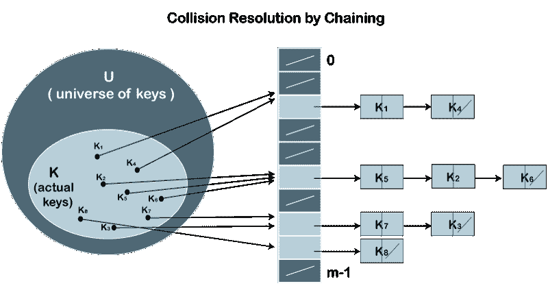
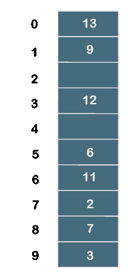

# 散列表

> 原文：<https://www.javatpoint.com/hash-table>

哈希表是最重要的数据结构之一，它使用一种称为哈希函数的特殊函数，该函数将给定的值与一个键进行映射，以更快地访问元素。

哈希表是存储一些信息的数据结构，信息基本上有两个主要组成部分，即键和值。哈希表可以在关联数组的帮助下实现。映射的效率取决于用于映射的散列函数的效率。

例如，假设键值是 John，值是电话号码，那么当我们在散列函数中传递键值时，如下所示:

Hash(key)=索引；

当我们在哈希函数中传递密钥时，它会给出索引。

散列(John)= 3；

上面的例子在索引 3 处添加了 john。

**哈希函数的缺点**

哈希函数为每个值分配一个唯一的键。有时哈希表使用不完美的哈希函数会导致冲突，因为哈希函数会生成两个不同值的相同密钥。

### 散列法

散列是使用恒定时间的搜索技术之一。哈希算法的时间复杂度为 0(1)。到目前为止，我们阅读了两种搜索技术，即[线性搜索](https://www.javatpoint.com/linear-search)和[二分搜索法](https://www.javatpoint.com/binary-search)。线性搜索中时间复杂度最差的是 O(n)，二分搜索法是 O(logn)。在这两种搜索技术中，搜索依赖于元素的数量，但是我们希望这种技术需要恒定的时间。因此，哈希技术的出现提供了一个恒定的时间。

在哈希技术中，使用了哈希表和哈希函数。使用散列函数，我们可以计算值可以存储的地址。

散列背后的主要思想是创建(键/值)对。如果给定了密钥，算法将计算存储该值的索引。它可以写成:

**索引=散列(密钥)**

**计算哈希函数有三种方式:**

*   **划分方法**
*   **折叠法**
*   **中间正方法**

在除法方法中，散列函数可以定义为:

**h(kI)= kI% m；**

其中 **m** 是哈希表的大小。

例如，如果键值为 6，哈希表的大小为 10。当我们将散列函数应用于键 6 时，索引将是:

h(6) = 6%10 = 6

存储该值的索引是 6。

### 冲突

当两个不同的值具有相同的值时，则问题出现在两个值之间，称为冲突。在上面的示例中，该值存储在索引 6 中。如果键值为 26，则索引为:

h(26) = 26%10 = 6

因此，两个值存储在同一索引处，即 6，这导致了冲突问题。为了解决这些冲突，我们有一些被称为冲突技术的技术。

以下是碰撞技术:

*   开放哈希:也称为封闭寻址。
*   封闭哈希:也称为开放寻址。

**打开哈希**

在开放哈希中，用于解决冲突的方法之一称为链接方法。

**我们先来了解一下解决冲突的链式方法。**

**假设我们有一个键值列表**

**A = 3，2，9，6，11，13，7，12 其中 m = 10，h(k) = 2k+3**

在这种情况下，我们不能直接用 h(k) = k i /m 作为 h(k) = 2k+3

*   键值 3 的索引为:

指数= h(3) = (2(3)+3)%10 = 9

值 3 将存储在索引 9 处。

*   键值 2 的索引为:

指数= h(2) = (2(2)+3)%10 = 7

值 2 将存储在索引 7 处。

*   键值 9 的索引是:

索引= h(9) = (2(9)+3)%10 = 1

值 9 将存储在索引 1 处。

*   键值 6 的索引为:

指数= h(6) = (2(6)+3)%10 = 5

值 6 将存储在索引 5 处。

*   键值 11 的索引是:

指数= h(11) = (2(11)+3)%10 = 5

值 11 将存储在索引 5 处。现在，我们有两个值(6，11)存储在同一个索引中，即 5。这导致了冲突问题，所以我们将使用链接方法来避免冲突。我们将再创建一个列表，并将值 11 添加到该列表中。在创建新列表之后，新创建的列表将被链接到值为 6 的列表。

*   键值 13 的索引是:

指数= h(13) = (2(13)+3)%10 = 9

值 13 将存储在索引 9 中。现在，我们有两个值(3，13)存储在同一个索引中，即 9。这导致了冲突问题，所以我们将使用链接方法来避免冲突。我们将再创建一个列表，并将值 13 添加到该列表中。在创建新列表之后，新创建的列表将被链接到值为 3 的列表。

*   键值 7 的索引是:

指数= h(7) = (2(7)+3)%10 = 7

值 7 将存储在索引 7 中。现在，我们有两个值(2，7)存储在同一个索引中，即 7。这导致了冲突问题，所以我们将使用链接方法来避免冲突。我们将再创建一个列表，并将值 7 添加到该列表中。创建新列表后，新创建的列表将链接到值为 2 的列表。

*   键值 12 的索引是:

指数= h(12) = (2(12)+3)%10 = 7

根据以上计算，值 12 必须存储在索引 7 处，但是值 2 存在于索引 7 处。因此，我们将创建一个新列表，并在列表中添加 12 个。新创建的列表将链接到值为 7 的列表。

**各键值关联的计算指标值如下表所示:**

| **键** | **位置(u)** |
| **3** | **((2*3)+3)%10 = 9** |
| **2** | **((2*2)+3)%10 = 7** |
| **9** | **((2*9)+3)%10 = 1** |
| **6** | **((2*6)+3)%10 = 5** |
| **11** | **((2*11)+3)%10 = 5** |
| **13** | **((2*13)+3)%10 = 9** |
| **7** | **((2*7)+3)%10 = 7** |
| **12** | **((2*12)+3)%10 = 7** |

### 封闭散列法

在封闭散列法中，使用三种技术来解决冲突:

1.  线性探测
2.  二次探测
3.  双重散列技术

**线性探测**

线性探测是开放寻址的一种形式。我们知道哈希表中的每个单元格都包含一个键值对，因此当通过将新的键映射到已经被另一个键占据的单元格而发生冲突时，线性探测技术会搜索最近的空闲位置，并向该空单元格添加新的键。在这种情况下，从发生冲突的位置开始，直到没有找到空单元，依次执行搜索。

**我们通过一个例子来理解线性探测。**

考虑上面的线性探测示例:

**A = 3，2，9，6，11，13，7，12 其中 m = 10，h(k) = 2k+3**

键值 3、2、9、6 分别存储在索引 9、7、1、5 中。计算出的索引值 11 是 5，它已经被另一个键值(即 6)占用。当应用线性探测时，离索引 5 最近的空单元是 6；因此，值 11 将在索引 6 处相加。

下一个键值是 13。应用哈希函数时，与此键值关联的索引值为 9。索引 9 处的单元格已被填充。当应用线性探测时，离索引 9 最近的空单元是 0；因此，值 13 将在索引 0 处相加。

下一个键值是 7。应用哈希函数时，与键值关联的索引值为 7。索引 7 处的单元格已被填充。当应用线性探测时，离索引 7 最近的空单元是 8；因此，值 7 将在索引 8 处相加。

下一个键值是 12。应用哈希函数时，与键值关联的索引值为 7。索引 7 处的单元格已被填充。当应用线性探测时，离索引 7 最近的空单元是 2；因此，值 12 将在索引 2 处相加。

**二次探测**

在线性探测的情况下，线性地执行搜索。相比之下，二次探测是一种开放寻址技术，它使用二次多项式进行搜索，直到找到一个空插槽。

也可以定义为允许在第一个自由位置从 **(u+i 2 )插入 ki % m，其中 i=0 到 m-1。**

**我们通过一个例子来理解二次试探。**

考虑我们在线性探测中讨论过的同一个例子。

**A = 3，2，9，6，11，13，7，12 其中 m = 10，h(k) = 2k+3**

键值 3、2、9、6 分别存储在索引 9、7、1、5 中。我们不需要在这些关键值上应用二次探测技术，因为不会发生冲突。

索引值 11 是 5，但是这个位置已经被 6 占据了。因此，我们应用二次探测技术。

**当 i = 0 时**

指数= (5+0 2 )%10 = 5

**当 i=1 时**

指数= (5+1 2 )%10 = 6

因为位置 6 是空的，所以值 11 将被添加到索引 6。

下一个元素是 13。当散列函数应用于 13 时，那么索引值为 9，我们已经在链式方法中讨论过了。在索引 9 处，该单元被另一个值，即 3 占据。因此，我们将应用二次探测技术来计算自由位置。

**当 i=0 时**

指数= (9+0 2 )%10 = 9

**当 i=1 时**

指数= (9+1 2 )%10 = 0

由于位置 0 为空，因此值 13 将被添加到索引 0 处。

下一个元素是 7。当散列函数应用于 7 时，那么索引值就是 7，我们已经在链式方法中讨论过了。在索引 7 处，单元格被另一个值(即 7)占据。因此，我们将应用二次探测技术来计算自由位置。

**当 i=0 时**

指数= (7+0 2 )%10 = 7

**当 i=1 时**

指数= (7+1 2 )%10 = 8

因为位置 8 是空的，所以值 7 将被添加到索引 8。

下一个元素是 12。当散列函数应用于 12 时，则索引值为 7。当我们观察散列表时，我们会知道索引 7 处的单元格已经被值 2 占据了。因此，我们在 12 上应用二次探测技术来确定自由位置。

**当 i=0 时**

指数= (7+0 2 )%10 = 7

**当 i=1 时**

指数= (7+1 2 )%10 = 8

**当 i=2 时**

指数= (7+2 2 )%10 = 1

**当 i=3 时**

指数= (7+3 2 )%10 = 6

**当 i=4 时**

指数= (7+4 2 )%10 = 3

由于位置 3 为空，因此值 12 将存储在索引 3 处。

最终的哈希表将是:

因此，元素的顺序是 13，9，_，12，_，6，11，2，7，3。

**双重散列**

双哈希是一种开放寻址技术，用于避免冲突。当冲突发生时，该技术使用密钥的二级散列。它使用一个哈希值作为索引向前移动，直到找到空位置。

在双重散列法中，使用两个散列函数。假设 h 1 (k)是用于计算位置的散列函数之一，而 h 2 (k)是另一个散列函数。可以定义为“从 ***(u+v*i)%m*** 第一个自由位置插入 k i ，其中 i=(0 到 m-1)”。在这种情况下，u 是使用散列函数计算的位置，v 等于(h 2 (k)%m)。

考虑我们在二次探测中使用的同一个例子。

**A = 3、2、9、6、11、13、7、12，其中 m = 10，**

**h 1 (k) = 2k+3**

**h 2 (k) = 3k+1**

| 键 | 位置(u) | v | 调查 |
| **3** | **((2*3)+3)%10 = 9** | - | one |
| **2** | **((2*2)+3)%10 = 7** | - | one |
| **9** | **((2*9)+3)%10 = 1** | - | one |
| **6** | **((2*6)+3)%10 = 5** | - | one |
| **11** | **((2*11)+3)%10 = 5** | (3(11)+1)%10 =4 | three |
| **13** | **((2*13)+3)%10 = 9** | (3(13)+1)%10 = 0 |  |
| **7** | **((2*7)+3)%10 = 7** | (3(7)+1)%10 = 2 |  |
| **12** | **((2*12)+3)%10 = 7** | (3(12)+1)%10 = 7 | Two |

因为我们知道在插入密钥(3，2，9，6)时不会发生冲突，所以我们不会对这些密钥值应用双重散列。

在哈希表中插入关键字 11 时，会发生冲突，因为计算出的索引值 11 是 5，已经被另一个值占用。因此，我们将对密钥 11 应用双重散列技术。当键值为 11 时，v 的值为 4。

现在，将 u 和 v 的值代入(u+v*i)%m

**当 i=0 时**

索引= (5+4*0)%10 =5

**当 i=1 时**

索引= (5+4*1)%10 = 9

**当 i=2 时**

索引= (5+4*2)%10 = 3

因为散列表中的位置 3 是空的；因此，密钥 11 被添加在索引 3 处。

下一个元素是 13。计算出的索引值 13 是 9，它已经被另一个键值占用了。因此，我们将使用双重散列技术来找到空闲位置。v 的值是 0。

现在，将 u 和 v 的值代入(u+v*i)%m

**当 i=0 时**

索引= (9+0*0)%10 = 9

我们将在从 0 到 m-1 的所有迭代中得到 9 个值，因为 v 的值为零。因此，我们不能在哈希表中插入 13。

下一个元素是 7。计算出的索引值 7 是 7，它已经被另一个键值占用了。因此，我们将使用双重散列技术来找到空闲位置。v 的值是 2。

现在，将 u 和 v 的值代入(u+v*i)%m

**当 i=0 时**

索引= (7 + 2*0)%10 = 7

**当 i=1 时**

索引= (7+2*1)%10 = 9

**当 i=2 时**

索引= (7+2*2)%10 = 1

**当 i=3 时**

索引= (7+2*3)%10 = 3

**当 i=4 时**

索引= (7+2*4)%10 = 5

**当 i=5 时**

索引= (7+2*5)%10 = 7

**当 i=6 时**

索引= (7+2*6)%10 = 9

**当 i=7 时**

索引= (7+2*7)%10 = 1

**当 i=8 时**

索引= (7+2*8)%10 = 3

**当 i=9 时**

索引= (7+2*9)%10 = 5

因为我们检查了 I 的所有情况(从 0 到 9)，但是我们没有找到合适的地方插入 7。因此，密钥 7 不能插入哈希表中。

下一个元素是 12。计算出的索引值 12 是 7，它已经被另一个键值占用了。因此，我们将使用双重散列技术来找到空闲位置。v 的值是 7。

现在，将 u 和 v 的值代入(u+v*i)%m

**当 i=0 时**

索引= (7+7*0)%10 = 7

**当 i=1 时**

索引= (7+7*1)%10 = 4

因为位置 4 是空的；因此，密钥 12 被插入索引 4。

最终的哈希表将是:

元素的顺序是 _，9，_，11，12，6，_，2，_，3。

* * *