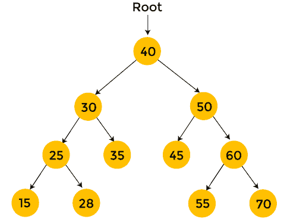
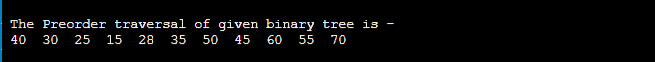
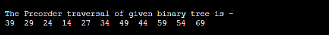
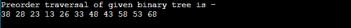
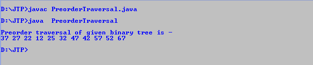

# 前序遍历

> 原文：<https://www.javatpoint.com/preorder-traversal>

在本文中，我们将讨论数据结构中的前序遍历。线性数据结构，如堆栈、数组、队列等。，只有一种方法来遍历数据。但是在**树**这样的分层数据结构中，有多种方式遍历数据。

在前序遍历中，首先访问根节点，然后访问左子树，之后访问右子树。前序遍历的过程可以表示为-

```

root → left → right

```

根节点总是在前序遍历中被首先遍历，而它是后序遍历的最后一项。前序遍历用于获取树的前缀表达式。

执行前序遍历的步骤如下-

*   首先，访问根节点。
*   然后，访问左边的子树。
*   最后，访问右边的子树。

前序遍历技术遵循**根左右**策略。preorder 这个名字本身表明根节点将首先被遍历。

### 算法

现在，让我们看看前序遍历的算法。

```

Step 1: Repeat Steps 2 to 4 while TREE != NULL
Step 2: Write TREE -> DATA
Step 3: PREORDER(TREE -> LEFT)
Step 4: PREORDER(TREE -> RIGHT)
[END OF LOOP]
Step 5: END

```

### 前序遍历示例

现在，让我们看一个前序遍历的例子。用一个例子更容易理解前序遍历的过程。



黄色的节点还没有被访问。现在，我们将使用前序遍历来遍历上述树的节点。

*   从根节点 40 开始。首先，**打印 40** 然后递归遍历左边的子树。
    T3】
*   现在，移到左边的子树。对于左子树，根节点是 30。**打印 30** ，向 30 的左子树移动。
    T3】
*   在 30 的左子树中，有一个元素 25，所以**打印 25** ，遍历 25 的左子树。
    T3】
*   在 25 的左子树中，有一个元素 15，而 15 没有子树。于是，**打印 15** ，移到 25 的右子树。
    T3】
*   在 25 的右子树中，有 28，28 没有子树。于是，**打印 28** ，移到 30 的右子树。
    T3】
*   在 30 的右子树中，有 35 个没有子树。所以**打印 35** ，遍历 40 的右子树。
    T3】
*   在 40 的右子树中，有 50。**打印 50** ，遍历 50 的左子树。
    T3】
*   在 50 的左子树中，有 45 个没有任何子树。于是，**打印 45** ，遍历右边 50 的子树。
    T3】
*   在 50 的右子树中，有 60。**打印 60** 并遍历 60 的左子树。
    T3】
*   在 60 的左子树中，有 55 没有任何子树。所以，**打印 55** 移到 60 的右子树。
    T3】
*   在 60 的右子树中，有 70 个没有任何子树。所以，**打印 70** 并停止该过程。
    T3】

完成前序遍历后，最终输出是-

**40、30、25、15、28、35、50、45、60、55、70**

### 前序遍历的复杂性

前序遍历的时间复杂度为 **O(n)** ，其中‘n’是二叉树的大小。

然而，如果我们不考虑函数调用的堆栈大小，预序遍历的空间复杂度是 **O(1)** 。否则，前序遍历的空间复杂度为 **O(h)** ，其中‘h’为树的高度。

### 预序遍历的实现

现在，让我们看看不同编程语言中预序遍历的实现。

**程序:**用 C 语言编写一个实现前序遍历的程序。

```

#include #include <stdlib.h>struct node {
	int element;
	struct node* left;
	struct node* right;
};

/*To create a new node*/
struct node* createNode(int val)
{
	struct node* Node = (struct node*)malloc(sizeof(struct node));
	Node->element = val;
	Node->left = NULL;
	Node->right = NULL;

	return (Node);
}

/*function to traverse the nodes of binary tree in preorder*/
void traversePreorder(struct node* root)
{
	if (root == NULL)
		return;
	printf(" %d ", root->element);
	traversePreorder(root->left);
	traversePreorder(root->right);
}

int main()
{
	struct node* root = createNode(40);
	root->left = createNode(30);
	root->right = createNode(50);
	root->left->left = createNode(25);
	root->left->right = createNode(35);
	root->left->left->left = createNode(15);
	root->left->left->right = createNode(28);
	root->right->left = createNode(45);
	root->right->right = createNode(60);
	root->right->right->left = createNode(55);
	root->right->right->right = createNode(70);

	printf("\n The Preorder traversal of given binary tree is -\n");
	traversePreorder(root);
	return 0;
}</stdlib.h> 
```

**输出**

执行上述代码后，输出将是-



**程序:**编写一个程序，在 C++中实现前序遍历。

```

#include 

using namespace std;

struct node {
	int element;
	struct node* left;
	struct node* right;
};

/*To create a new node*/
struct node* createNode(int val)
{
	struct node* Node = (struct node*)malloc(sizeof(struct node));
	Node->element = val;
	Node->left = NULL;
	Node->right = NULL;

	return (Node);
}

/*function to traverse the nodes of binary tree in preorder*/
void traversePreorder(struct node* root)
{
	if (root == NULL)
		return;
	cout<element<left);
	traversePreorder(root->right);
}

int main()
{
	struct node* root = createNode(39);
	root->left = createNode(29);
	root->right = createNode(49);
	root->left->left = createNode(24);
	root->left->right = createNode(34);
	root->left->left->left = createNode(14);
	root->left->left->right = createNode(27);
	root->right->left = createNode(44);
	root->right->right = createNode(59);
	root->right->right->left = createNode(54);
	root->right->right->right = createNode(69);

	cout<
```

**输出**

执行上述代码后，输出将是-



**程序:**写一个用 C#实现前序遍历的程序。

```

using System;

class Node {
	public int value;
	public Node left, right;

	public Node(int element)
	{
		value = element;
		left = right = null;
	}
}

class BinaryTree {
	Node root;

	BinaryTree() { root = null; }

	void traversePreorder(Node node)
	{
		if (node == null)
			return;
		Console.Write(node.value + " ");
		traversePreorder(node.left);
		traversePreorder(node.right);
	}

	void traversePreorder() { traversePreorder(root); }

	static void Main()
	{
		BinaryTree bt = new BinaryTree();
		bt.root = new Node(38);
		bt.root.left = new Node(28);
		bt.root.right = new Node(48);
		bt.root.left.left = new Node(23);
		bt.root.left.right = new Node(33);
		bt.root.left.left.left = new Node(13);
		bt.root.left.left.right = new Node(26);
		bt.root.right.left = new Node(43);
		bt.root.right.right = new Node(58);
		bt.root.right.right.left = new Node(53);
		bt.root.right.right.right = new Node(68);

		Console.WriteLine("Preorder traversal of given binary tree is - ");
		bt.traversePreorder();
	}
}

```

**输出**

执行上述代码后，输出将是-



**程序:**写一个用 Java 实现前序遍历的程序。

```

class Node {
	public int value;
	public Node left, right;

	public Node(int element)
	{
		value = element;
		left = right = null;
	}
}

class PreorderTraversal {
	Node root;

	PreorderTraversal() { root = null; }

	void traversePreorder(Node node)
	{
		if (node == null)
			return;
		System.out.print(node.value + " ");
		traversePreorder(node.left);
		traversePreorder(node.right);
	}

	void traversePreorder() { traversePreorder(root); }

	public static void main(String args[])
	{
		PreorderTraversal pt = new PreorderTraversal();
		pt.root = new Node(37);
		pt.root.left = new Node(27);
		pt.root.right = new Node(47);
		pt.root.left.left = new Node(22);
		pt.root.left.right = new Node(32);
		pt.root.left.left.left = new Node(12);
		pt.root.left.left.right = new Node(25);
		pt.root.right.left = new Node(42);
		pt.root.right.right = new Node(57);
		pt.root.right.right.left = new Node(52);
		pt.root.right.right.right = new Node(67);

		System.out.println();
		System.out.println("Preorder traversal of given binary tree is - ");
		pt.traversePreorder();
		System.out.println();
	}
}

```

**输出**

执行上述代码后，输出将是-



所以，这就是文章的全部内容。希望文章对你有所帮助和启发。

* * *