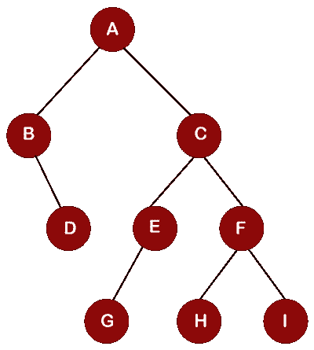

# 树遍历

> 原文：<https://www.javatpoint.com/tree-traversal>

这里，树遍历是指**遍历**或**访问**一棵树的每个节点。像堆栈、队列、链表这样的线性数据结构只有一种遍历方式，而树有各种遍历或访问每个节点的方式。以下是三种不同的遍历方式:

*   **有序遍历**
*   **前序遍历**
*   **后序遍历**

**我们一个一个来看每个遍历。**

### 有序遍历

有序遍历是遵循策略的遍历技术，即**左根右**。这里的左根右是指先遍历根节点的左子树，再遍历根节点，然后遍历根节点的右子树。这里，有序名称本身表明根节点位于左右子树之间。

**让我们通过一个例子来理解有序遍历。**

考虑下面的有序遍历树。

首先，我们将访问左边的部分，然后是根，然后是执行有序遍历的右边部分。在上面的树中，A 是根节点，所以我们移动到 A 的左边，即 B。由于节点 B 没有任何剩余的子节点，所以 B 将被打印，如下所示:

访问节点 B 后，我们移动到节点 B 的右子节点，即 D，由于节点 D 是叶节点，所以节点 D 的打印如下所示:

遍历节点 A 的左边部分。现在，我们将访问根节点，即 A，它将被打印如下所示:

一旦完成了左边部分和根节点的遍历，我们就移动到根节点的右边部分。我们移到节点 A 的右子节点，即 C，节点 C 也离开了子节点，即 E 和 E 也离开了子节点，即 G，由于 G 是叶节点，所以 G 的打印如下所示:

G 的根节点是 E，所以打印如下:

由于 E 没有任何正确的子节点，所以我们移动到 E 节点的根，即 C. C .得到如下所示的打印结果:

一旦遍历了节点 C 的左边部分和根节点，即 C，我们就移动到节点 C 的右边部分。我们移动到节点 F，节点 F 有一个左边的子节点，即 H。因为 H 是叶节点，所以它被打印出来，如下所示:

现在我们移动到 H 的根节点，即 F，它被打印如下:

访问 F 节点后，我们移动到 F 节点的右子节点，即 I，它被打印出来，如下所示:

因此，上述树的有序遍历是 B，D，A，G，E，C，H，F，I

### 前序遍历

前序遍历是遵循策略的遍历技术，即**根左右**。这里的根左右是指先遍历树的根节点，再遍历左子树，最后遍历右子树。在这里，Preorder 名称本身表明将首先遍历根节点。

**我们通过一个例子来理解 Preorder 遍历。**

考虑下面的树进行 Preorder 遍历。

为了执行前序遍历，我们首先访问根节点，然后访问左侧部分，然后遍历根节点的右侧部分。由于节点 A 是上面树中的根节点，因此它的打印如下所示:

一旦遍历了根节点，我们就移动到左边的子树。在左子树中，B 是其右子树的根节点，即 d。因此，B 的打印如下所示:

由于节点 B 没有左子节点，只有右子节点；因此，D 的打印如下所示:

一旦遍历了根节点 A 的左边部分，我们就移动到节点 A 的右边部分。节点 A 的右边子节点是 C。因为 C 是所有其他节点的根节点；因此，C 的打印如下所示:

现在我们移到左边的子节点，即节点 c 的 E，由于节点 E 是节点 G 的根节点；因此，E 的打印如下所示:

节点 E 有一个左子节点，即 G，它被打印出来，如下所示:

由于节点 C 的左边部分完成了，所以我们移到节点 C 的右边部分，节点 C 的右边子节点是节点 F，节点 F 是节点 H 和 I 的根节点；因此，节点 F 被打印出来，如下所示:

一旦节点 F 被访问，我们将遍历左边的子节点，即节点 F 的 H，如下所示:

现在我们将遍历右边的子节点，即节点 F 的 I，如下所示:

因此，上述树的前序遍历是 A、B、D、C、E、G、F、H、I。

### 后序遍历

后序遍历是遵循策略的遍历技术，即**左右根**。这里的左右根是指先遍历根节点的左子树，再遍历右子树，最后遍历根节点。在这里，后缀名本身表明树的根节点将在最后被遍历。

**我们通过一个例子来理解后序遍历。**

考虑下面的树进行后置遍历。

为了执行后置遍历，我们首先访问左边的部分，然后访问右边的部分，然后遍历根节点。在上面的树中，我们移动到左边的子节点，即节点 a 的 B，由于 B 是节点 D 的根节点；因此，将首先遍历右边的子节点，即节点 B 的 D，然后遍历 B，如下所示:

一旦完成了对节点 A 的左子树的遍历，那么将遍历节点 A 的右部分。我们移到节点 A 的右子节点，即 C，由于节点 C 是其他节点的根节点，所以我们移到节点 C 的左子节点，即节点 E，节点 E 是根节点，节点 G 是节点 E 的左子节点；因此，首先打印节点 G，然后打印节点 E，如下所示:

一旦遍历了节点 C 的左边部分，那么我们就移动到节点 C 的右边部分。节点 C 的右边子节点是节点 F。由于 F 也是节点 H 和 I 的根节点；因此，首先遍历左边的子节点“H”，然后遍历节点 F 的右边的子节点“I”，如下所示:

遍历完 H 和 I 后，如下所示遍历节点 F:

一旦节点 C 的左半部分和右半部分被遍历，则节点 C 被遍历，如下所示:

在上面的树中，根节点 A 的左子树和右子树已经被遍历，节点 A 将被遍历。

因此，上述树的后序遍历是 D，B，G，E，H，I，F，C，a。

* * *