# 使用队列实现堆栈

> 原文：<https://www.javatpoint.com/implementation-of-stack-using-queue>

堆栈是遵循后进先出原则的线性数据结构，这意味着首先插入的元素将在最后移除。另一方面，Queue 是遵循 FIFO 原则的线性数据结构，这意味着添加的元素将首先被移除。现在，我们将讨论如何使用[队列](https://www.javatpoint.com/data-structure-queue)实现[堆栈](https://www.javatpoint.com/data-structure-stack)。

使用队列实现堆栈有两种方法:

*   首先，我们可以使推送操作成本高昂。
*   第二，我们可以使 pop 操作成本高昂。

### 第一种方法:让推送操作变得昂贵

**我们通过一个例子来了解一下。**

**假设我们有一个列表如下:**

**1、5、3、P、2、P**

在上面的列表中，“P”意味着我们必须实现 pop 操作，而整数 1、5、3 和 2 将被插入堆栈中。我们将通过队列实现。或者我们可以说，我们将通过队列实现推送和弹出操作。

首先，我们创建两个空队列，如下所示:

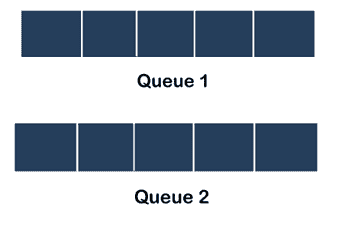

在上图中，我们创建了两个队列，即 ***队列 1*** 和 ***队列 2*** 。首先，我们将元素 1 推入队列 1，因此前面和后面指向元素 1，如下所示:

在插入元素 1 之后，我们必须将元素 5 插入队列 1。首先，我们从队列 1 弹出元素 1 并将其推入队列 2，然后我们将元素 5 推入队列 1，如下所示:

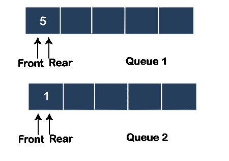

如上图所示，队列 1 的前部和后部指向元素 5，而队列 2 的前部和后部指向元素 1。一旦元素 5 的插入完成，队列 2 中的元素 1 将移回队列 2。在队列 1 中，前面将指向元素 5，后面将指向元素 1，如下所示:

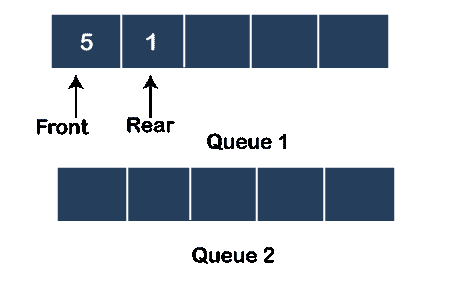

现在下一个元素是 3，我们必须插入到队列 1 中。为了实现这一点，所有元素，即队列 1 中的 5 和 1，将被弹出并添加到队列 2 中。

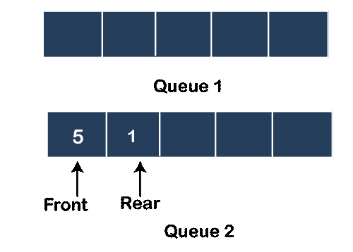

一旦元素从队列 1 中弹出，元素 3 将被推入队列 1，并且 front 将指向元素 3，如下所示:

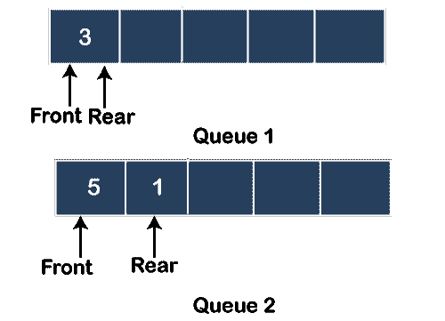

在队列 1 中推送元素 3 之后，我们将弹出队列 2 中的所有元素，并将它们推回到队列 1。前面将指向元素 3，后面将指向元素 1，如下所示:

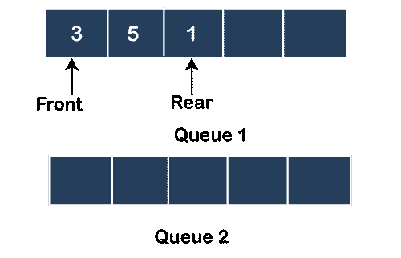

下一个操作是 pop 操作。到目前为止，我们已经观察到推送操作成本很高，但弹出操作需要 O(1)个时间。因此，我们将从队列 1 中弹出元素 3，并更新前指针。弹出的元素将打印在输出中。现在，front 将指向元素 5，如下所示:

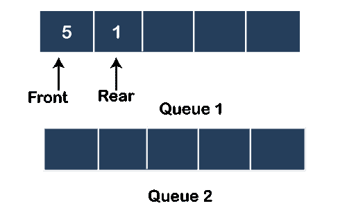

下一个要插入的元素是 2。首先，我们将弹出队列 1 中的所有元素，并将其添加到队列 2 中，如下所示:

一旦所有元素从队列 1 中弹出，元素 2 将被推入队列 1。队列 1 的前面和后面将指向元素 2，如下所示:

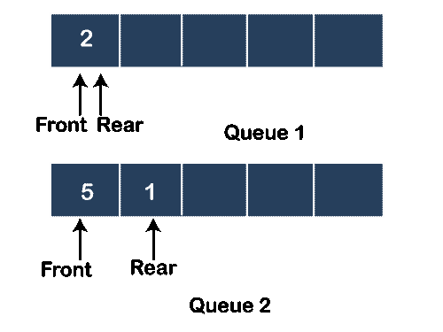

将元素插入队列 1 后，我们将弹出队列 2 中的所有元素，并将它们移回队列 1，如下所示:

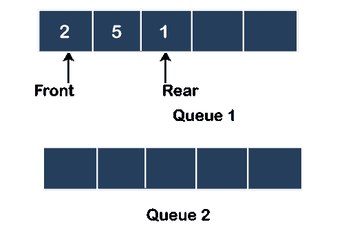

从上图中我们可以看到，前面指向元素 2，而后面指向元素 1。

下一个操作是 pop 操作。在弹出操作中，元素 2 将从队列 1 中弹出，并打印在输出中。前指针得到更新并指向元素 5，如下所示:

输出是 3，2。

如果我们想验证输出是否正确，那么我们可以使用 stack。首先，我们将元素 1 推入堆栈，如下所示:

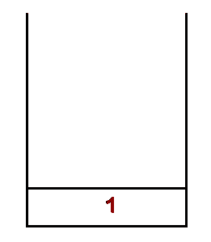

下一个元素 5 被推入堆栈，如下所示:

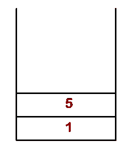

下一个元素是 3，将被推入堆栈，如下所示:

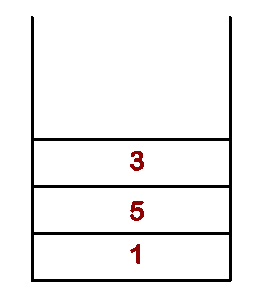

现在将调用 pop 操作，元素 3 将从堆栈中弹出。元素 3 打印在输出中，如下所示:

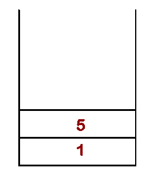

下一个元素是要推入堆栈的 2:

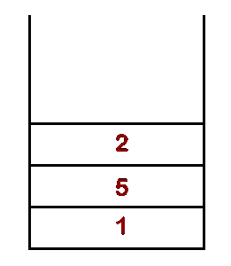

插入 2 后，将调用 pop 操作，元素 2 将从堆栈中弹出。元素 2 被打印在输出中。

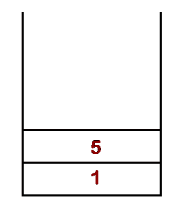

输出为 3，2，这与通过实现队列生成的输出相同。

### 时间复杂性

如果我们通过 Queue 实现堆栈，那么推送操作将花费 O(n)个时间，因为所有元素都需要从 Queue1 中弹出，并将它们推回到 Queue1。

弹出操作将花费 0(1)时间，因为我们需要从队列中移除前面的元素。

**算法(推送操作成本高时)**

**推送算法**

**执行推送操作的步骤如下:**

**步骤 1:** 考虑两个队列，即 Q1 和 Q2，队列中要插入的元素是 x

**步骤 2:** 如果 Q1.isEmpty()那么

Q1 .入队(x)；

其他

size:= Q1 . size()；

对于 I = 0…尺寸为

Q2 .入队(Q1 .出列())；

目标

Q1 .入队(x)；

对于 j=0…尺寸

Q1 .入队(Q2 .出列())；

目标

**弹出算法**

**执行弹出操作的步骤如下:**

**步骤 1:** 考虑两个队列，即 Q1 和 Q2，我们想从队列的前面移除元素。

**第二步:**项:= Q1 .出列()；

**第三步:**退货；

### 第二种方法:使 pop 操作成本高

**假设我们有一个列表如下:**

**1、5、3、P、2、P**

我们将考虑两个队列，即队列 1 和队列 2，就像我们在前面的方法中所做的那样。首先，我们将元素 1 推入队列 1，如下所示:

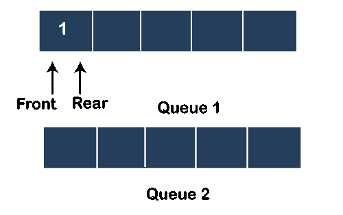

下一个元素是 5，它将被推入队列 1，如下所示:

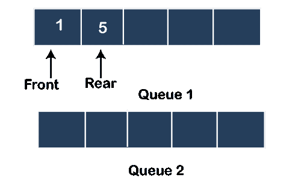

下一个元素是 3，它也将被推入队列 1，如下所示:

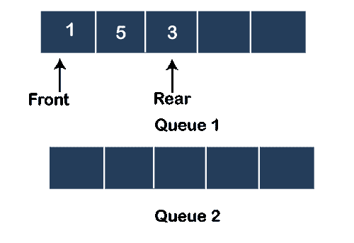

现在我们必须在 Queue1 上实现 pop 操作。在这种情况下，我们将首先弹出除最后一个由后方指向的元素之外的所有元素，并将它们添加到队列 2 中。最后一个元素将从 Queue1 中删除，并打印在输出中，如下所示:

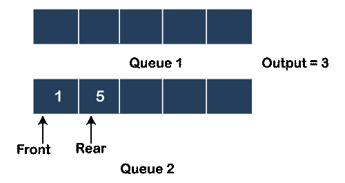

现在我们将队列 2 的元素移回队列 1。

下一个元素是 2，它将被插入队列 1，如下所示:

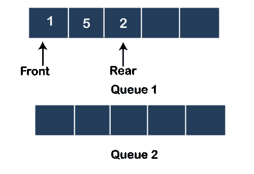

下一个操作是 pop 操作。在这个操作中，首先，我们需要弹出队列 1 中除了最后一个由后方指向的元素之外的所有元素，并将其添加到队列 2 中。最后一个元素，即 2，将从队列 1 中删除，并在输出中打印出来，如下所示:

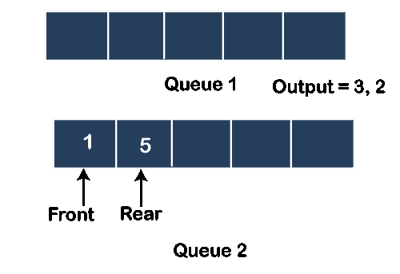

队列 2 中添加的元素将被移回队列 1，如下所示:

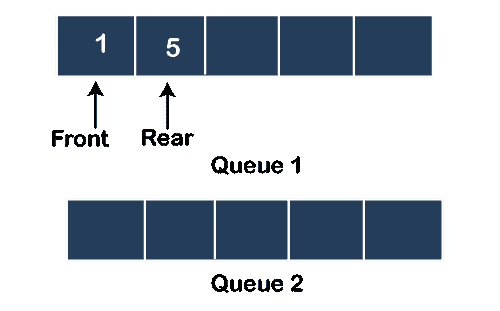

从上图中我们可以看到，生成的输出是 3，2，队列中剩余的元素是 1，5。

### 时间复杂性

在上述情况下，推送操作需要 O(1)个时间，因为每次推送操作都会在队列的末尾添加新元素。另一方面，pop 操作采用 O(n)，因为在每个 pop 操作中，除了最后一个元素之外，所有元素都从 Queue1 中弹出，并将其推入 Queue2。队列 1 中的最后一个元素将被删除，然后队列 2 中的所有元素都被移回队列 1。

**算法(当 pop 操作成本高时)**

**推送算法**

**执行推送操作的步骤如下:**

**步骤 1:** 考虑两个队列，即 Q1 和 Q2，队列中要插入的元素是 x

**步骤 2:** 元素= Q1 . enqueue(x)；

**第三步:**返回元素；

**弹出算法**

**以下是从队列中删除元素的步骤:**

**步骤 1:** 考虑两个队列，即 Q1 和 Q2，我们想从队列中移除一个元素。

**第二步:**如果！Q1.isEmpty()然后

size:= Q1 . size()；

对于 I = 0…尺寸-1 do

Q2 .入队(Q1 .出列())；

目标

int item = Q1 .出列()；

对于 j = 0…尺寸-1 do

Q1 .入队(Q2 .出列())；

目标

* * *