# 二项式堆

> 原文：<https://www.javatpoint.com/binomial-heap>

在本文中，我们将讨论二项式堆。在开始讨论这个话题之前，我们应该先了解一些基本术语，如堆、最小堆、最大堆和二叉树。

### 什么是堆？

堆是一个完整的二叉树，二叉树是一个节点最多可以有两个子节点的树。堆有两种类型，定义如下-

*   **最小堆:**父节点的值应小于或等于其子节点的值。
    数学上，最小堆可以定义为-
    **A【父(I)】<= A【I】**
*   **最大堆:**父节点的值大于或等于其子节点。
    数学上，最大堆可以定义为-
    **A【父(I)】>= A【I】**

### 什么是二叉树？

二叉树 B <sub>k</sub> 是递归定义的有序树，其中 k 定义为二叉树的顺序。

*   如果二叉树表示为 B <sub>0</sub> ，则该树由单个节点组成。
*   一般来说，B <sub>k</sub> 由两个二叉树组成，即 B <sub>k-1</sub> 和 B <sub>k-1</sub> ，这两个二叉树连接在一起，其中一个树成为另一个二叉树的左子树。

我们可以通过下面给出的例子来理解它。

如果 B <sub>0</sub> ，其中 k 为 0，则树中只存在一个节点。

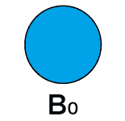

如果 B <sub>1</sub> ，其中 k 为 1。因此，会有两个 B <sub>0</sub> 的二项式树，其中一个 B <sub>0</sub> 成为另一个 B <sub>0</sub> 的左子树。

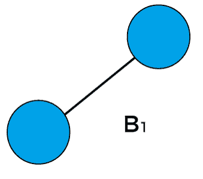

如果 B <sub>2</sub> ，其中 k 为 2。因此，会有两个 B <sub>1</sub> 的二项式树，其中一个 B <sub>1</sub> 成为另一个 B <sub>1</sub> 的左子树。

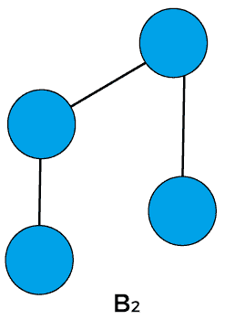

如果 B <sub>3</sub> ，其中 k 为 3。因此，会有两个 B <sub>2</sub> 的二项式树，其中一个 B <sub>2</sub> 成为另一个 B <sub>2</sub> 的左子树。

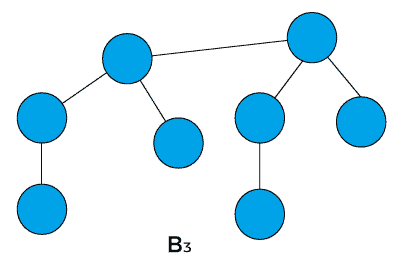

现在，让我们开始主题“二项式堆”。

### 什么是二项式堆？

二项式堆可以定义为满足堆属性的二项式树的集合，即最小堆。最小堆是每个节点的值小于其子节点的值的堆。二项式堆主要用于实现优先级队列。它是二进制堆的扩展，提供了更快的合并或联合操作以及二进制堆提供的其他操作。

### 二项式堆的性质

具有 **n 个**节点的二项式堆具有以下属性-

*   堆中的每个二叉树都必须遵循 **min-heap** 属性，即节点的键大于或等于其父节点的键。
*   对于任何非负整数 k，堆中应该至少有一个二叉树，其中根的度数为 k。

堆的第一个属性确保最小堆属性在整个堆中保持不变。而上面列出的第二个属性保证了具有 **n** 个节点的二叉树最多应该有 **1 + log <sub>2</sub> n** 个二叉树，这里 **log <sub>2</sub>** 是二进制对数。

我们可以借助一个例子来理解上面列出的属性-

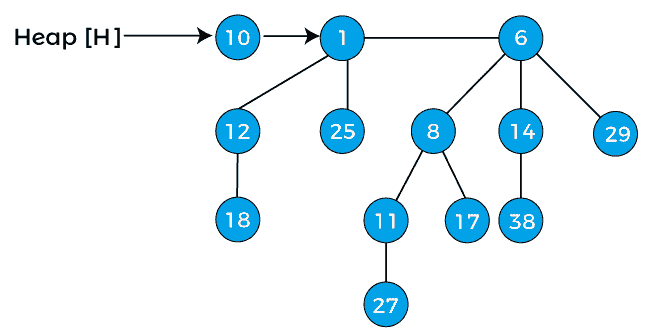

上图有三棵二叉树，分别是 B <sub>0</sub> ，B <sub>2</sub> ，B <sub>3</sub> 。由于所有节点的值都小于子节点的值，因此上述所有三个二叉树都满足 min heap 的属性。

上图还满足二项式堆的第二个性质。例如，如果我们把 k 的值看作 3，我们可以在上图中观察到 3 度的二叉树存在于一个堆中。

## 二项式堆和数字的二进制表示

具有 **n 个**节点的二项式堆由二项式树组成，二项式树等于 n 的二进制表示中的集合位数。

假设我们想创建一个由“n”个节点组成的二项式堆，它可以简单地用二进制数“n”来定义。例如:如果我们要创建 13 个节点的二项式堆；13 的二进制形式是 1101，所以如果我们从最右边的数字开始编号，那么我们可以观察到 1 在 0、2 和 3 位置可用；因此，具有 13 个节点的二项式堆将具有 B <sub>0</sub> 、B <sub>2</sub> 和 B <sub>3</sub> 二项式树。

我们可以用另一个例子来更清楚地理解它，假设我们必须创建具有 9 个节点的二项式堆。9 的二进制表示是 1001。所以，在 9 的二进制表示中，数字 1 出现在 0 和 3 的位置，因此，二项式堆将包含 0 和 3 度的二项式树。

现在，让我们转向在二项式堆上执行的操作。

## 二项式堆上的运算

可以对二项式堆执行的操作如下-

*   创建二项式堆
*   找到最小键
*   两个二项式堆的合并或合并
*   插入节点
*   提取最小密钥
*   减少一个键
*   删除节点

现在，让我们详细讨论上面列出的操作。

### 创建新的二项式堆

当我们创建一个新的二项式堆时，它只需要 O(1)个时间，因为创建一个堆将创建堆的头部，其中没有附加任何元素。

## 找到最小键

如上所述，二项式堆是二叉树的集合，每个二叉树都满足最小堆属性。这意味着根节点包含一个最小值。因此，我们只需要比较所有二项式树的根节点来找到最小键。二项式堆中求最小键的时间复杂度为 **O(logn)。**

## 两个二项式堆的并集或合并

这是对二项式堆执行的最重要的操作。堆中的合并可以通过比较两棵树根部的键来完成，键较大的根节点将成为键较小的根的子节点。寻找并集的时间复杂度为 0(logn)。合并两棵树的函数如下所示-

```

function merge(a,b)
if a.root.key ? b.root.key
return a.add(b)
else
return b.add(a)

```

为了实现两个二项式堆的并集，我们必须考虑以下情况-

**情况 1:** 如果度数[x]不等于度数[下一个 x]，则向前移动指针。

**情况 2:** 如果度[x] =度[下一个 x] =度[同级(下一个 x)]，那么，

将指针向前移动。

**情况 3:** 如果度[x] =度[下一个 x]但不等于度[同级[下一个 x]]

和键[x]

**情况 4:** 如果度[x] =度[下一个 x]但不等于度[同级[下一个 x]]

和键[x]>键[下一个 x]，然后从根中移除 x 并附加到[下一个 x]。

现在，让我们借助一个例子来理解两个二项式堆的合并或并集。考虑两个二项式堆-

 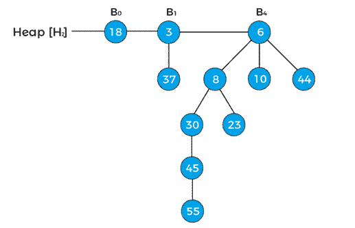

我们可以看到有两个二项式堆，所以，首先，我们必须组合这两个堆。为了组合堆，首先，我们需要以递增的顺序排列它们的二叉树。

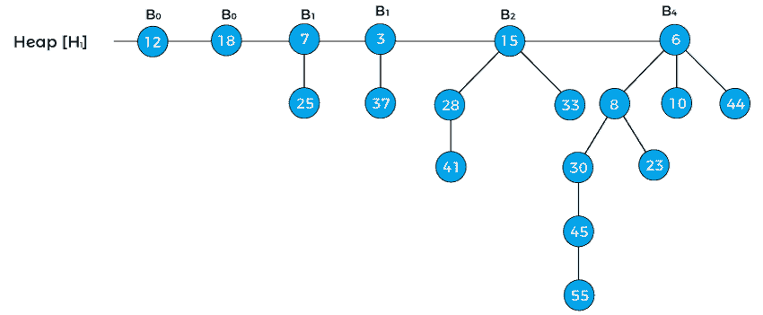

在上面的堆中，指针 x 首先指向 B 级 <sub>0</sub> 的节点 12，然后指针[x]指向 B 级 <sub>0</sub> 的节点 18。具有 B 级的节点 7<sub>1</sub>是 18 的兄弟，因此，它被表示为兄弟[next[x]]。

现在，首先应用 Case1，它说**'如果度[x] ≠度[next x]，那么将指针向前移动'**但是在上面的例子中，度[x] =度[next[x]]，所以这个情况无效。

现在，应用案例 2，它说**‘如果度[x] =度[下一个 x] =度[同级(下一个 x)]，那么向前移动指针’。**所以，这种情况也不适用于上面的堆。

现在，应用 Case3，它表示**‘如果度[x] =度[下一个 x] ≠度[同级[下一个 x]]和键[x]【T2]键[下一个 x]，则从根中移除[下一个 x]并附加到 x’。**我们将应用这种情况，因为上面的堆遵循情况 3 的条件-

度[x] =度[下一个 x] ≠度[兄弟[下一个 x]] {as，B<sub>0</sub>= B<sub>0</sub>≠B<sub>1</sub>}和键[x] <键[下一个 x] {as 12 < 18}。

因此，移除节点 18 并将其连接到 12，如下所示-

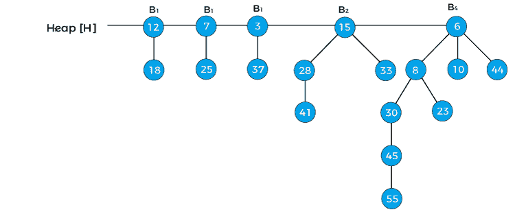

**x = 12，next[x] = 7，同级[next[x]] = 3，度[x] = B <sub>1</sub> ，dgree[next[x]] = B <sub>1</sub> ，度[同级[next[x]]= B<sub>1</sub>T7】**

现在我们将重新应用上面二项式堆中的情况。首先，我们将应用案例 1。由于 x 指向节点 12，next[x]指向节点 7，所以 x 的度数等于 next x 的度数；因此，案例 1 无效。

这里，情况 2 是有效的，因为 x，next[x]，和兄弟[next[x]]的度数相等。因此，根据情况，我们必须将指针向前移动。

因此， **x = 7，next[x] = 3，同辈【next[x]】= 15，**和**度【x】= B<sub>1</sub>，dgree【next[x]】= B<sub>1</sub>，度【同辈【next[x]】= B<sub>2</sub>T9】**

现在，让我们尝试应用案例 3，这里，案例 3 的第一个条件满足为度[x] =度[next[x]] ≠度[同级[next[x]]]，但是不满足案例 3 的第二个条件(key[x] < key[next x])。

现在，让我们尝试应用案例 4。因此，情况 4 的第一个条件得到满足，第二个条件(键[x]>键[下一个 x])也得到满足。因此，从根中移除 x，并将其附加到[下一个[x]]。

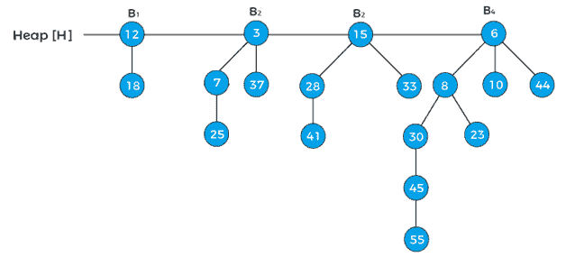

现在，指针 x 指向节点 3，next[x]指向节点 15，兄弟[next[x]]指向节点 6。因为，x 的度等于 next[x]的度但不等于度[同胞[next[x]]]，x 的键值小于 next[x]的键值，所以我们要去掉 next[x]并附加到 x 上，如下图-

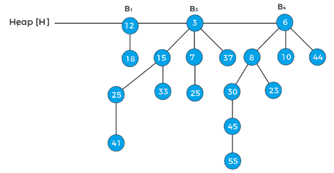

现在，x 代表节点 3，下一个[x]指向节点 6。因为，x 和 next[x]的度数不相等，所以 case1 有效。因此，将指针向前移动。现在，指针 x 指向节点 6。

B4 是堆中的最后一棵二叉树，因此它导致循环的终止。上面的树是两个二项式堆合并后的最后一棵树。

## 在堆中插入元素

只需用要插入的元素创建一个新堆，然后将其与原始堆合并，就可以在堆中插入元素。由于合并，堆中的单次插入需要 O(logn)时间。现在，让我们用一个例子来理解在堆中插入一个新节点的过程。

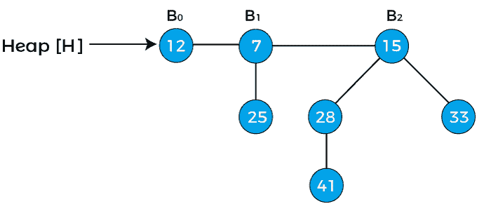

在上面的堆中，给出了 0 度、1 度和 2 度的三个二项式树，其中 B0 连接到堆的头部。

假设我们必须在上面的堆中插入节点 15。

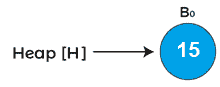

首先，我们必须将两个堆结合起来。因为节点 12 和节点 15 都是 0 度，所以节点 15 如下所示连接到节点 12

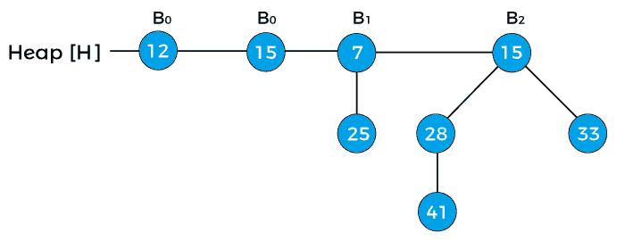

现在，将 x 分配给值为 12 的 B <sub>0</sub> ，将下一个(x)分配给值为 15 的 B <sub>0</sub> ，将同级(下一个(x))分配给值为 7 的 B <sub>1</sub> 。因为 x 和 next(x)的度数相等。x 的键值小于 next(x)的键值，因此 next(x)被移除并附加到 x。如下图所示-

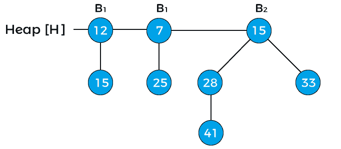

现在，x 指向具有 B 级 <sub>1</sub> 的节点 12，下一个(x)指向具有 B 级 <sub>1</sub> 的节点 7，兄弟(下一个(x))指向具有 B 级 <sub>2</sub> 的节点 15。x 的度等于 next(x)的度，但不等于 six(next(x))的度。x 的键值大于 next(x)的键值；因此，x 被移除并附着到下一个(x ),如下图所示-

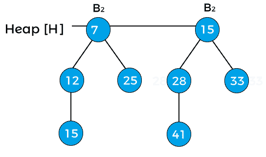

现在，x 指向节点 7，下一个(x)指向节点 15。x 和 next(x)的度数均为 B <sub>2</sub> ，x 的键值小于 next(x)的键值，因此 next(x)将被移除并附加到 x 上，如下图所示-

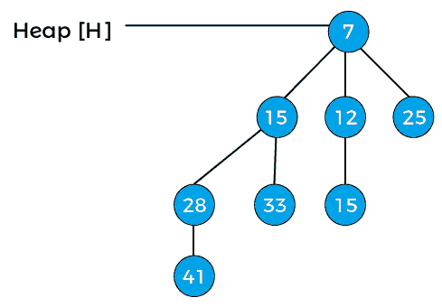

现在上面堆的度是 B <sub>3</sub> ，是插入节点 15 后的最终二项式堆。

## 提取最小密钥

这意味着我们必须移除具有最小键值的元素。我们知道，在最小堆中，根元素包含最小键值。因此，我们必须比较所有二项式树的根节点的键值。让我们看一个从堆中提取最小键的例子。

假设堆是-

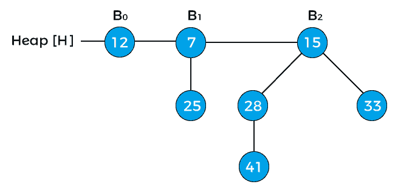

现在，比较上面堆中二叉树根节点的键值。因此，12、7 和 15 是上述堆中根节点的键值，其中 7 是最小值；因此，从树中删除节点 7，如下图所示-

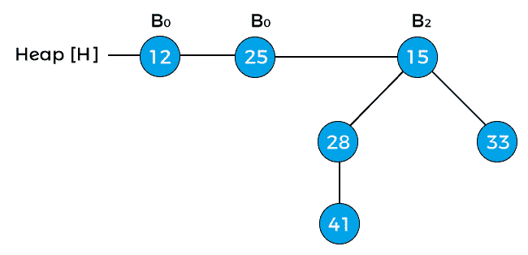

现在，节点 12 和节点 25 的度数为 B <sub>0</sub> ，节点 15 的度数为 B <sub>2</sub> 。指针 x 指向节点 12，下一个(x)指向节点 25，兄弟(下一个(x))指向节点 15。因为 x 的度等于下一个(x)的度，但不等于兄弟(下一个(x))的度。指针 x 的值小于指针 next(x)，因此节点 25 将被移除并附加到节点 12，如下图所示-

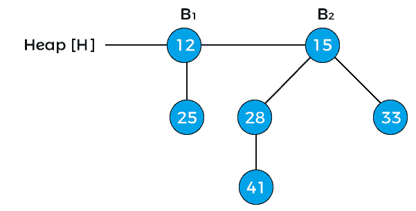

现在，节点 12 的度数变为 B <sub>1</sub> 。上面的堆是提取最小键后的最后一个堆。

## 减少一个键

现在，让我们前进到要在二项式堆上执行的另一个操作。一旦键的值减小，它可能会小于其父键，从而导致违反 min-heap 属性。如果这种情况发生在减少键之后，则与其父元素、祖父元素等交换元素，直到满足 min-heap 属性。

让我们用一个例子来理解在二项式堆中减少一个键的过程。考虑下面给出的堆-

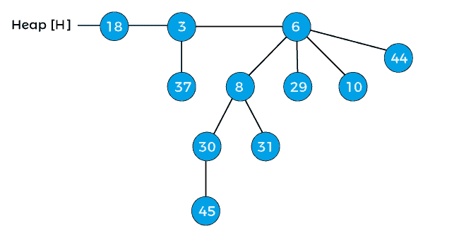

将上述堆的键 45 减少 7。将 45 减 7 后，堆将-


减少键后，违反了上述堆的最小堆属性。现在，比较 7 和它的父 30，因为它比父 30 小，用 30 交换 7，交换之后，堆将是-


再次比较元素 7 和它的父元素 8，同样它比父元素小，所以交换元素 7 和它的父元素 8，交换之后堆将是-


现在，上面堆的 min-heap 属性得到了满足。所以，上面的堆是递减一个键后的最后一个堆。

## 从堆中删除节点

要从堆中删除一个节点，首先，我们必须将其键减少到负无穷大(或-∞)，然后删除堆中的最小值。现在我们将借助一个例子来看看如何删除一个节点。考虑下面的堆，假设我们必须从堆中删除节点 41-

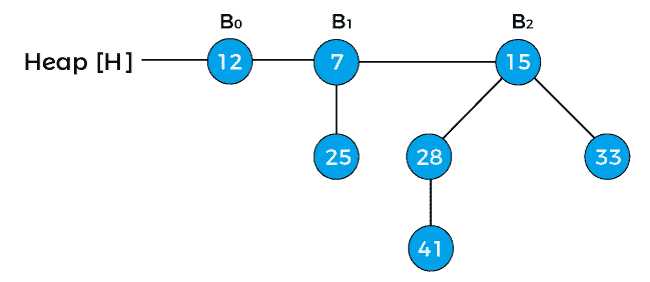

首先，用负无穷大(或-∞)替换节点，如下所示-


现在，将负无穷大与其根节点交换，以保持最小堆属性。

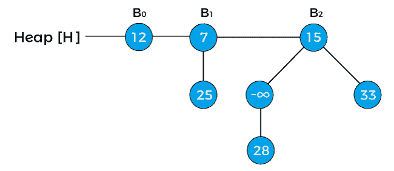

现在，再次将负无穷大与其根节点交换。


下一步是从堆中提取最小键。由于上面堆中的最小键是-infinity，所以我们将提取这个键，堆将是:

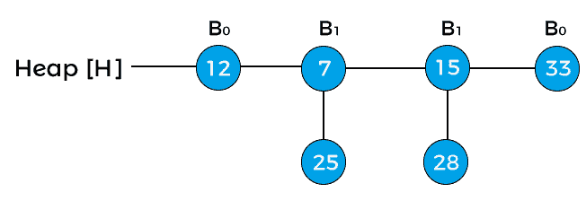
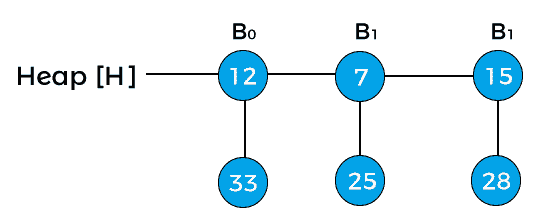
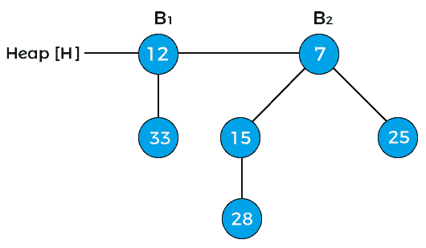

以上是删除节点 41 后的最终堆。

## 二项式堆的复杂性

现在，让我们看看在二项式堆上执行的操作的时间复杂性。

**时间复杂度**

| 操作 | 时间复杂性 |
| 找到最小键 | o(对数 n) |
| 插入节点 | o(对数 n) |
| 提取最小密钥 | o(对数 n) |
| 减少一个键 | o(对数 n) |
| 联合还是合并 | o(对数 n) |
| 删除节点 | o(对数 n) |

从堆中找到最小元素的时间复杂度可以降低到 O(1)。这可以通过使用指向最小元素的附加指针来实现。

**空间复杂度**

具有“n”个元素的二项式堆的空间复杂度是 O(n)。

## 结论

所以，这就是文章的全部内容。在这里，我们讨论了二项式堆及其性质和复杂性。我们还借助一个例子讨论了二项式堆上执行的操作，以使主题更容易理解。希望文章对你有帮助，有意思。

* * *